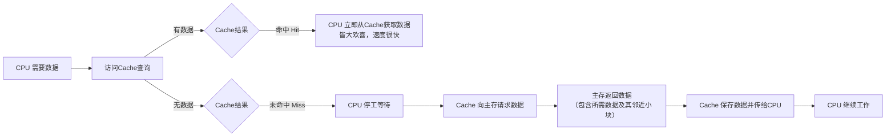
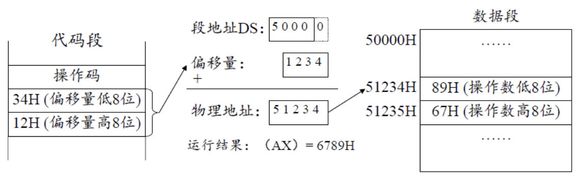
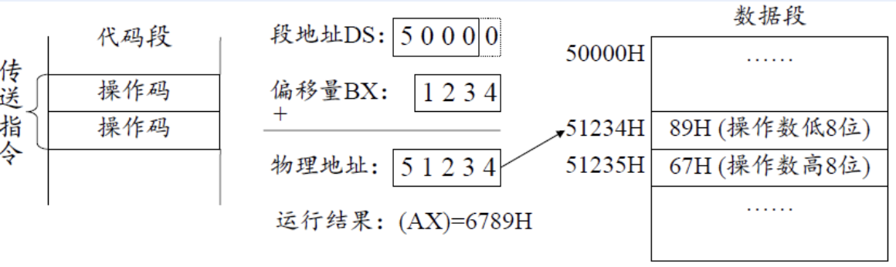
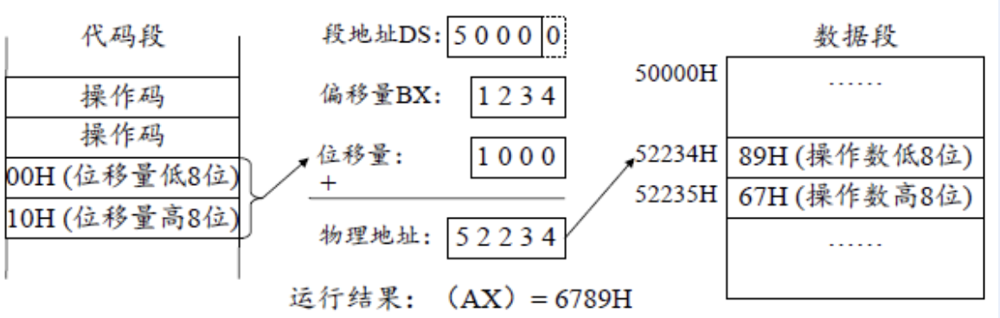

# 8086 寻址方式

## 存储器体系结构

不管实际存储容量是多少，CPU 都默认自己有无限大的存储空间（即理想存储情况）。


### 局部性原理

1. **时间局部性**：刚用过的数据，很可能马上还要再用一次。

2. **空间局部性**：刚用过的数据，它旁边的数据，很可能马上也要被用。

**工作流程：**



## 寻址方式

### 概述

|  寻址方式   | 操作数位置  |   细分分类   |               举例               |
| :-----: | :----: | :------: | :----------------------------: |
|  立即寻址   | 在指令代码中 |    --    |        `MOV AX, 1234H`         |
|  寄存器寻址  | 在寄存器中  |    --    |          `MOV AX, BX`          |
|  存储器寻址  |  在主存中  |   直接寻址   |       `MOV AX, [2000H]`        |
|         |        | 寄存器间接寻址  |         `MOV AX, [BX]`         |
|         |        | 寄存器相对寻址  |       `MOV AX, [BX+10H]`       |
|         |        |  基址变址寻址  |       `MOV AX, [BX+SI]`        |
|         |        | 相对基址变址寻址 |     `MOV AX, [BX+SI+20H]`      |
| I/O端口寻址 | 在IO端口中 |  直接端口寻址  |          `IN AL, 60H`          |
|         |        |  间接端口寻址  | `MOV DX, 378H`<br>`OUT DX, AL` |
>**注意：** 寻址方式是针对==操作数==而言的。即寻找对应表述地址里面的==数据==（不管是立即数，还是从寄存器、主存里找到对应的数据）。


### 立即寻址

操作数（数据）作为指令机器码的一部分，存放在内存的==代码段==中。

>[!note] 案例分析
>
>1. **`MOV AX 1234H`**：其中的`1234H`即为立即数，此种寻址方式即为立即寻址。
>

>立即数只能作为==源操作数==，只能传给==存储器和通用寄存器==，不能直接给段寄存器。
### 寄存器寻址

用寄存器代号代替对应寄存器内部放置的数据。

>[!note] 案例分析
>
>1. **`MOV AX BX`**：把`BX`里面的数据给到`AX`里面，用寄存器代号`BX`来代替里面的数据。

> 源寄存器和目的寄存器的类型要一样，
### 存储器寻址

8086 的物理地址为：`段地址 + 偏移地址`

其中：`偏移地址 = 有效地址 = 基址（BX BP） + 变址(SI DI) + 位移量`

> 段地址基本上不会直接出现在指令代码中，会根据偏移地址中使用的寄存器==默认匹配==段。

以下展示的各种各样的存储器寻址方式其实就是这个公式里面三个元素的排列组合，记忆方式很反人类：

|   寻址方式   |                   组合                   |
| :------: | :------------------------------------: |
|   直接寻址   |                  偏移地址                  |
| 寄存器间接寻址  | 基址（我们把 BX 默认为基址，而不是认为是把偏移地址存到 BX 寄存器里） |
| 寄存器相对寻址  |                基址+偏移地址                 |
|  基址变址寻址  |                 基址+变址                  |
| 相对基址变址寻址 |               基址+变址+偏移地址               |

#### 直接（位移量）寻址


*存储器直接寻址示意图*

如`MOV AL,[2000H]`，这里不需要PTR。实际使用过程中经常使用`MOV AL,DATA1`也就是变量来直接寻址。

> ==存储单元之间不能互相直接操作数据==。如果将data2处数据放到data1，需要AL这种通用寄存器来过渡。

#### 寄存器间接寻址



只能用`BX,SI,DI`，如`[BX]`，即把偏移量提前存在了 `BX` 寄存器里面了，具体语句：

```asm
MOV BX, OFFSET DATA1 ; 把 DATA1 的地址赋予 BX
MOV AL,[BX]
```

#### 寄存器相对寻址

`EA（偏移量）= 基址/变址寄存器 + 位移量`

```asm
MOV AX, [BX+1000H]
```


#### 基址变址寻址

`EA = (BX 或 BP) + (SI 或 DI)`

#### 相对基址变址寻址

使用完全体公式进行寻址：`偏移地址 = 有效地址 = 基址（BX BP） + 变址(SI DI) + 位移量`

### I/O 端口寻址

CPU访问I/O端口，**只能**使用两条专属指令：**`IN`** (输入) 和 **`OUT`** (输出)。分为==直接端口寻址==（直接使用 16 进制数进行寻址端口）与==间接端口寻址==（从通用寄存器寻址）

# 8086 指令系统

