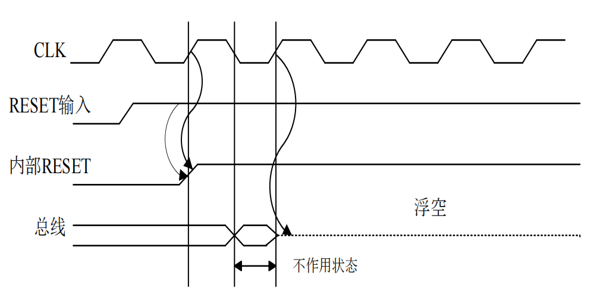
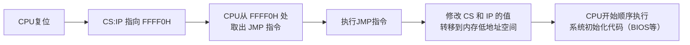
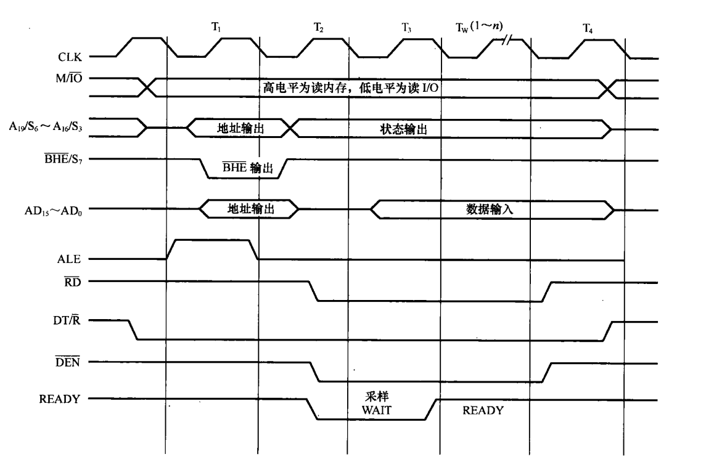
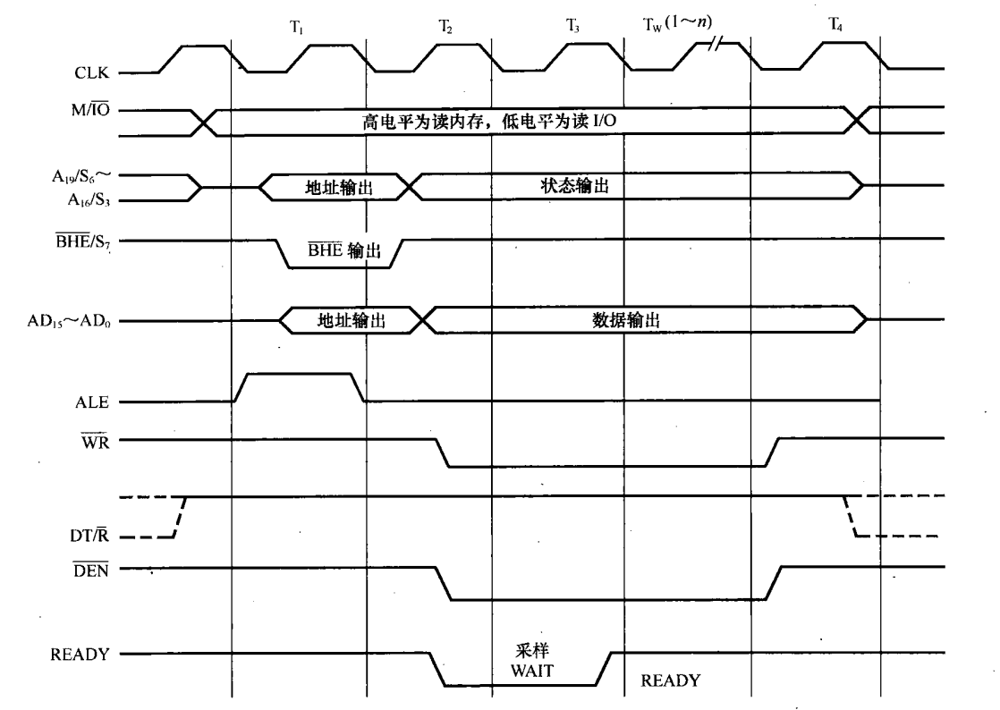
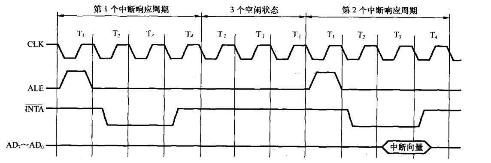

# 总线概述

微处理器（CPU）、主存（ROM、RAM）以及I/O接口是通过一组==共享的、并行的电子通路==连接的。这种将所有功能部件连接到一组公共信息传输线上的结构，就是**总线拓扑结构 (Bus Topology)**。

在这种结构中，CPU通常作为**总线主控设备**，而内存和I/O接口作为**总线从属设备**。（方便以后判断数据方向，主语方向一般是CPU）

## 总线分类

### 按功能划分
#### 地址总线 (Address Bus, AB)

当CPU需要从内存读取数据或向I/O端口写入数据时，首先需要==指明它要操作的具体单元==。CPU将该单元的地址放置到地址总线上。

**地址总线是单向的**（通常是74LS373锁存器）。==CPU是地址的唯一发起者==，它始终是向外输出地址信号。存储器和I/O设备始终是地址的接收者，当发现总线上的地址与自身地址匹配时，才会响应后续的数据或控制信号。

**地址总线的位数决定了寻址范围**，关系是 $N = 2^W$。（**例**: Intel 8086 CPU有**20位**地址信号。因此，其物理寻址范围为 $2^{20}$ 个字节，即 1,048,576 字节，也就是 **1MB** 物理地址空间。）
#### 数据总线 (Data Bus, DB) 

在CPU、存储器和I/O设备之间**传送数据信息**的通道。**双向传输**。
    
- **写操作**: CPU作为主设备，将数据输出到数据总线上，目标设备从总线读取该数据。
        
- **读操作**: 目标设备作为响应，将数据输出到数据总线上，CPU从总线读取数据。

> [!note] 三态逻辑 (Tri-state Logic)
> 双向传输时通常采用**双向三态形式**。
>
> 由于多个设备（CPU, RAM, I/O）都可能需要向数据总线输出数据，为防止**总线冲突**（即多个设备同时驱动总线导致信号线之间短路），所有连接到数据总线的设备都必须具备**三态**输出能力（即高电平、低电平、高阻态 HZ）。
>
> 当设备未被选中时，其数据总线接口处于**高阻态**，相当于在电气上与总线断开。

数据总线宽度通常与微处理器的字长一致，表示在一个总线周期内可以传送的数据位数（比如16位处理器、32位处理器）。
#### 控制总线 (Control Bus, CB)

CPU用于**协调和同步**所有总线操作的信号集合。控制总线是**一组异质化的控制信号线**的统称。

传送方向由具体控制信号来定，其位数也由系统的实际控制需要来定。

例如：

| 信号名称            | 方向   | 描述                |
| --------------- | ---- | ----------------- |
| `RD#`/ `WR#`    | 单向   | CPU -> 设备 (读、写使能) |
| `INTR`/ `READY` | 单向   | 设备 -> CPU (中断、就绪) |
| `HOLD`/ `HLDA`  | 双向交互 | CPU 与设备之间的总线握手信号  |
### 按位置划分
#### 片内总线

IC内部的信息通路，用于连接该芯片内部的各个功能单元（如`寄存器`与`寄存器`之间、`寄存器`与`ALU`之间的连接）

**封装在芯片，内部不可见**。设计、宽度和协议由芯片制造商（如Intel, ARM）在设计芯片时固定。
#### 片总线 (Chip Bus / Component-level Bus)

连接同一块插件板（电路板，**PCB**）上各个芯片的总线。

常见片总线协议：

| 总线标准       | 全称                                          | 特点与用途                               |
| ---------- | ------------------------------------------- | ----------------------------------- |
| **I²C **​  | Inter-IC                                    | 低速、用于连接微控制器和外围芯片（如EEPROM、传感器）的串行总线。 |
| **SPI **​  | Serial Peripheral Interface                 | 短距离、高速的芯片间串行通信的总线。                  |
| **UART **​ | Universal Asynchronous Receiver/Transmitter | ==异步串行==通信的逻辑标准                     |

#### 内总线 (Internal Bus / System Bus)

连接微机系统中**各个插件板**（显卡、声卡、网卡）与**系统板（主板）** 之间的总线。

是微机系统中最总要的总线，==通常所说的总线就是这种总线==。CPU插件板、内存插件板、I/O插件板通过一个共享的`内总线`（如主板插槽）进行互连。

###### 外总线 (External Bus / Communication Bus)

微机系统和外部设备之间进行互连的总线。

与外部的、独立的硬件设备进行通信（传输距离更长、环境更复杂，速率通常远低于内总线）。

常见外总线：

| 总线标准          | 类型    | 描述                     |
| ------------- | ----- | ---------------------- |
| **IEEE-488**​ | 并行外总线 | 一种（已过时）用于连接仪器仪表的并行外总线。 |
| **RS-232C**​  | 串行外总线 | 一种经典的串行外总线（通信端口）。      |
| **USB**​      | 串行外总线 | 现代标准的串行外总线。            |
## 总线性能与标准

### 总线性能

#### 总线宽度 (Bus Width)

就是数据总线的位数，决定了在一个总线周期内，能够并行传输的数据位数。

#### 总线频率 (Bus Frequency)
    
总线的==工作时钟频率==（单位为Hz），表示每秒总线可以执行多少次数据传输。

#### 传输速率 (Transfer Rate, 也称为总线带宽)**:
    
衡量总线性能的最终指标，表示==单位时间内总线可传输的数据总量==（单位为**MB/s**）。

三种性能总关系：
$$\text{传输速率} = (\frac{\text{总线宽度}}{8}) × \text{总线频率}$$
# 常用芯片

| 型号           | 功能描述             |
| ------------ | ---------------- |
| **74LS244**​ | 单向三态缓冲器/驱动器      |
| **74LS245**​ | 双向三态缓冲器/驱动器（收发器） |
| **74LS373**​ | 带有三态输出的锁存器       |

## 74LS244

该芯片的数据流向是固定的，只能从 `A` 输入端流向 `Y` 输出端。（实际上用的挺少）

	*74LS244*

八路驱动器，内部集成了8个三态门，可以一次性处理8位数据。

8路分为两组（Group 1: `1A1-1A4` -> `1Y1-1Y4`，通过 `1G` 控制使能；Group 2: `2A1-2A4` -> `2Y1-2Y4`，通过 `2G` 控制使能），两个使能端是**低电平有效**（从反相泡可以看出来）。

1其单向特性与地址总线和部分类型的控制总线匹配，同时，作为驱动器可以增强信号的驱动能力（从CPU里面出来的信号波形不是很完整）。

## 74LS245

也被称为**收发器**。在两个数据端（`A0` 和 `B0`）之间，==并联了两个方向相反的单向三态门==。

*74LS245*

*内部结构，相反三态门*

拥有两个控制信号：

- **`E` (Gate Enable)**: **全局使能信号**。决定整个双向通道是工作，还是处于高阻态，依然是低电平有效。
    
- **`DIR` (Direction)**: **方向控制信号**。在通道被`E`使能时，选择数据是`A->B`传输，还是`B->A`传输。

## 74LS373

*74LS373*

由两个独立逻辑单元组成：

1. **D型锁存器**: ==存储/保持数据==。（由`G`控制。使能时，锁存器处于**透明** 状态，输出`1Q`跟随输入`1D`的逻辑电平变化；非使能时，锁存器被关闭，保存上一瞬间`1D`上的逻辑状态。）
    
2. **三态输出门**: 负责控制数据是否被驱动到输出总线。（由`OE`控制使能是传输还是高阻态）

# 8086 引脚以及工作方式

CPU必须通过==物理引脚==与外部的逻辑部件完成信息的交换。
## 总线复用

8086 一共的40个引脚不足以承载20位地址总线和16位数据总线及其他的控制线。

*8086两种工作方式及引脚复用说明*

8086采用了**分时复用** 技术：

- `AD0` - `AD15`  (Pin 2-16, 39):  ==地址/数据==复用总线，

	- 在总线周期的T1，传递地址总线低16位 (A0-A15)；

	- 在总线周期的T2-T4，转而用作数据总线 (D0-D15)。

- `A16/S3` - `A19/S6` (Pin 35-38): ==地址/状态==复用总线。

	- 在总线周期的T1，传送地址总线高4位 (A16-A19)（构成20位完整地址）；

	- 在总线周期的T2-T4，转而输出CPU的内部状态信号 (S3-S6)。

### 双工作模式

即使复用了地址和数据总线，剩余的引脚仍不足以同时支持简单系统（CPU自行控制）和复杂系统（多处理器协同工作）所需的两套不同的控制信号。

8086使用 `MN/MX#`（Pin 33）来切换CPU的工作模式，使Pin 24-31具有双重功能。

#### 最小方式

 `MN/MX#` 连接到高电平（`Vcc`）时激活。

CPU==自行产生总线控制信号==（引脚24-31直接输出控制信号，例如 `INTA#` (中断应答), `ALE` (地址锁存允许), `RD#` (读), `WR#` (写), `M/IO#` (内存/IO选择) 等）

适用于**单处理器** 系统，CPU直接控制总线，无需外部总线控制器。

#### 最大方式

 `MN/MX#` 连接到低电平（`GND`）时激活。

CPU不直接产生控制信号，而是==输出编码后的状态信号==，用于多处理器系统的总线仲裁。
 
- 引脚24-31被重定义：

	- `S0#`, `S1#`, `S2#` (26-28): CPU输出编码的状态。系统必须外接一个8288，由8288来解码状态信号，并生成系统总线控制信号（`RD#`, `WR#`, `ALE`等）。
	
	- `RQ#/GT0#`, `RQ#/GT1#` (30-31): 请求/准许信号。用于总线仲裁的信号，例如允许`8087`数学协处理器请求并获得总线的控制权。
	
	- `LOCK#` (29): 总线锁定信号，用于保证多处理器环境下的原子操作。

## 8086 最小方式系统总线结构

### $CLK$

对于8086/8088系统，时钟信号是由外部的专用芯片提供的。（`8284A` 时钟发生器，接收来自晶振的原始频率，经过分频和整形后，向CPU提供稳定的时钟脉冲）

对于8086/8088，==时钟信号占空比为33%时是最佳状态==。

#### 工作频率

- **标准版**: `8086` 和 `8088` 的最高标准主频为 **5MHz**。
    
- **高速版**: 随着半导体工艺的改进，Intel推出了更高频率的版本。
    
    - `8086-2`: 主频 **8MHz**。
        
    - `8086-1`: 主频 **10MHz**。
        
（与现代CPU命名习惯不同，数字越小代表频率越高或版本越新，8086-1是性能最强的版本）

#### 时序概念

- **时序**: 信息在总线上的出现不仅要有==空间顺序==，还要有==严格的顺序和准确的时间==。这种时间和逻辑上的配合关系被称为时序。

- **时钟**: 由时钟发生器产生的具有固定频率和占空比的脉冲序列。是整个微机系统的时间基准，所有部件的动作都必须与此信号同步。

- **主频**: 时钟的频率，衡量CPU处理速度的一个指标。

- **时钟周期**: 主频的倒数（$T = 1/f$）。

- **总线周期**: CPU通过总线对存储器或I/O端口进行==一次完整的访问（读或写）所需的时间==。

   一个基本的总线周期==需要至少4个时钟周期==（即4个T状态，通常标记为T1, T2, T3, T4）。

| 状态/周期          | 描述                                                               |
| -------------- | ---------------------------------------------------------------- |
| **T1 状态**​     | CPU输出地址。                                                         |
| **T2 状态**​     | CPU输出控制信号，总线切换方向。                                                |
| **T3 状态**​     | 数据准备/传输。                                                         |
| **T4 状态**​     | 总线周期结束。                                                          |
| **Tw (等待状态)**​ | 实质上是**延长了T3状态**，给慢速设备提供额外的时间。设备准备好后，拉高 `READY`，CPU进入T4结束周期。      |
| **Ti (空闲状态)**​ | 执行完一个总线周期，且内部指令队列已满或正在执行一条耗时较长的指令（如乘法），不需要立即访问总线时，总线接口单元会进入空闲状态。 |

### $ALE$

*ALE信号工作示意*

地址锁存允许信号，高电平表示地址线的地址信息有效。利用它的下降沿控制74LS373锁存器（其实就是低电平开启锁存器的`G`使能）把地址信号和BHE信号锁存在地址锁存器。

*地址总线*

### $\overline{BHE}$

低电平有效，表示使用高8位数据线。

| 操作          | BHE | A₀  | 使用的数据引脚                                                                                                     |
| :---------- | :-: | :-: | :---------------------------------------------------------------------------------------------------------- |
| 读或写偶地址的一个字  |  0  |  0  | AD15~AD0                                                                              |
| 读或写偶地址的一个字节 |  1  |  0  | AD7~AD0                                                                               |
| 读或写奇地址的一个字节 |  0  |  1  | AD15~AD8                                                                              |
| 读或写奇地址的一个字  |  0  |  1  | **第一个总线周期**：AD15~AD8（传输低位数据字节） **第二个总线周期**：AD7~AD0（传输高位数据字节） |
### $DT/\overline{R}$ & $\overline{DEN}$

- $DT/\overline{R}$ 控制数据传输方向；控制74LS245的传送方向

- $\overline{DEN}$ 控制数据有效时间；控制74LS245的输出允许

*数据总线构成*

### $\overline{RD}$ & $\overline{WR}$

### $M/\overline{IO}$

# 8086 的总线时序

## 复位和启动

- **内外 RESET 信号**：**RESET输入**必须保持高电平至少4个时钟周期，**内部RESET**信号的触发滞后于外部RESET输入，且==依赖于CLK的特定边沿==（CPU内部逻辑对外部异步复位信号的采样与同步过程）

- **总线状态变化**：内部RESET信号有效期间，总线处于“==浮空==”状态。此时，8086的所有三态输出引脚（包括地址总线、数据总线及控制总线）均呈现==高阻抗状态==。

###  RESET 之后各寄存器的值

|     寄存器     |  内容   |                         说明                          |
| :---------: | :---: | :-------------------------------------------------: |
| IF=1, 其他标志位 |  清除   | IF 为中断允许标志，意味着复位后 CPU 处于允许可屏蔽中断（INTR）的状态，其余的算术标志位清零 |
|  ==指令指针（IP）==   | ==0000H== |      复位时，流水线被清空，任何预取但未执行的指令都被丢弃，CPU必须重新从内存取指。       |
|    ==CS寄存器==    | ==FFFFH== |            为了配合IP寄存器，将CPU的执行流指向内存的高端地址区域            |
|    DS寄存器    | 0000H |                         --                          |
|    SS寄存器    | 0000H |                         --                          |
|    ES寄存器    | 0000H |                         --                          |
|    指令队列     |   空   |                         --                          |
### 复位后启动与执行流

8086复位后重新启动时，便从内存的 **FFFF0H** 处开始执行指令

在 **FFFF:0000H** （即 `FFFF0H`地址）内存单元内，一般存放一条 **JMP指令**，以便跳转到要执行程序的首地址运行（由于启动地址 **FFFF0H** 到内存顶端 **FFFFFH** 只有16个字节的空间，这一狭小的区域无法容纳完整的系统初始化程序）

## 最小模式总线读写

### 概述

*最小方式总线读操作时序图*

当8086 CPU需要与外部存储器或I/O端口交换数据，或者需要填充指令队列时，必须执行一个**总线周期**（四个或更多时钟周期，考虑到 $T_W$ 的存在）。这也就是所谓的**总线读/写操作**，所有的总线操作均由CPU内部的**总线接口单元**控制并执行。

### 最小模式总线读操作

#### T1 周期（地址输出与控制信号建立）

1. **访问空间选择（$M/\overline{IO}$）**：

在 $T_1$ 周期伊始，CPU首先要确定是访问内存还是I/O设备，即在 $M/\overline{IO}$ 引脚上发出有效电平（该信号在==整个总线周期内保持稳定==）

3. **地址输出：**

|  访问空间  | 地址线使用位数 |
| :----: | :-----: |
|  存储器   |  20 位   |
| I/O 端口 |  16 位   |

3. **地址锁存（$ALE$）**：

因为 $AD$ 总线是复用的（$T_1$ 传地址，$T_2$ 之后传数据），地址信息必须在 $T_1$ 结束前被保存下来，否则后续传输数据时地址会丢失。

CPU在 $T_1$ 状态从 ALE 引脚输出一个==正脉冲==，该信号直接连接到外部的输出缓冲锁存器芯片（373），该芯片利用 ALE 的**下降沿**将总线上的地址信息锁存并保持输出，让 CPU 可以干其他的事情。

4. **高位数据选通（$\overline{BHE}$）**（==可选==，仅在此总线周期涉及奇地址寻址时产生）：

$\overline{BHE}$ (Bus High Enable) 有效表示允许访问**奇地址库**，配合 $A_0$ 信号，CPU可以区分是读取低8位、高8位还是整个16位字。

5. **数据流向控制（$DT/\overline{R}$）**：

$DT/\overline{R}$ 信号输出给 245 芯片，控制数据的流向方向。

#### T2 周期（数据准备）

1. **总线复用转换：**

CPU 撤销在 $AD_{15} \sim AD_0$ 上的地址信号驱动，使这组引脚进入**高阻状态**

2. **状态信号输出：**

高4位地址/状态复用线（$A_{19}/S_6 \sim A_{16}/S_3$）以及高位允许线（$\overline{BHE}/S_7$）在 $T_2$ 期间切换为状态输出线。

|    状态位     |             描述              |
| :--------: | :-------------------------: |
|   $S_6$    |     指示当前总线周期是否由 DMA 控制      |
|   $S_5$    |      指示当前中断允许标志（IF）的状态      |
| $S_4, S_3$ | 指示当前使用的段寄存器（CS, DS, ES, SS） |

3. **数据收发使能（$\overline{DEN}$）：**

给数据总线缓冲芯片（245）使能，让数据通路打开。

4. **读写命令发出（$\overline{RD}、\overline{WR}$）:**

直接作用于存储器或者 I/O 端口芯片，让它们准备好其数据总线缓冲芯片。

#### T3 周期（数据传输）

1. **外部设备响应：**

经过 $T_1$ 的地址选通和 $T_2$ 的读命令（$\overline{RD}$）触发，被选中的存储器单元或 I/O 端口在 $T_3$ 期间开始工作，外部设备将请求的数据正式驱动到 地址/数据复用总线 ($AD_{15} \sim AD_0$) 上。

#### Tw 周期（异步速度匹配）

**READY 信号**：由时钟产生器（如8284芯片）发给 CPU 的握手信号。
        
- `READY = 1`：表示外设数据已准备就绪。
            
- `READY = 0`：表示外设尚未就绪，请求等待。
            
CPU 并不是时刻监测 READY 信号，而是在特定的时间窗口进行采样：在 **$T_3$ 状态的前沿（即 $T_2$ 结束进入 $T_3$ 的那个时钟上升沿或下降沿边界）** 对 READY 引脚进行采样。

#### T4 周期（数据采样与周期结束）

CPU 在 **$T_4$ 状态和前一状态（$T_3$ 或 $T_W$）交界的下降沿处**，对数据总线 $AD_{15} \sim AD_0$ 上的信号进行==采样==。在这一瞬间，总线上的电压状态被锁存入 CPU 内部的暂存器或指令队列中，完成了==物理上的“读”操作==。

完成数据读取后，CPU 必须释放总线：
    
- **$\overline{RD}$ 变高**：撤销读命令，外部设备随即关闭输出驱动器，停止发送数据。
    
- **$\overline{DEN}$ 变高**：关闭数据缓冲器使能，切断数据通路。
    
- **$DT/\overline{R}$ 恢复**：数据传输方向控制信号可能会在周期结束后恢复默认状态或保持，等待下一周期的指令。

### 最小模式总线写操作

#### T1 周期

1. **地址与控制信号的输出**

	- **地址驱动**：与读周期一致，在 $T_1$ 期间，CPU 将存储单元或 I/O 端口的地址信息输出到 **地址/数据复用总线 ($AD_{15} \sim AD_0$)** 以及地址/状态复用线上。
	    
	- **ALE 锁存**：$ALE$ 发出正脉冲，利用下降沿将地址信息锁存，以便后续 $AD$ 总线可以腾出来传输数据。

2. **数据传输方向的建立**

	- **$DT/\overline{R}$ 信号**：在写操作中，**数据发送/接收信号 ($DT/\overline{R}$)** 被置为 **高电平**

#### T2 状态

1. **写控制信号有效：$\overline{WR}$**

CPU 将 **写信号 $\overline{WR}$ (Write)** 置为 **低电平（有效）**。
        
2. **数据的直接驱动**
    
在 $T_1$ 的地址信息结束后，==总线**没有**进入高阻（浮空）状态，而是紧接着输出了有效的 **数据**==
        
> 这是写操作与读操作的重大区别。在读操作中，CPU 必须释放总线让外设驱动数据；而在写操作中，地址和数据均由 CPU 这一侧驱动。因此，CPU 保持对总线的控制权，直接完成从“传地址”到“传数据”的切换。

#### T3 、Tw 周期

和读操作一样，根据 READY 信号的情况插入 Tw 周期，并进行数据总线的稳定上传。

#### T4 周期

利用 $\overline{WR}$ 的**上升沿**，外设将总线上的数据正式写入其内部存储单元。

>[!tip] T3 和 T4 的写入区别
>
>简单来说，**$T_2$、$T_3$ 和 $T_W$ 是数据在总线上的“稳定保持期”，而 $T_4$ 的开始（即 $\overline{WR}$ 信号的上升沿）才是数据真正被“锁存（Latch）”或“写入”进存储芯片的瞬间**
>
>电信号在总线上传输存在延迟，且电平达到稳定值需要时间。如果 CPU 一把数据放上去立刻就让存储器保存，可能会因为电平未稳而导致写入错误数据。因此，$T_3$ 和 $T_W$ 的存在，本质上是==CPU 在等待数据在总线上彻底稳定，并让存储器有足够的时间去“感知”这个数据==。

## 暂停操作（了解）

应该不考。

## 中断响应周期

这个第七章会重点讲解，这里简单介绍一下时序流程。

当 CPU 接收到外部中断请求（$INTR$）且中断允许标志 IF=1 时，CPU 会执行一个**中断响应操作**。这个操作在总线时序上表现为==**两个连续的总线周期**==

#### 第一周期（$\overline{INTA}$信号）

CPU 通过 $\overline{INTA}$ 引脚向外设端口（通常是 **8259A 中断控制器**）发送第一个**负脉冲**（低电平有效）。这个脉冲并不涉及数据传输，它的作用是==信号握手==

为了外设速度向下兼容，在第一个周期结束后，PPT指出会插入3个或2个空闲状态 $T_I$（空闲状态周期）

#### 第二周期

CPU 再次使 **$\overline{INTA}$** 引脚变低，发出**第二个负脉冲**。外部中断控制器（如 8259A）在检测到这第二个脉冲后，会将其内部决定的 **中断类型码（即中断向量）** 放到数据总线的低8位 **$AD_7 \sim AD_0$** 上。

CPU 在该周期的末尾（通常是 $T_4$ 前沿）读取数据总线上的这个 8位中断类型码。获得类型码后，CPU 计算中断向量表中的地址，从而跳转到相应的 **中断服务程序** 去执行。至此，硬件的中断响应周期结束，软件处理流程开始。
### DMA 模式（了解即可）

大概率不会考。

# 课后习题 & 其他习题

>[!example] 5.1简述8086引脚信号中M/IO、DT/R、RD、WR、ALE、DEN和BHE/S7的作用。

**解：**
 
1. `M/IO`为**存储器/`IO`控制信号**，用于区分`CPU`是访问存储器(`M/IO`=1)还是访问`I/O`端口(`M/IO`=0)。

2. `DT/R`为**数据发送/接收信号**，==在 T1 周期==用于指示 245 等数据缓冲芯片的传输方向。

3. `RD`为**读控制信号**。`RD`信号为低电平时，表示`8086CPU`执行读操作。在`DMA`方式时，`RD`处于高阻态。

(4) `WR`为写控制信号(输出，三态)。当`8086CPU`对存储器或`I/O`端口进行写操作时，`WR`为低电平。

(5) `ALE`为地址锁存允许信号(输出)。这是`8086CPU`在总线周期的第一个时钟周期内发出的正脉冲信号，其下降沿用来把地址/数据总线($AD_{15}$~$AD_{0}$)以及地址/状态总线($A_{19}/S_{6}$~$A_{16}/S_{3}$)中的地址信息锁住存入地址锁存器中。

(6) `DEN`为数据允许信号(输出、三态)。在`CPU`访问存储器或`I/O`端口的总线周期的后一段时间内，该信号有效，用作系统中总线收发器的允许控制信号。

(7) `BHE/S7`为总线高允许/状态$S_{7}$信号(输出三态)。这也是分时复用的双重总线，在总线周期开始的$T_{1}$周期，作为总线高半部分允许信号，低电平有效。当`BHE`为低电平时，把读/写的8位数据与$AD_{15}$~$AD_{8}$连通。该信号与$A_{0}$(地址信号最低位)结合以决定数据字是高字节工作还是低字节工作。在总线周期的其他$T$周期，该引脚输出状态信号$S_{7}$。在`DMA`方式下，该引脚为高阻态。