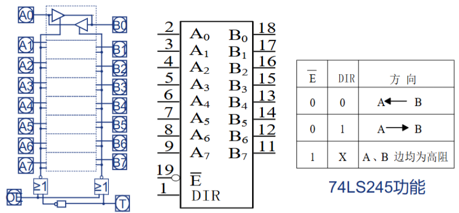
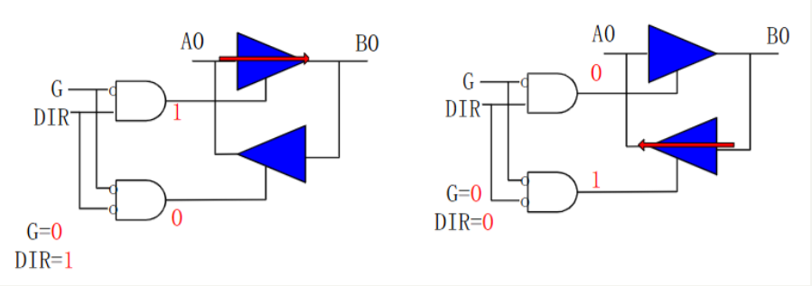
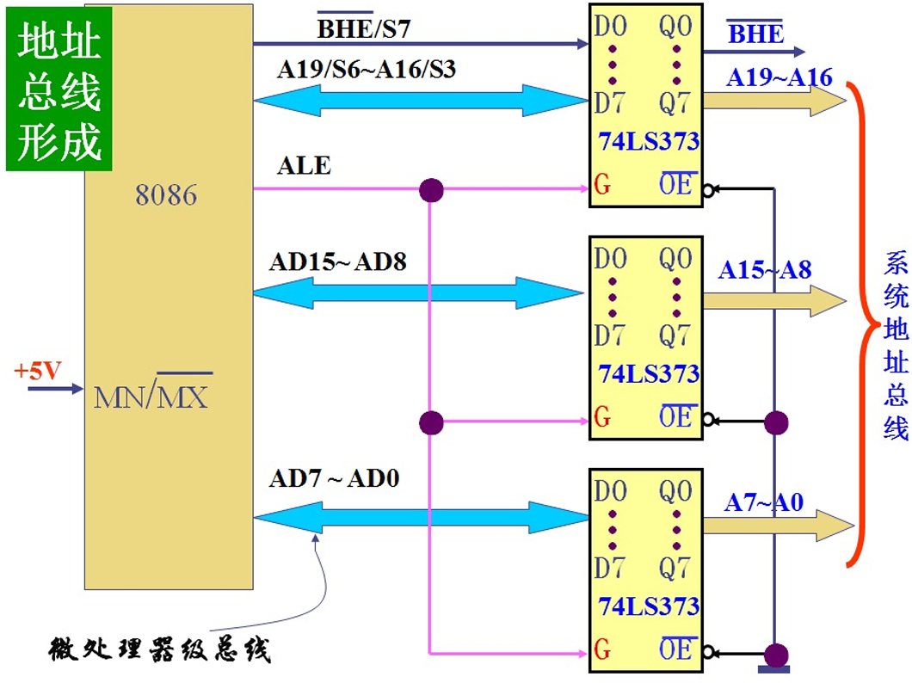

# 总线概述

微处理器（CPU）、主存（ROM、RAM）以及I/O接口是通过一组==共享的、并行的电子通路==连接的。这种将所有功能部件连接到一组公共信息传输线上的结构，就是**总线拓扑结构 (Bus Topology)**。

在这种结构中，CPU通常作为**总线主控设备**，而内存和I/O接口作为**总线从属设备**。（方便以后判断数据方向，主语方向一般是CPU）

## 总线分类

### 按功能划分
#### 地址总线 (Address Bus, AB)

当CPU需要从内存读取数据或向I/O端口写入数据时，首先需要==指明它要操作的具体单元==。CPU将该单元的地址放置到地址总线上。

**地址总线是单向的**（通常是74LS373锁存器）。==CPU是地址的唯一发起者==，它始终是向外输出地址信号。存储器和I/O设备始终是地址的接收者，当发现总线上的地址与自身地址匹配时，才会响应后续的数据或控制信号。

**地址总线的位数决定了寻址范围**，关系是 $N = 2^W$。（**例**: Intel 8086 CPU有**20位**地址信号。因此，其物理寻址范围为 $2^{20}$ 个字节，即 1,048,576 字节，也就是 **1MB** 物理地址空间。）
#### 数据总线 (Data Bus, DB) 

在CPU、存储器和I/O设备之间**传送数据信息**的通道。**双向传输**。
    
- **写操作**: CPU作为主设备，将数据输出到数据总线上，目标设备从总线读取该数据。
        
- **读操作**: 目标设备作为响应，将数据输出到数据总线上，CPU从总线读取数据。

> [!note] 三态逻辑 (Tri-state Logic)
> 双向传输时通常采用**双向三态形式**。
>
> 由于多个设备（CPU, RAM, I/O）都可能需要向数据总线输出数据，为防止**总线冲突**（即多个设备同时驱动总线导致信号线之间短路），所有连接到数据总线的设备都必须具备**三态**输出能力（即高电平、低电平、高阻态 HZ）。
>
> 当设备未被选中时，其数据总线接口处于**高阻态**，相当于在电气上与总线断开。

数据总线宽度通常与微处理器的字长一致，表示在一个总线周期内可以传送的数据位数（比如16位处理器、32位处理器）。
#### 控制总线 (Control Bus, CB)

CPU用于**协调和同步**所有总线操作的信号集合。控制总线是**一组异质化的控制信号线**的统称。

传送方向由具体控制信号来定，其位数也由系统的实际控制需要来定。

例如：

| 信号名称            | 方向   | 描述                |
| --------------- | ---- | ----------------- |
| `RD#`/ `WR#`    | 单向   | CPU -> 设备 (读、写使能) |
| `INTR`/ `READY` | 单向   | 设备 -> CPU (中断、就绪) |
| `HOLD`/ `HLDA`  | 双向交互 | CPU 与设备之间的总线握手信号  |
### 按位置划分
#### 片内总线

IC内部的信息通路，用于连接该芯片内部的各个功能单元（如`寄存器`与`寄存器`之间、`寄存器`与`ALU`之间的连接）

**封装在芯片，内部不可见**。设计、宽度和协议由芯片制造商（如Intel, ARM）在设计芯片时固定。
#### 片总线 (Chip Bus / Component-level Bus)

连接同一块插件板（电路板，**PCB**）上各个芯片的总线。

常见片总线协议：

| 总线标准       | 全称                                          | 特点与用途                               |
| ---------- | ------------------------------------------- | ----------------------------------- |
| **I²C **​  | Inter-IC                                    | 低速、用于连接微控制器和外围芯片（如EEPROM、传感器）的串行总线。 |
| **SPI **​  | Serial Peripheral Interface                 | 短距离、高速的芯片间串行通信的总线。                  |
| **UART **​ | Universal Asynchronous Receiver/Transmitter | ==异步串行==通信的逻辑标准                     |

#### 内总线 (Internal Bus / System Bus)

连接微机系统中**各个插件板**（显卡、声卡、网卡）与**系统板（主板）** 之间的总线。

是微机系统中最总要的总线，==通常所说的总线就是这种总线==。CPU插件板、内存插件板、I/O插件板通过一个共享的`内总线`（如主板插槽）进行互连。

###### 外总线 (External Bus / Communication Bus)

微机系统和外部设备之间进行互连的总线。

与外部的、独立的硬件设备进行通信（传输距离更长、环境更复杂，速率通常远低于内总线）。

常见外总线：

| 总线标准          | 类型    | 描述                     |
| ------------- | ----- | ---------------------- |
| **IEEE-488**​ | 并行外总线 | 一种（已过时）用于连接仪器仪表的并行外总线。 |
| **RS-232C**​  | 串行外总线 | 一种经典的串行外总线（通信端口）。      |
| **USB**​      | 串行外总线 | 现代标准的串行外总线。            |
## 总线性能与标准

### 总线性能

#### 总线宽度 (Bus Width)

就是数据总线的位数，决定了在一个总线周期内，能够并行传输的数据位数。

#### 总线频率 (Bus Frequency)
    
总线的==工作时钟频率==（单位为Hz），表示每秒总线可以执行多少次数据传输。

#### 传输速率 (Transfer Rate, 也称为总线带宽)**:
    
衡量总线性能的最终指标，表示==单位时间内总线可传输的数据总量==（单位为**MB/s**）。

三种性能总关系：
$$\text{传输速率} = (\frac{\text{总线宽度}}{8}) × \text{总线频率}$$
# 常用芯片

| 型号           | 功能描述             |
| ------------ | ---------------- |
| **74LS244**​ | 单向三态缓冲器/驱动器      |
| **74LS245**​ | 双向三态缓冲器/驱动器（收发器） |
| **74LS373**​ | 带有三态输出的锁存器       |

## 74LS244

该芯片的数据流向是固定的，只能从 `A` 输入端流向 `Y` 输出端。（实际上用的挺少）

	*74LS244*

八路驱动器，内部集成了8个三态门，可以一次性处理8位数据。

8路分为两组（Group 1: `1A1-1A4` -> `1Y1-1Y4`，通过 `1G` 控制使能；Group 2: `2A1-2A4` -> `2Y1-2Y4`，通过 `2G` 控制使能），两个使能端是**低电平有效**（从反相泡可以看出来）。

其单向特性与地址总线和部分类型的控制总线匹配，同时，作为驱动器可以增强信号的驱动能力（从CPU里面出来的信号波形不是很完整）。

## 74LS245

也被称为**收发器**。在两个数据端（`A0` 和 `B0`）之间，==并联了两个方向相反的单向三态门==。

*74LS245*

*内部结构，相反三态门*

拥有两个控制信号：

- **`E` (Gate Enable)**: **全局使能信号**。决定整个双向通道是工作，还是处于高阻态，依然是低电平有效。
    
- **`DIR` (Direction)**: **方向控制信号**。在通道被`E`使能时，选择数据是`A->B`传输，还是`B->A`传输。

## 74LS373

*74LS373*

由两个独立逻辑单元组成：

1. **D型锁存器**: ==存储/保持数据==。（由`G`控制。使能时，锁存器处于**透明** 状态，输出`1Q`跟随输入`1D`的逻辑电平变化；非使能时，锁存器被关闭，保存上一瞬间`1D`上的逻辑状态。）
    
2. **三态输出门**: 负责控制数据是否被驱动到输出总线。（由`OE`控制使能是传输还是高阻态）

# 8086 引脚以及工作方式

CPU必须通过==物理引脚==与外部的逻辑部件完成信息的交换。
## 总线复用

8086 一共的40个引脚不足以承载20位地址总线和16位数据总线及其他的控制线。

*8086两种工作方式及引脚复用说明*

8086采用了**分时复用** 技术：

- `AD0` - `AD15`  (Pin 2-16, 39):  ==地址/数据==复用总线，

	- 在总线周期的T1，传递地址总线低16位 (A0-A15)；

	- 在总线周期的T2-T4，转而用作数据总线 (D0-D15)。

- `A16/S3` - `A19/S6` (Pin 35-38): ==地址/状态==复用总线。

	- 在总线周期的T1，传送地址总线高4位 (A16-A19)（构成20位完整地址）；

	- 在总线周期的T2-T4，转而输出CPU的内部状态信号 (S3-S6)。

### 双工作模式

即使复用了地址和数据总线，剩余的引脚仍不足以同时支持简单系统（CPU自行控制）和复杂系统（多处理器协同工作）所需的两套不同的控制信号。

8086使用 `MN/MX#`（Pin 33）来切换CPU的工作模式，使Pin 24-31具有双重功能。

#### 最小方式

 `MN/MX#` 连接到高电平（`Vcc`）时激活。

CPU==自行产生总线控制信号==（引脚24-31直接输出控制信号，例如 `INTA#` (中断应答), `ALE` (地址锁存允许), `RD#` (读), `WR#` (写), `M/IO#` (内存/IO选择) 等）

适用于**单处理器** 系统，CPU直接控制总线，无需外部总线控制器。

#### 最大方式

 `MN/MX#` 连接到低电平（`GND`）时激活。

CPU不直接产生控制信号，而是==输出编码后的状态信号==，用于多处理器系统的总线仲裁。
 
- 引脚24-31被重定义：

	- `S0#`, `S1#`, `S2#` (26-28): CPU输出编码的状态。系统必须外接一个8288，由8288来解码状态信号，并生成系统总线控制信号（`RD#`, `WR#`, `ALE`等）。
	
	- `RQ#/GT0#`, `RQ#/GT1#` (30-31): 请求/准许信号。用于总线仲裁的信号，例如允许`8087`数学协处理器请求并获得总线的控制权。
	
	- `LOCK#` (29): 总线锁定信号，用于保证多处理器环境下的原子操作。

## 8086 最小方式系统总线结构

### $CLK$

对于8086/8088系统，时钟信号是由外部的专用芯片提供的。（`8284A` 时钟发生器，接收来自晶振的原始频率，经过分频和整形后，向CPU提供稳定的时钟脉冲）

对于8086/8088，==时钟信号占空比为33%时是最佳状态==。

#### 工作频率

- **标准版**: `8086` 和 `8088` 的最高标准主频为 **5MHz**。
    
- **高速版**: 随着半导体工艺的改进，Intel推出了更高频率的版本。
    
    - `8086-2`: 主频 **8MHz**。
        
    - `8086-1`: 主频 **10MHz**。
        
（与现代CPU命名习惯不同，数字越小代表频率越高或版本越新，8086-1是性能最强的版本）

#### 时序概念

- **时序**: 信息在总线上的出现不仅要有==空间顺序==，还要有==严格的顺序和准确的时间==。这种时间和逻辑上的配合关系被称为时序。

- **时钟**: 由时钟发生器产生的具有固定频率和占空比的脉冲序列。是整个微机系统的时间基准，所有部件的动作都必须与此信号同步。

- **主频**: 时钟的频率，衡量CPU处理速度的一个指标。

- **时钟周期**: 主频的倒数（$T = 1/f$）。

- **总线周期**: CPU通过总线对存储器或I/O端口进行==一次完整的访问（读或写）所需的时间==。

   一个基本的总线周期==需要至少4个时钟周期==（即4个T状态，通常标记为T1, T2, T3, T4）。

| 状态/周期          | 描述                                                               |
| -------------- | ---------------------------------------------------------------- |
| **T1 状态**​     | CPU输出地址。                                                         |
| **T2 状态**​     | CPU输出控制信号，总线切换方向。                                                |
| **T3 状态**​     | 数据准备/传输。                                                         |
| **T4 状态**​     | 总线周期结束。                                                          |
| **Tw (等待状态)**​ | 实质上是**延长了T3状态**，给慢速设备提供额外的时间。设备准备好后，拉高 `READY`，CPU进入T4结束周期。      |
| **Ti (空闲状态)**​ | 执行完一个总线周期，且内部指令队列已满或正在执行一条耗时较长的指令（如乘法），不需要立即访问总线时，总线接口单元会进入空闲状态。 |

### $ALE$

*ALE信号工作示意*

地址锁存允许信号，高电平表示地址线的地址信息有效。利用它的下降沿控制74LS373锁存器（其实就是低电平开启锁存器的`G`使能）把地址信号和BHE信号锁存在地址锁存器。

*地址总线*

### $\overline{BHE}$

低电平有效，表示使用高8位数据线。

| 操作          | BHE | A₀  | 使用的数据引脚                                                                                                     |
| :---------- | :-: | :-: | :---------------------------------------------------------------------------------------------------------- |
| 读或写偶地址的一个字  |  0  |  0  | AD15~AD0                                                                              |
| 读或写偶地址的一个字节 |  1  |  0  | AD7~AD0                                                                               |
| 读或写奇地址的一个字节 |  0  |  1  | AD15~AD8                                                                              |
| 读或写奇地址的一个字  |  0  |  1  | **第一个总线周期**：AD15~AD8（传输低位数据字节） **第二个总线周期**：AD7~AD0（传输高位数据字节） |
### $DT/\overline{R}$ & $\overline{DEN}$

- $DT/\overline{R}$ 控制数据传输方向；控制74LS245的传送方向

- $\overline{DEN}$ 控制数据有效时间；控制74LS245的输出允许

*数据总线构成*

### $\overline{RD}$ & $\overline{WR}$

### $M/\overline{IO}$

# 8086 的总线时序

