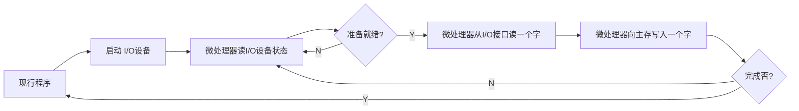
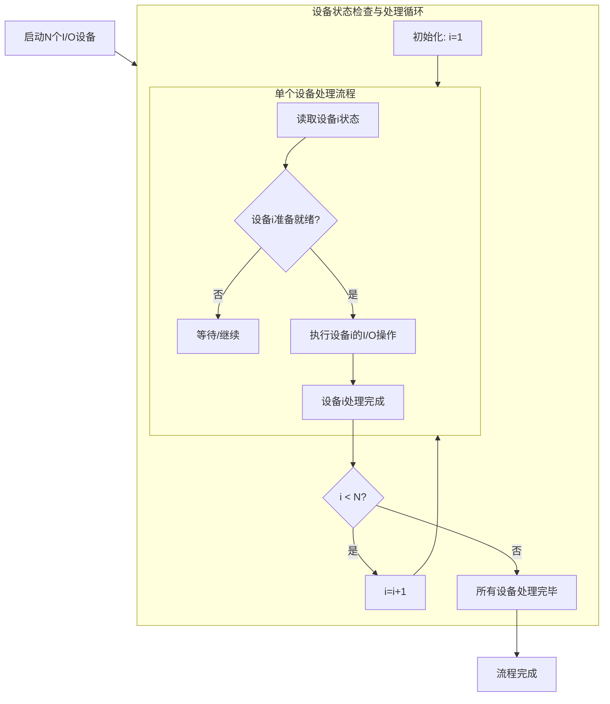
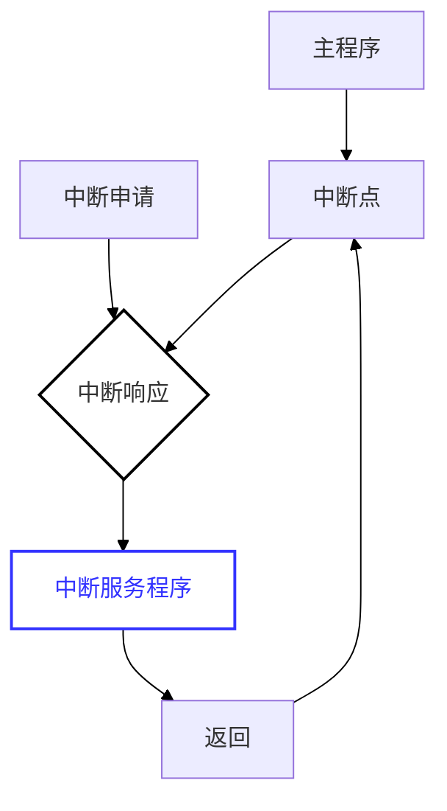
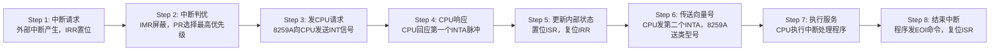
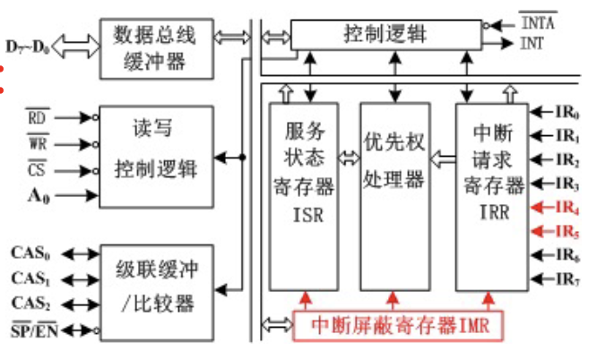
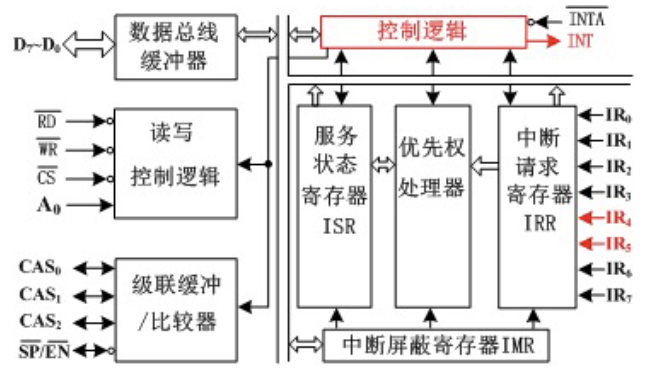
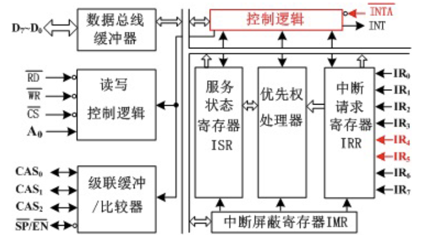
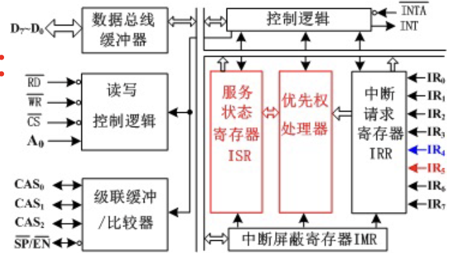
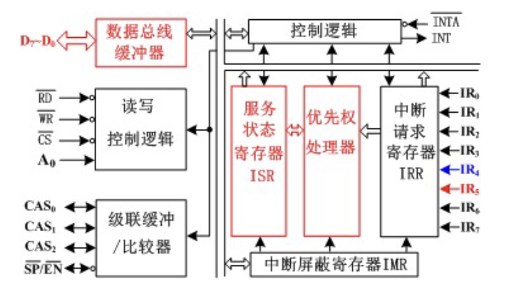

# I/O 接口概述

无论是对内存还是对外设，CPU的核心操作逻辑本质上都是==读与写==。

| 指令  | 格式             | 功能描述               | 用途            |
| --- | -------------- | ------------------ | ------------- |
| IN  | `IN DST, SRC`  | 从外设端口读取数据，送入CPU寄存器 | 输入操作，外设 → CPU |
| OUT | `OUT DST, SRC` | 将CPU数据发送到外设端口      | 输出操作，CPU → 外设 |

**核心作用**：对信号进行转化或储存，使其符合CPU的总线规范，供CPU使用。

|   功能   |                                            说明                                             |
| :----: | :---------------------------------------------------------------------------------------: |
|  地址选择  |                                       选择输入或输出的外设设备                                        |
|  控制功能  |                                        启动、停止或复位外设                                         |
|  状态指示  |                                        解决时序不匹配问题。                                         |
|  速度匹配  |                                        解决速度不匹配问题。                                         |
| 转换信息格式 |                                        解决信息格式不匹配问题                                        |
|  电平转换  | CPU通常使用TTL/CMOS电平（如0V-5V），而外设（如RS-232接口）可能使用不同的电压标准（如±12V）。接口电路负责==将双方的电压信号调整到对方可接受的范围内== |
|  可编程性  |                                         提高硬件的通用性                                          |

## I/O 软硬件

### I/O 硬件

一共三个组成部分：控制部件、设备实体、接口电路

|     类别      |                   功能                    |                                          示例                                          |
| :---------: | :-------------------------------------: | :----------------------------------------------------------------------------------: |
| **I/O控制部件** | 完成对输入和输出操作过程的控制，实现内存与外设间的数据直接传输而无需CPU干预 |                                   `中断控制器`、`DMA控制器`                                   |
|  **I/O设备**  |         I/O操作的终端实体，负责数据的实际采集或呈现         | **输入设备**：`键盘`、`鼠标`<br>**输出设备**：`显示器`、`打印机`<br>**存储设备**：`硬盘机`<br>**其他**：`调制解调器`、`扫描仪` |
|  **I/O接口**  |      实现I/O设备和系统总线的连接，作为设备与总线之间的中间件      |                                                                                      |

### I/O 软件

I/O软件是建立在I/O硬件基础之上的，硬件提供了物理通路，而==软件发出指令==才能启动数据传输。

| 层次                   | 描述                                                                                |
| -------------------- | --------------------------------------------------------------------------------- |
| **I/O 指令编写的输入/输出程序** | 最底层的控制方式。直==接使用指令集中的I/O指令==（如x86架构中的`IN`、`OUT`指令）来编写程序，对端口进行读写。                   |
| **OS  中的有关管理模块**     | 较高层级的抽象。现代操作系统（OS）会提供设备驱动程序和I/O管理子系统，应用程序通常不直接操作硬件，而是通过==调用操作系统的管理模块==来间接完成I/O操作。 |
## 接口电路的作用

CPU是纯电子的、高速的、数字化的、同步的核心部件；而外设则是复杂的、低速的、可能包含机械结构的部件。两者在物理属性和工作模式上存在巨大的差异。接口电路的存在，就是为了==抹平这些差异==，让CPU能够像访问内存一样方便地访问外设。

### 外设与CPU之间的主要矛盾

##### 速度不匹配

I/O设备的工作速度通常要比CPU**慢许多**。CPU是纳秒级的，而外设（如机械硬盘、键盘）可能是毫秒甚至秒级的。

> **解决方案**：接口电路内含==缓冲器==或==锁存器==，用于暂存数据。

##### 时序不匹配

各个I/O设备都有自己的**定时控制电路**，按照自己的时钟频率和速度传输数据。外设无法与CPU的系统时钟取得统一。即外设是==异步工作==的，而CPU通常是==同步工作==的。

>  **解决方案**：接口电路负责进行==握手信号==的处理，通过查询状态或中断机制，协调双方的传输时机。

##### 信息格式不匹配

- **传输方式：** 分**串行**和**并行**两种。CPU数据总线通常是并行的，而许多外设（如鼠标、网络）是串行传输的。
    
- **编码格式：** 包含二进制格式、ASCII编码（字符设备常用）、BCD编码（数码显示常用）等。

##### 信息类型不匹配

外设中有些使用**数字信号**（如键盘），而有些是**模拟信号**（如麦克风的声音输入、温度传感器的电压输出）。CPU只能处理数字信号。

## I/O 接口分类

|  分类维度  |   类型   |             描述             |       特点       |
| :----: | :----: | :------------------------: | :------------: |
| 数据传送方式 |  并行接口  |          数据各位同时传输          |    短距离、高速传输    |
|        |  串行接口  |          数据按位顺序传输          | 长距离传输，需要较少的传输线 |
|  通用性   |  通用接口  |       设计用于多种标准设备的接口        |    如USB、打印口    |
|        |  专用接口  |       为特定设备专门设计的接口电路       | 功能专一，针对特定设备优化  |
|  可编程性  | 可编程接口  |  其功能和工作方式可以通过CPU写入控制字来改变   |    微机接口的主流     |
|        | 不可编程接口 |  逻辑固定，功能单一，接线后无法通过软件更改模式   |   结构简单，成本较低    |
|  复杂性   |  芯片式   |      接口功能集成在单一的IC芯片中       |    集成度高，体积小    |
|        |  卡槽式   | 接口电路做成独立的电路板（扩展卡），插入主板的插槽中 |  扩展性强，便于升级维护   |
## I/O 接口的内部组成

CPU与I/O设备交换的信息主要有三种：**数据信息、控制信息、状态信息**。这三种信息分别由接口内部的三种寄存器（是三种不是三个，光是控制寄存器就有好多）处理：


*I/O 接口的逻辑组成*

| 信息类别 |   处理部件    |    核心功能     |
| :--: | :-------: | :---------: |
| 数据信息 |   数据寄存器   |  暂存数据，速度匹配  |
| 状态信息 |   状态寄存器   | 状态指示，供CPU查询 |
| 控制信息 |   控制寄存器   |  控制功能，可编程性  |
| 控制逻辑 | 地址选择与控制逻辑 |  地址译码，读写控制  |

# I/O 接口的编址方式

## 概述

### 编址对象及编址数量

>[!note] I/O 端口和 I/O 接口
> | 概念 | 本质 | 关键特性 |
> |------|------|----------|
> | I/O接口 | 物理==系统==或集成电路 | 物理实体，如插槽、芯片 |
> | I/O端口 | 接口内部的==寄存器== | 逻辑单元，是接口电路内部的数据/状态/控制寄存器 |
> 
>  **关系**：接口包含多个端口，==每个端口有自己固定的地址单元==，CPU直接寻址端口，地址指向端口而非整个接口芯片。

每个端口都需要一个独立的地址，**一个I/O接口有几个端口，就说明该I/O接口至少占用几个地址**。

### 编址方式分类

| 编址方式 |   代表处理器   |         核心描述          |            关键特点             |
| :--: | :-------: | :-------------------: | :-------------------------: |
| 独立编址 | 8086/8088 | CPU开辟两个平行的地址空间：内存和I/O | 有专用控制信号（如M/IO#）或指令（如IN/OUT） |
| 统一编址 |  C51 单片机  |    I/O端口被视为内存的一部分     |       使用通用访存指令（如MOV）        |
## 独立编址

**同一个地址，有可能指向I/O，也有可能指向存储器**。仅凭地址码本身无法区分CPU意图访问的是内存条还是接口芯片。需通过控制总线上的特定信号来区分：


*独立编址逻辑电路图*

|     引脚状态      | M/IO# = 高 (内存访问) | M/IO# = 低 (I/O访问) |
| :-----------: | :--------------: | :---------------: |
| RD#低有效, WR高无效 |       内存读        |       I/O读        |
| RD高无效, WR低有效  |       内存写        |       I/O写        |

**8086/8088系统是典型的独立编址方式**。这一特征一直延续至今天的x86 处理器。

|    系统     | I/O地址线 |         寻址空间         |   I/O地址范围   |
| :-------: | :----: | :------------------: | :---------: |
| 86/8088系统 |  16根   | $2^{16}=64\text{KB}$ | 0000H-FFFFH |
|  PC/XT系统  |  10根   | $2^{10}=1\text{KB}$  |  000H-3FFH  |

### 优缺点

#### 优点

- **存储空间最大化**：I/O不占用内存地址，**存储器的容量可以达到与地址总线所决定的地址空间相同**。

- **总线效率：** **访问I/O端口时的地址位数较少**，可提高总线的利用率。
#### 缺点

- **指令系统复杂：**  CPU**必须设置专门的I/O指令**来访问这些特定的地址空间。
    
- **硬件设计复杂：** 增加了指令系统的复杂性，同时也意味着CPU内部需要针对I/O指令设计独立的控制逻辑。

## 统一编址

也称为“**存储器映射编址**”，即把 I/O 端口看作是内存地址空间的一部分，将其映射到某一段特定的内存地址上。

### 优缺点

#### 优点

- **无需专用指令：** CPU可以使用指令集中所有访问内存的指令（如 `MOV`, `ADD`, `AND`, `OR` 等）来操作I/O端口。
        
- **硬件控制简化：** CPU在硬件上无需专门的控制线区分寻址内容。统一使用存储器读写信号即可。

#### 缺点

- **挤占内存空间：** I/O端口占用了存储器的一部分地址空间，导致系统可用的实际存储器容量减少。

- **指令执行效率降低、总线负载增加：** 这回访问存储器和访问I/O端口必须使用相同位数的地址了，这会增加**总线中传送的信息量**，可能导致执行速度相对较慢（相比于短小的专用I/O指令）。

# I/O 接口的基本工作方式

## 概述

输入/输出的控制方式是指==以某种方式控制==计算机的主机（主要是微处理器）与I/O接口之间进行==数据传送==，其根本区别在于**CPU与外设并行工作的程度**不同：

| 并行度 |    工作特点    | 效率  |
| :-: | :--------: | :-: |
|  低  |  CPU等待外设   |  低  |
|  高  | CPU与外设同时工作 |  高  |

### 分类

微型计算机中有四种标准的控制方式：

- **无条件传送方式（Unconditional Transfer）**     

- **程序查询方式（Programmed I/O / Polling）：** CPU不断==查询外设状态==。

- **I/O中断方式（Interrupt-driven I/O）：** 外设主动请求服务。

- **DMA方式（Direct Memory Access）：** 硬件直接接管总线进行传输。

>[!danger] 任何时候分析输入输出操作，都是以CPU为主语地位进行分析

## 无条件传送方式

又称同步传送方式（并非时钟同步，而是外设的动作必须==严格跟随CPU的指令执行时间==），CPU 无需查询I/O 设备的状态，而是直接可以执行 I/O 指令进行读写。

**前提条件**：I/O设备必须可以在微处理器限定的时间内==随时准备就绪==。（适用于简单设备，如：物理开关、发光二极管等）

### 无条件传送输入


*无条件传送输入电路图*

**工作流程：**

- 当CPU需要读取开关状态时，发出读信号。（这时外设的数据已经准备好，且已经输入三态缓冲门）
        
- 译码器选中LS244（三态缓冲器）的使能端（1G/2G）。

- LS244导通，将外设的数据直接投放到**数据总线**上供CPU读取。

### 无条件传送输出


*无条件传送方式输出电路*

同理，先把数据通过数据总线给到锁存器输入端，再把根据地址信号和 MIO 和 WR 相与之后，选通锁存器，把输出信息给锁存器保留。

**锁存器芯片（74LS373）**：起到了==时间展宽==的作用。能捕捉CPU瞬间发出的数据，并将其**保持**在输出端，为外设提供持续稳定的控制信号，从而保障==快速CPU==与==慢速外设==的速度匹配。

>[!warning] 课堂例题
>设计一个控制8个LED的输出接口，并设计汇编程序驱动:
>
>- **系统环境：** PC/XT系统总线。
 >
> - **分配地址：** **280H**（注意和前面总线与CPU连接的知识点结合，`280H = 10 1000 0000 B`，即A9,A7用NAND连接，剩下地址位用OR门连接）。
>
> - **核心芯片：** **74LS374**。
   > 
> - **外设：** 8个发光二极管（LED）。

```assembly
MOV DX,280H.     ;设置为输出端口地址

LOP:MOV AL,0FFH
	OUT DX,AL    ;使8个LED亮

	CALL DELAY1S ;调用1s延时子程序
	
	MOV AL,00H
	OUT DX,AL    ;使8个LED灭

	CALL DELAY1S
JMP LOP
```

## 程序查询方式

也称为：**异步传送方式**，或**有条件传送方式**（CPU与外设之间不需要严格的时钟同步，CPU通过==读取状态位==来确认外设的进度，传送的执行是有前提条件的：即外设必须处于==“准备就绪”状态==）


### 多外设轮询机制



首先**读取I/O设备1的状态（这里隐含外设设备的优先级）**，如果设备1**准备就绪（Y）**，则执行设备1的工作，完成后返回继续查询或进入下一轮，直到设备 1 的操作完成后，开始处理设备 2 的工作。

如果设备1未就绪，CPU不等待，立即转向设备2的状态。依次类推，直到查询完设备N，然后再回到设备1，形成一个大的循环。

### 优缺点

**缺点：** 

- **CPU 效率极低**：当I/O设备没有准备好时，CPU被困在查询循环中，无法执行其他有用的计算任务。

- **实时性差**：如果CPU正在处理设备1，或者刚查过设备2（未就绪）转而去查设备3，此时设备2突然就绪了，它必须等到CPU==完成一整轮查询回到设备2时才能被服务==。

## I/O 中断方式


- **中断触发**：只有当I/O设备==准备就绪==（例如键盘被按下、打印机打印完毕）且==向CPU发出中断信号==时，CPU才会暂停当前的主程序。

- **中断服务程序**：CPU响应中断，跳转去执行一段专门处理该外设的程序（即==中断服务程序==），完成数据传输。
    
- **返回：** 服务完成后，CPU返回主程序继续执行（第K+1条指令）。

### 优缺点

**优点：**
    
- **效率提升：** ==CPU和外设并行工作==，消除了查询方式中的忙等待。
        
- **多设备支持：** 当系统中有多个外设同时请求服务时，可以通过**硬件排队电路**（判断谁先谁后）和**中断屏蔽寄存器**（决定是否理会某个中断）来进行灵活的选择和管理。
        
- **实时性：** 外设一旦就绪就能主动打断CPU，相比于轮询等待，CPU对突发事件的响应速度更快。
        
**缺点：**
    
- **复杂度增加：** 中断方式需要复杂的**软、硬件设计**。

## DMA 方式

专门用于==高速、大数据量==的数据传输场景。有时数据并不需要经过 CPU 而是直接存到内存就好。在传送过程中，CPU完全释放总线控制权，不执行传送指令。

在DMA传送期间，**DMA控制器取代CPU成为总线的主人：**。


DMA 控制器向 CPU 发送 `HOLD`（总线请求信号）,CPU 允许之后，给出 `HLDA`（总线响应信号）表示同意让出总线。此时，CPU的三态门呈现==高阻态==（断开连接）。

### 工作流程

#### DMA 初始化

CPU执行主程序中的I/O指令，启动输入设备。CPU需要对**DMA控制器（DMAC）** 进行初始化设置，将以下信息写入DMAC 的内部寄存器中：

1. **主存的起始地址**：数据要存放在内存的哪个位置。写入 DMAC 的地址寄存器。

2. **数据块的字数**：传输数据的总量。

3. **DMA 的工作方式**：配置传输模式（如输入还是输出、突发传输还是周期挪用）。

#### 数据准备与请求

输入设备（如磁盘接口）从外部介质读取到数据并准备就绪后，首先将这一个字节的数据写入**DMA控制器的数据缓存器**中，随后，输入设备向DMA控制器发送一个**DMA请求（`DREQ`）** 信号，正式提出数据传输申请。

#### 总线握手

DMAC 和 CPU 互发 `HOLD`  和 `HLDA`信号，总线控制权交给 DMAC。

#### 数据传送

常规数据总线操作：发地址 - 放数据 - 写命令。

完成一次传送之后，DMAC 的字计数器-1，并将地址寄存器的地址+1，向输入设备发出应答（`DACK`），表示当前字传输完毕。

#### 循环与结束

只要计数器不为0，DMA控制器就会继续处理下一个字节的请求。结束后，DMAC 通过中断的方式通知 CPU，同时撤销 `HOLD` 信号。

### 优缺点

效率很高。

# 可编程中断控制器 8259A

## 中断

### 概念



中断是指CPU暂时停止正在执行的主程序，转而去执行处理“中断事件”的程序（即中断服务程序）。待处理完那个突发事件后，CPU必须能自动==返回到原被中断的程序处==继续执行。

#### 中断源分类


*80x86的中断源*

|          中断分类          |     子类别      |           触发因素           |            示例            | 可屏蔽性 |
| :--------------------: | :----------: | :----------------------: | :----------------------: | :--: |
|  **外部中断源<br>(硬件中断)**   | 可屏蔽中断 (INTR) |       可通过软件设置标志位忽略       |    硬盘I/O完成、键盘按键、鼠标移动     | 可屏蔽  |
|                        | 非可屏蔽中断 (NMI) |  极为重要的硬件异常信号，CPU必须立即处理   |   电源掉电预警、内存奇偶校验错误、硬件故障   | 不可屏蔽 |
| **内部中断源<br>(软件中断/异常)** |    除法错中断     | CPU执行除法指令时，除数为0或商溢出寄存器容量 |  `DIV` 或 `IDIV` 指令除数为0   | 不可屏蔽 |
|                        |     单步中断     |  用于程序调试，CPU每执行一条指令后自动产生  |    调试器设置==陷阱标志(TF)==     | 不可屏蔽 |
|                        |     断点中断     |    用于程序调试，在指定代码位置暂停执行    | `INT 3` 指令 (操作码为 `0xCC`) | 不可屏蔽 |
|                        |    运算溢出中断    |  算术运算结果溢出，且溢出标志位(OF)被置1  |      `INTO` 指令检测溢出       | 不可屏蔽 |
|                        |     软中断      |   由程序代码中显式写入的中断指令主动调用    |   `INT n` 指令 (n为中断向量号)   | 不可屏蔽 |
#### 中断类型号

为了让CPU识别不同的中断源，系统给每个中断源（只是被分成了 6 类，实际上中断源有很多）分配了一个编号。这个编号通常是一个==二进制编码（8位，0-255）==，称为中断类型号。

#### 中断向量表

存放在存储器中的一张表。位于内存从00000H开始的==最低地址区==，共占用1024个单元（00000H - 003FFH）。存放了==256个中断服务程序的入口地址==（每个中断入口都有2字节段地址CS + 2字节偏移地址IP）。

#### 中断断点

断点不是当前正在执行的指令地址，而是==即将执行、但由于中断而没有被执行的那条指令==（即当前指令的下一条指令）的地址。

在跳转到中断服务程序之前，CPU会自动将这个断点地址（CS和IP值）==压入堆栈保存==。
#### 中断服务程序

处理中断事件的程序段被称为**中断服务程序（Interrupt Service Routine, ISR）**。

**中断程序和子程序的区别**：

| 特性       | 子程序 (Subroutine)          | 中断服务程序 (ISR)           |
| :------- | :------------------------ | :--------------------- |
| **调用方式** | 程序主动调用（如 `CALL` 指令）       | 外部事件或内部异常触发（硬件或软件中断）   |
| **确定性**  | **确定、可预测**（调用时机和位置在程序中固定） | **不确定、随机**（事件发生时间不可预知） |
| **调用者**  | 程序员/程序自身                  | 外部硬件、异常条件或特定指令         |
| **响应方式** | 程序**主动执行**                | CPU**被动响应**            |

#### 中断系统

中断系统并非单一的部件，而是为了实现计算机的中断功能而配置的==相关硬件和软件的集合==。

##### 组成

- **硬件：** 包括CPU内部的中断逻辑、外部的==可编程中断控制器（如8259A）==、以及外设接口中的==中断请求电路==。
        
- **软件：** 包括中断向量表、中断服务程序（ISR）以及初始化程序。

##### 功能

- **中断响应**：就是正常的接受中断请求 - 调用中断服务程序 - 返回断点。

- **中断优先权排队**：多个中断源同时提出中断申请，CPU 按照优先级分别处理。

- **中断嵌套**：中断处理过程中，有新的优先级更高的中断请求，CPU 于是暂停当前中断服务，转而响应更高优先级的中断

### 工作方式优点

1. **并行处理能力：** CPU可以在外设进行I/O操作的==同时继续执行主程序==，实现了CPU与外设的**并行工作**，极大提高了系统效率。
        
2. **实时处理能力：** 系统能够对外部突发事件（如传感器信号、网络数据包）做出**即时响应**，满足实时控制系统的要求。
        
3. **故障处理能力：** 利用内部中断（如除法错、溢出），系统可以在运算出错时自动跳转到错误处理程序，避免死机，提高了系统的**可靠性**。
        
4. **多道程序或多重任务的运行：** 现代操作系统的基础。通过**定时器中断**，系统可以周期性地打断当前任务，切换到另一个任务，从而在单核CPU上实现“同时”运行多个程序的效果（==多线程原理==）。

### 中断管理


*多重中断处理时序*

### 中断过程


#### 中断源请求中断


不同中断源请求中断流程图，部分中断源可被禁止（CLI），屏蔽（MASK），嵌套。
#### CPU 进行中断响应

##### 响应条件

CPU并不是一收到信号就立刻停下，而是需要满足一定的条件：

- **对于内部中断**：等到当前指令执行结束

- **对于 NMI** ：

	1. 总线控制权还在 CPU 手里，没有被 DMA 等占用
	2. 等到当前指令执行结束

- **对于 INTR** ：

	1. CPU 处于中断允许状态
	2. 没有更紧急的 NMI 和其他的总线请求
	3. 当前指令执行结束
##### CPU 的中断响应周期


*中断响应周期*

- **PSW, CS, IP入栈：** 保存标志寄存器（PSW），当前主程序的断点地址（代码段寄存器CS和指令指针IP），以便将来返回。

- **清除IF：** CPU自动将IF置0，进入关中断状态。意味着==在进入ISR的初期，默认是禁止响应其他可屏蔽中断的==（为了防止混乱）。
    
- **清除TF：** 避免在调试模式下对ISR进行单步跟踪。

#### 中断服务程序

##### 保护现场（`PUSH`）

除了CPU自动保存的PSW/CS/IP外，程序员必须==手动==保存ISR中会用到的==通用寄存器（如AX, BX等）==，防止破坏主程序的数据。如果不存，ISR运行完后，主程序里的寄存器值就被篡改了，程序就会跑飞或出错。

```assembly
PUSH AX;
PUSH BX;
PUSH CX;
PUSH DX;
PUSH SI;
PUSH DI;
PUSH SP;
PUSH BP;
```

##### 开中断（`STI`）

将标志寄存器中的**IF置1**。这使得CPU在执行当前中断服务程序时，**能够响应级别更高的中断请求**，从而实现**中断嵌套**。

##### 执行 ISR 主体

##### 关中断（`CLI`）

将IF置0。这是为了保证接下来的==“恢复现场”操作是原子性的==，不被其他中断打断，确保堆栈操作的绝对安全。

##### 返回（`IRET`）

#### 中断返回

普通子程序返回用 `RET`，而中断服务程序必须用 `IRET` (Interrupt Return)。

当CPU执行到 `IRET` 时，它会从堆栈中连续弹出三个值，依次恢复给 **IP、CS 和 PSW**（剩下的寄存器需要手动 POP）。

## 8086 的中断系统

>[!note] 8086 中断优先级排序
>**第一梯队**：内部中断
>**第二梯队**：NMI
>**第三梯队**：INTR
>**第四梯队**：单步中断（调试用）

### 8086 的中断类型

#### INTR（外部可屏蔽中断）

通过CPU的 **INTR** 引脚引入，控制权由**标志寄存器（FLAGS）** 中的**中断允许标志位 (IF)** 决定：

- **IF = 0**：关中断状态。微处理器**不响应** INTR引脚上的请求。
    
- **IF = 1**：开中断状态。微处理器**响应** INTR引脚上的请求。

**中断类型码**：8 - 255

由于外部设备众多（键盘、鼠标、打印机等），而CPU只有一个INTR引脚，所以通常由==可编程中断控制器 8259A== 统一管理（8259A会负责向CPU提供中断类型码，其范围通常是 **8~255**）。

#### NMI（外部不可屏蔽中断）

通过CPU的 **NMI (Non-Maskable Interrupt)** 引脚引入，不受中断允许标志位 IF 的控制。

**中断类型码**：2

####  内部中断
|        中断类型        | 中断号 |         触发条件/指令          |           主要用途            |
| :----------------: | :-: | :----------------------: | :-----------------------: |
|      **除法中断**      |  0  | 执行除法指令时，**除数为0**或**商溢出** |          处理算术异常           |
|      **单步中断**      |  1  |  **陷阱标志TF=1**时，每条指令执行后   |        程序调试（单步跟踪）         |
|      **断点中断**      |  3  |     执行 **INT 3** 指令      |        程序调试（设置断点）         |
|      **溢出中断**      |  4  | 执行 **INTO** 指令且**OF=1**  |         检测并处理算术溢出         |
| **INT n<br>（软中断）** |  n  |  执行 **INT n** 指令（n为立即数）  | 调用系统服务/BIOS功能（如`INT 21H`） |
### 8086 的中断向量表


*中断向量查表*

根据中断类型号 n ，CPU自动将 n 乘以 4，得到该中断向量在表中的起始地址（因为是从 0000H 开始的，所以直接乘 4 即可）。

|    内存地址    |  存储内容   |
| :--------: | :-----: |
| **4n + 0** | IP 的低8位 |
| **4n + 1** | IP 的高8位 |
| **4n + 2** | CS 的低8位 |
| **4n + 3** | CS 的高8位 |

### 8086 的中断响应及返回

#### INTR


INTR信号进入CPU内部后，必须经过**CLK的上升沿同步**才能被内部逻辑识别。由于CPU只在每条指令的最后一个时钟周期采样INTR引脚，因此**INTR上的中断请求信号必须保持到当前指令结束**，否则CPU可能在采样时错失该信号。


*中断响应周期时序*

8086响应中断时，会连续执行**两个**中断响应总线周期，**$\overline{\text{INTA}}$ (Interrupt Acknowledge)** 信号会出现了两次低电平脉冲。

- **第一个$\overline{\text{INTA}}$信号**：在第一个周期的T2状态发出，同时将中断请求触发器复位。

- **第二个$\overline{\text{INTA}}$信号**：要求 8259A 在第二个中断总线周期的T3之前把中断向量类型码发送给CPU。

为了确保整个握手过程成功，==INTR信号必须持续高电平，至少维持两个以上的中断响应周期==，直到CPU发回响应信号为止，防止中途掉线。

#### NMI

虽然NMI是紧急信号，但为了防止干扰误触发，8086要求NMI引脚上的请求信号==有效宽度要大于两个时钟周期==。这是一种**硬件滤波**机制。

由于 NMI 的中断向量号固定为 2，所以不需要两个总线周期以及 INTA 来获取，使得响应速度更快。

#### 内部中断

向量号由指令码直接给定，所以也不需要 INTA 的两个响应周期。

## 8259A 及其应用

### 概述

#### 主要功能

1. 多个外部中断请求信号（如IR0-IR7）物理汇聚并连接到CPU唯一的INTR引脚的问题。

2. 解决**CPU如何识别是哪一个中断源发送的中断请求**的问题

3. 多个中断源**同时**申请中断时，8259A必须确定**响应顺序**，保证高优先级的设备先得到服务。

4. 解决**中断屏蔽**与**中断嵌套**的管理问题。

#### 工作特性

 1. **级联扩展能力：**

	- 单片8259A具有**8级优先级**（可以同时管理8个中断源）。
	    
	- 通过**级联**方式，最多可以扩展至**64级**（1片主片+8片从片）。

2. **可编程屏蔽：** 可以通过编程（写入操作命令字）来**屏蔽或开放**接于其上的任一中断源。

3. **自动提供向量：** 8259A 可以在 INTA 周期中自动向 CPU 提供可编程的中断类型号。

4. **多工作模式**：可以通过编程选择各种不同的工作方式（如普通嵌套、特殊嵌套、自动结束、非自动结束等），适应不同的系统需求。

### 内部结构及功能模块


*8259A 引脚及内部结构图*

#### 中断请求寄存器（IRR）

IRR 是一个==8位锁存器==，用来锁存外部设备送来的 **IR7 ~ IR0** 中断请求信号。当外部中断请求线 $IR_i$ 有中断请求时，IRR中与之对应的**第i位被置1**。

这个寄存器的内容**可以被微处理器读出**。这允许CPU在必要时查询当前有哪些设备正在请求服务。

#### 中断屏蔽寄存器 (IMR)

IMR是一个==8位寄存器==，它的每一位（$D_0 \sim D_7$）一一对应外部的中断请求输入线（$IR_0 \sim IR_7$）。

当IMR的第 $i$ 位被置为 **1** 时，对应的外部中断请求线 $IR_i$ 就被**屏蔽**。反之，只有当该位为 **0** 时，中断请求才被允许通过。

IMR是==可编程==的。CPU可以通过输出指令（写操作命令字OCW1）随时修改IMR的内容。

#### 优先级处理器

用于识别和管理各中断请求信号的优先级别。位于IRR（请求登记）和ISR（服务记录）之间，起决策作用。

##### 场景一：多中断同时请求

当几个中断请求信号**同时**出现时，优先权处理器会按照预设的优先级规则（如全嵌套方式下 $IR_0 > IR_1 > \dots > IR_7$）进行比较。

它选中优先权**最高**的那个请求，并将IRR中对应的位清零，同时将 **ISR（中断服务寄存器）** 中对应的位**置“1”**，表示该中断开始被服务。

##### 场景二：嵌套处理

当8259A正在为某一级中断服务（即ISR某位为1）时，如果又出现了新的中断请求，优先权处理器会将新请求的优先级与当前正在服务的中断优先级进行比较。

- 如果新请求优先级**更高**，则允许其打断当前服务（发送INT信号），实现**中断嵌套**。
            
- 如果新请求优先级**较低**，则不予响应，让其在IRR中等待。

#### 中断服务状态寄存器 (ISR)

ISR是一个==8位寄存器==，用于记录当前正在被服务的所有（这里说“所有”，是因为在**中断嵌套**的情况下，可能有==多个中断处于“未服务完”的状态==）中断级。

该位必须在该中断处理结束前被清除（使用**中断结束命令 (EOI, End of Interrupt)** 指令），以便下一次该级中断能再次被响应。

此寄存器的内容可以被微处理器读出，以便软件查询当前的中断嵌套层级。

#### 控制逻辑（编程接口）

8259A之所以叫“可编程”，全靠这部分逻辑。它通过接收CPU发来的命令字来控制芯片的所有行为。

- **初始化命令字 (ICW1 ~ ICW4)：**
    
    - 在系统**初始化时置入**。
        
    - 设定芯片的基本属性（如连接方式、中断向量号基址等），在工作过程中一般==保持不变==。
        
- **操作命令字 (OCW1 ~ OCW3)：**
    
    - 在**工作过程中**根据需要设定。
        
    - 用于动态控制，如设置屏蔽位（写IMR）、发送EOI命令、设置读取状态等。

#### 数据总线缓冲器

经典LS145：双向三态门缓冲器，用于往两边传命令，状态信息以及中断类型号。

#### 读写逻辑

### 8259A 的工作过程



#### Step 1 —— 中断请求的锁存


*3个外设（IR5, IR4, IR2）同时在申请中断*

外部的中断源（连接在 $IR_0 \sim IR_7$ 引脚上的设备）产生中断请求信号，这些信号直接进入8259A的**中断请求寄存器 (IRR)**（相应的位置会被**置1**，实现信息的**锁存**。）

#### Step 2 —— 屏蔽与判优

*先看“屏蔽”，再看“优先级”*

1. **屏蔽处理：** 数据送入**中断屏蔽寄存器 (IMR)** 进行比对。IMR决定了哪些中断是被禁止的。

 2. **优先级判定：** 8259A默认的优先级顺序是 $IR_0 > IR_1 > \dots > IR_7$。因此，**IR4 的优先级高于 IR5**。

#### Step 3 —— 发送INT信号



8259A 通过芯片的 **INT** 引脚，向CPU的 **INTR** 引脚发送一个高电平信号。

#### Step 4 —— 第一次中断响应周期



CPU收到INT信号后，如果IF=1且当前指令执行完毕，就会启动中断响应：通过总线向8259A发出 **$\overline{\text{INTA}}$ (Interrupt Acknowledge)** 信号（这是**第一个中断响应周期**，即发回**第一个负脉冲**）

> 这个信号的主要作用是让8259A**冻结**当前的优先级状态，确保在后续读取类型码时，中断状态不会发生改变（==即使此时来了更高优先级的请求，也会留到下一轮处理==）。

#### Step 5 —— 更新ISR与复位IRR



将 **ISR** 中对应 **IR4** 的位置 **置1**，同时，将 **IRR** 中对应 **IR4** 的位置 **复位（置0）**

#### Step 6  —— 第二个 $\overline{\text{INTA}}$ 脉冲（数据传输）


CPU发出第二个 $\overline{\text{INTA}}$ 负脉冲。 收到这个脉冲后，8259A将选定的**中断类型码**推送到数据总线（$D_7 \sim D_0$）上。

> 只有在第二个周期，总线上才有有效数据。第一个周期只是握手和冻结状态。

#### Step 7 —— CPU读取类型码与跳转

CPU利用这个类型码计算中断向量表的地址（$\times 4$），取出CS:IP，从而**跳转到相应的中断处理程序**开始执行软件逻辑。

#### Step 8 —— 中断结束（EOI）与复位

在中断处理程序==结束前==，CPU通常需要向8259A发送一个 **EOI** 命令。

8259A收到EOI后，将ISR中的对应位**清零（复位）**，表示“服务彻底完成，可以接待下一位了”。至此，一次完整的中断硬件过程宣告结束。

### 8259A 的级联

>[!question] 如果外设超过8个怎么办？
>
>一片8259A只能管理 **8级** 中断（$IR_0 \sim IR_7$），通过将多个8259A芯片连接起来，可以扩展中断系统的容量。

使用 **1片主片 (Master)** 和最多 **8片从片 (Slave)**。（8259A 的级联不能无限向下进行，它严格限制为==两级结构==，即最多可扩展至 $8 \times 8 = 64$ 级中断）

#### 连接方式


##### 中断请求线（INTR / INT）

|     对象     |   方向    |      连接引脚       |      说明       |
| :--------: | :-----: | :-------------: | :-----------: |
| 从片的 INT 引脚 | → 连接到 → |  主片的 `IRx` 引脚   | 从片相当于是主片的一个外设 |
| 主片的 INT 引脚 | → 连接到 → | CPU 的 `INTR` 引脚 |               |
##### <span style="color:rgb(213, 93, 111)">级联控制总线（CAS0 ~ CAS2）</span>


主片的 $CAS_0 \sim CAS_2$ 与所有从片的 $CAS_0 \sim CAS_2$ 并联。

当主片响应了某个从片的请求（例如IR2对应的从片）时，主片会在 $\overline{\text{INTA}}$ 周期内，通过 CAS 线广播“我正在服务IR2从片”的ID。连接在上面的从片会比对这个ID，==只有ID匹配的那个从片才会把自己的中断类型码送到数据总线上==。

##### 主从选择线（$\overline{\text{SP}}/\overline{\text{EN}}$）

| 芯片类型        | SP/EN引脚电平  | 功能说明   |
| :---------- | :--------- | :----- |
| 主片 (Master) | 接 +5V（高电平） | 指示其为主片 |
| 从片 (Slave)  | 接地（低电平）    | 指示其为从片 |
### 8259A 的工作方式（了解）

由于这部分的内容几乎都是==了解即可==，所以不过多赘述了

CPU通过编程对`ICW1~ICW4` 和 `OCW1~OCW3`进行读写操作来实现工作方式的选择和工作状态的读取。

| 功能类别  |    细分分类     |                      说明                       |
| :---: | :---------: | :-------------------------------------------: |
| 优先权管理 |    固定优先级    | 默认方式，优先级固定为 $IR_0 > IR_1 > IR_2 > ... > IR_7$ |
|       |    循环优先级    |          优先级动态循环，可防止低优先级请求“饿死”，保证公平性          |
| 中断屏蔽  |   普通屏蔽模式    |          通过编程IMR寄存器的对应位来屏蔽/允许特定级别的中断          |
|       |   特殊屏蔽模式    |         允许低优先级请求打断正在服务的高优先级中断，用于特殊场景          |
| 中断结束  | 自动结束 (AEOI) |           在中断响应周期末尾，硬件自动清除ISR中的对应位            |
|       | 非自动结束 (EOI) |        最常见方式，需在中断服务程序末尾发EOI命令来清除ISR对应位        |
| 查询工作  |   查询工作方式    |       CPU可主动读取8259A状态字，查询有无中断请求，而非被动响应        |

### 8259A 的编程

#### 概述

编程分为两个阶段——==初始化与操作==

| 阶段    | 时机                      | 使用指令             | 指令范围        | 主要目的                                                                |
| :---- | :---------------------- | :--------------- | :---------- | :------------------------------------------------------------------ |
| 初始化阶段 | 在系统加电或复位后**立即**进行       | 初始化命令字 (**ICW**) | ICW1 ~ ICW4 | 设定芯片最基础、最固定的硬件属性（如：单片/级联、边沿/电平触发、中断向量号起始值等）。==一旦设定，通常在系统运行期间不再改变==。 |
| 操作阶段  | 在初始化完成后的**正常工作过程中随时**进行 | 操作命令字 (**OCW**)  | OCW1 ~ OCW3 | 用于动态控制8259A的状态。例如：临时屏蔽某个中断、发送中断结束命令(EOI)、查询当前优先级状态等。                |
#### 初始化编程

8259A对ICW的写入顺序有严格规定，必须按==ICW1 -> ICW2 -> (ICW3) -> (ICW4) ==的顺序进行

|      命令字      |                                    主要设定内容                                     |
| :-----------: | :---------------------------------------------------------------------------: |
|     ICW1      |             1. 设定中断请求信号==触发形式==（电平/边沿触发）<br>2. 设定==级联方式==（单片/级联）              |
|     ICW2      |                  3. 设定==中断类型号基值==。确定IR0对应的中断号，其他IR线类型号依此递增。                   |
|     ICW3      |    4. 设定==主从关系==。**仅在级联方式下使用**。<br>主片：指定哪些IR引脚连接了从片。<br>从片：指定本从片的标识号（ID）。     |
| ICW4 <br>（了解） | 5. 设定==微处理器类型==（8086/8088系统必须设为8086模式）<br>6. 设定==中断结束操作==（工作方式的自动AEOI/非自动EOI） |
##### ICW1


`ICW1` 是初始化的第一步，它向端口写入数据时，地址线必须满足 **$A_0=0$**（偶地址端口）

>  
>  8259A 芯片只有一根地址线引脚 **$A_0$**，这意味着它在物理上只能区分两个端口地址：
>
> **偶地址端口（$A_0=0$）：** 专门用于接收命令字 **ICW1**、**OCW2** 和 **OCW3**。
>  
> **奇地址端口（$A_0=1$）：** 专门用于接收 **ICW2**、**ICW3**、**ICW4** 和 **OCW1**。
    
| 位   | 名称   | 功能描述                | 值及含义                               |
| --- | ---- | ------------------- | ---------------------------------- |
| D4  | 特征标志 | 标识 ==ICW1==，启动初始化序列 | --                                 |
| D3  | LTIM | 设置中断触发模式            | 1: 电平触发（高有效）<br>0: 边沿触发（上升沿）       |
| D1  | SNGL | 设置单片/级联工作模式         | 1: 单片工作（无 ICW3）<br>0: 多片级联（需 ICW3） |
| D0  | IC4  | 控制 ICW4 初始化         | 1: 需要 ICW4<br>0: 不需要 ICW4          |
##### ICW2


用于设置**中断类型号基值**（对应IR0的中断号）

|  位范围  |                  说明                   |
| :---: | :-----------------------------------: |
| D7~D3 |          由用户编程设定，作为中断向量号的高5位          |
| D2~D0 | 初始化时通常填0，中断时由8259A硬件根据IR引脚编号(0~7)自动生成 |

>[!example] 
>若两片8259A的中断类型号基值分别为`08H`(二进制 `00001 000`）和`70H`(二进制 `01110 000`），ICW2的高5位T7～T3分别为00001和01110。

>[!note] 
> 1. ==外部中断类型号（主要针对 INTR ）是 8259A 提供的==，而不是 CPU 自己生成的（内部中断和外部 NMI 是 CPU 自己生成的，或者说 CPU 自己固定的）：
> 
> $$\text{Vector} = \{ \text{ICW2的高5位} \} \quad \text{拼接} \quad \{ \text{当前IR引脚编号的3位二进制} \}$$
> 
> 1. 由于ICW2只设定高5位，而低3位在对应IR0时默认为 `000`、
> 2. **基值约束**：IR0对应的中断类型号（即基值），一定是一个能被8整除的正整数

##### ICW3
###### 主片


当ICW1中的 $SNGL=0$（表示级联）时，必须设置`ICW3`（主片必须知道哪些引脚连接了从片，哪些连接了普通外设）

###### 从片


**低3位 ($D_2, D_1, D_0$)：** 存储一个**3位二进制代码**（000~111），此代码必须等于==该从片所连接的主片 $IR$ 引脚编号==。而**高5位**无意义，通常置0。

>[!example] 如果一个从片连接在主片的 **IR2** 上。
> 
> **主片的ICW3**：第2位要置1，即 `0000 0100` ($04H$)。
> **该从片的ICW3**：低3位要写2，即 `0000 0010` ($02H$)。
> 
> 这样，当主片响应中断并广播“2”时，从片发现广播号与自己ICW3存的ID一致，就会接管总线发送中断类型码。

##### ICW4

ICW4是可选的（取决于ICW1中D0位是否为1），但在8086系统中通常是必须的（用于调节工作方式）。


| 位  | 名称/缩写       | 功能描述                     | 值及含义                          |
|-----|----------------|----------------------------|-----------------------------------|
| D4  | SFNM           | 特殊全嵌套模式控制         | 1: 特殊全嵌套（用于级联主片）<br>0: 正常全嵌套 |
| D3  | BUF (缓冲控制) | 缓冲模式控制位             | 1: 缓冲模式<br>0: 非缓冲模式       |
| D2  | M/S (主/从)   | 在缓冲模式下定义主从      | 1: 主片<br>0: 从片                 |
| D1  | AEOI          | 自动结束中断控制          | 1: 自动结束中断<br>0: 正常结束中断（需软件发送EOI） |
| D0  | μPM           | 微处理器模式选择          | 1: 8086/8088模式<br>0: MCS-80/85模式 |
##### 初始化编程总结

| 步骤 | 适用模式 | 操作描述 | 关键参数 / 说明 |
| :--- | :--- | :--- | :--- |
| 1 | 单片 | 写 ICW1 (初始化命令字1) | 偶地址 (A0=0)，特征位 D4 必须为 1 |
| 2 | 单片 | 写 ICW2 (初始化命令字2) | 奇地址 (A0=1)，设置中断向量基址 |
| 3 | 单片 | 写 ICW4 (初始化命令字4) | 奇地址 (A0=1)，设定CPU模式、中断结束方式等 |
| 1 | 级联 | 写 **主片** ICW1 | 偶地址 (A0=0)，特征位 D4 必须为 1 |
| 2 | 级联 | 写 **主片** ICW2 | 奇地址 (A0=1)，设置主片中断向量基址 |
| 3 | 级联 | 写 **主片** ICW3 | 奇地址 (A0=1)，标记连接了从片的 IR 引脚 |
| 4 | 级联 | 写 **主片** ICW4 | 奇地址 (A0=1)，建议设置 SFNM=1 |
| 5 | 级联 | 写 **从片** ICW1 | 偶地址 (A0=0)，特征位 D4 必须为 1 |
| 6 | 级联 | 写 **从片** ICW2 | 奇地址 (A0=1)，设置从片中断向量基址 |
| 7 | 级联 | 写 **从片** ICW3 | 奇地址 (A0=1)，设置从片标识码 (对应主片的 IRx) |
| 8 | 级联 | 写 **从片** ICW4 | 奇地址 (A0=1)，设定CPU模式、中断结束方式等 |
_注意：_ 主从片必须分别独立进行初始化编程。只有 **ICW1** 写入偶地址端口，**ICW2, ICW3, ICW4** 全部写入奇地址端口。

##### 初始化编程示例

>[!example] PC/XT 系统中，8259的工作方式为单片工作，边沿触发，中断类型号08H~0FH，非缓冲方式，非中断自动结束，非特殊全嵌套方式。端口地址为20H和21H，写初始化程序段
> **分析**：由于是单片模式，所以只有写 `ICW1`，`ICW2` 与 `ICW4`
>
>**代码块**：
>
>```asm
>
>      MOV     AL, 00010011B       ; 写入 ICW1: 边沿触发、单片模式、需要ICW4
>      OUT     20H, AL             ; 写入8259A偶地址端口
>
>      MOV     AL, 00001000B       ; 写入 ICW2: 设置中断向量基址为08H
>      OUT     21H, AL             ; 写入8259A奇地址端口
>      
>      MOV     AL, 00000001B       ; 写入 ICW4: 8086模式、非缓冲、正常EOI
>      OUT     21H, AL             ; 写入8259A奇地址端口
>```

#### 操作编程

系统运行中可以向8259A发操作命令字，对8259A管理中断的方式进行修改和设定，不是按照既定流程写入的，而是**按需选择写入**。

| 操作控制字 |             功能说明             |
| :---: | :--------------------------: |
| OCW1  |      用于操作IMR（中断屏蔽寄存器）。       |
| OCW2  |      用于发送EOI命令或设置优先级循环。      |
| OCW3  | 用于设置特殊屏蔽或读取内部寄存器（IRR/ISR）状态。 |

##### OCW1

`OCW1` 专门用于操作 **IMR（中断屏蔽寄存器）**，作用是设置哪些中断请求被**屏蔽**，哪些被允许。设置OCW1的I/O端口地址必须是 **$A_0=1$**（即==奇地址端口==）。


>[!example] IBM PC微机系统中，8259A的端口地址为20H和21H，要实现屏蔽IR4的中断输入，但并不改变其他中断输入的状态，写出程序段。
>```asm
>IN AL, 21H ; 读IMR内容
>OR AL, 00010000H ; 保持其他位不变，第四位置1
>OUT 21H, AL ; 写OCW1，即改变IMR
>```

##### OCW2

最常用的命令字之一，主要用于发送 **EOI（中断结束）** 命令


##### OCW3

OCW3 用于管理特殊的屏蔽方式和查询方法，也是写入 **$A_0=0$** 的端口，但通过特征位与 OCW2 区分（数据位 **$D_4=0, D_3=1$**）


| 特殊屏蔽方式 | 功能说明                                                                 |
| :----- | :------------------------------------------------------------------- |
| ESMM   | 这是一个“开关的开关”。只有当 ESMM=1 时，SMM 位才有效。否则保持原有的屏蔽方式。                       |
| SMM    | $SMM=1$：进入特殊屏蔽模式。在此模式下，允许低优先级中断打断高优先级中断（这种用法较少见）。<br>$SMM=0$：普通屏蔽方式。 |
CPU有时需要知道“当前有哪些中断在排队（IRR）”或者“当前正在服务谁（ISR）”，OCW3提供了读取这两个寄存器内容的机制。

| 位/组合              | 功能说明                                                                                                                                       |
| :---------------- | :----------------------------------------------------------------------------------------------------------------------------------------- |
| 查询命令位 (P, Poll)   | $P=1$：发送查询命令。在此模式下，CPU读取数据总线时，8259A不提供中断向量号，而是返回一个表示“是否有中断”的状态字。用于程序查询方式而不是中断方式。                                                           |
| 读取内部寄存器 (RR, RIS) | 用于控制通过 IN 指令读取到的内容是 IRR 还是 ISR。<br>$RR=1, RIS=0$：下次读取偶地址端口时，读出 IRR（中断请求寄存器）。<br>$RR=1, RIS=1$：下次读取偶地址端口时，读出 ISR（中断服务寄存器）。<br>$RR=0$：无读取操作。 |

###### 查询方式


当 **$P=1$** 时，8259A进入**查询方式**，当 CPU 向 8259A 写入一个 **$P=1$** 的 OCW3 命令后，紧接着执行的一条**读指令**（`IN`）会被 8259A 解释为“查询”

这种模式下，CPU 不是被动等待 INTR 信号，而是==主动询问 ==8259A：你现在有没有中断请求？如果有，谁的优先级最高？

#### 综合编程示例

>[!example] 在8259A工作过程中，观察IRR的内容，发给DL，观察IMR的内容发给DH，观察ISR的内容发给CL，8259A的地址为20H，21H

```asm
; 读取中断屏蔽寄存器(IMR)的值
IN AL, 21H       ; 从端口21H读入IMR值到AL寄存器
MOV DH, AL       ; 将IMR值存入DH寄存器备份

; 读取中断请求寄存器(IRR)的值
OUT 20H, 00001010B  ; 向端口20H写入OCW3命令(0AH=00001010B)，设置读取IRR
IN AL, 20H          ; 从端口20H读入IRR值到AL寄存器
MOV DL, AL          ; 将IRR值存入DL寄存器备份

; 读取中断服务寄存器(ISR)的值
OUT 20H, 00001011B  ; 向端口20H写入OCW3命令(0BH=00001011B)，设置读取ISR
IN AL, 20H          ; 从端口20H读入ISR值到AL寄存器

; 其他操作
MOV CL, 20H         ; 将20H值存入CL寄存器
```

# 作业/习题答案

