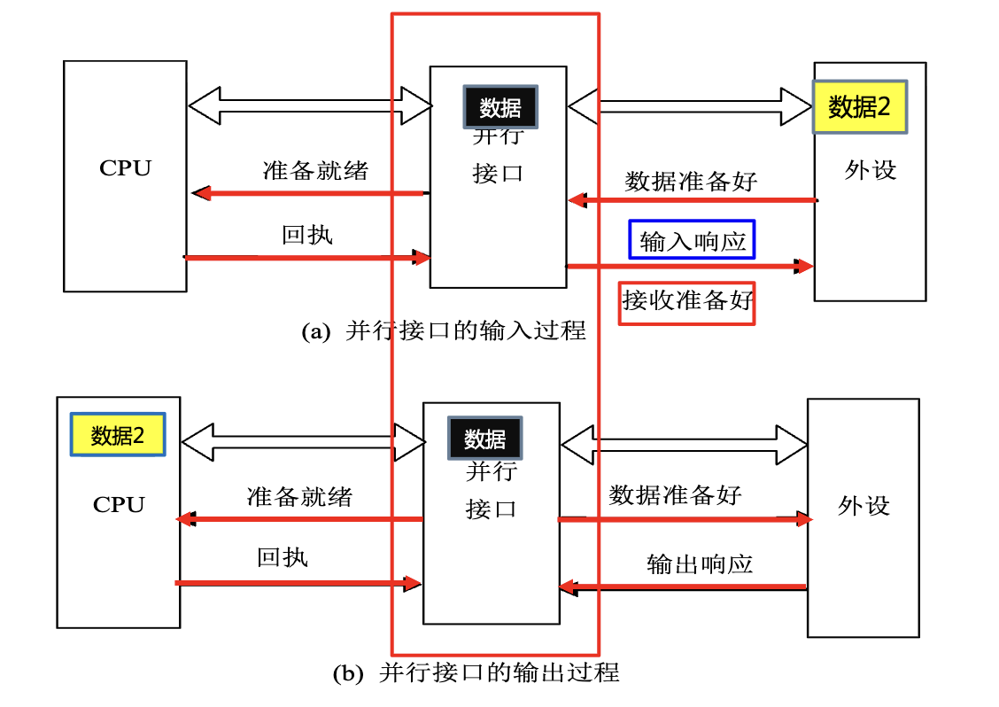
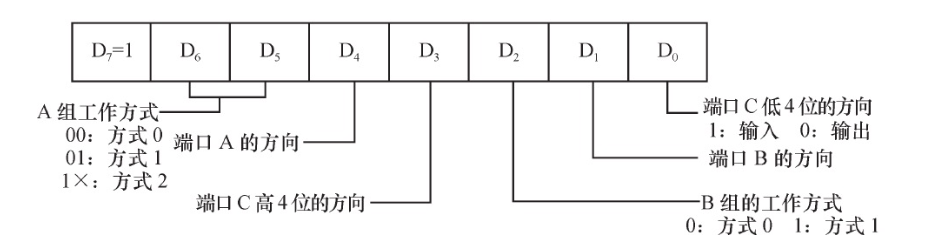
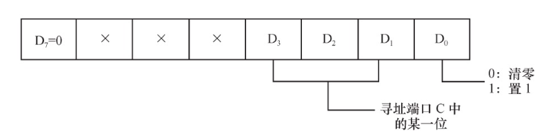

# 8255A 芯片

8255A具有多种工作模式（基本输入输出、选通输入输出、双向总线）。理解每种模式的时序和信号交互是核心。

## 并行接口的输入/输出过程


*并行接口输入\输出过程*

## 概述

8255A 提供了==3个8位的端口==（Port A, Port B, Port C），总计24根可独立控制的输入/输出信号线。

它是Intel 8086/8088微处理器系列的配套外围芯片。这意味着其总线时序与8086/8088 CPU高度兼容。

## 引脚及结构功能


*8255A 内部结构*

|    引脚     | 信号/端口名称 |             方向/功能说明              |
| :-------: | :-----: | :------------------------------: |
| PA0 ~ PA7 |   端口A   | 8位通用I/O端口，连接外部设备。输入/输出方向可通过编程设定。 |
| PB0 ~ PB7 |   端口B   | 8位通用I/O端口，连接外部设备。输入/输出方向可通过编程设定。 |
| PC0 ~ PC7 |   端口C   | 8位通用I/O端口，连接外部设备。输入/输出方向可通过编程设定。 |
|  D0 ~ D7  |  数据总线   |      双向8位数据总线，连接CPU，用于数据传输。      |
|  A0, A1   |  端口地址线  |    输入，连接CPU，用于==选择内部端口或寄存器==     |
|    WR#    |   写使能   |        输入，低电平有效，来自CPU的写信号        |
|    RD#    |   读使能   |        输入，低电平有效，来自CPU的读信号        |
|    CS#    |   片选    |         输入，低电平有效，使能芯片操作。         |
|    VCC    |   电源    |                --                |
|    GND    |    地    |                --                |
### 端口选择


| CS# | A0  | A1  | 端口      |
| --- | --- | --- | ------- |
| 0   | 0   | 0   | PA      |
| 0   | 0   | 1   | PB      |
| 0   | 1   | 0   | PC      |
| 0   | 1   | 1   | 内部控制寄存器 |
| 1   | /   | /   | /       |
- **端口A (PA)** 和 **端口B (PB)**：均为8位数据端口，通常作为主要的==数据传输通道==。
    
- **端口C (PC)**：被物理分割为**高4位** ($PC_7 \sim PC_4$) 和 **低4位** ($PC_3 \sim PC_0$)。（功能比较特殊，既可以传送数据，也可以在特定工作方式下（如方式1、2）充当**控制/状态端口**，传输握手信号（如中断请求、应答信号等），协调CPU与外设的同步。）

### 逻辑分组

虽然物理上有PA、PB、PC三个端口，但在内部逻辑控制上，它们被划分为**A组**和**B组**。这种划分是为了让芯片能同时处理两组不同性质或不同速度的外设任务。

| 项目          | Group A                               | Group B                               |
| :---------- | :------------------------------------ | :------------------------------------ |
| **端口构成**    | 端口A (8位) + 端口C的高4位 ($PC_7 \sim PC_4$) | 端口B (8位) + 端口C的低4位 ($PC_3 \sim PC_0$) |
| **支持的工作方式** | 方式0、方式1、方式2                           | 方式0、方式1                               |
| **功能特点**    | 功能最强，**只有A组支持方式2（双向总线I/O）**           | --                                    |
| **联络线分配**   | 在方式1或2下，端口C的高4位通常用作端口A的联络（握手）信号线      | 在方式1下，端口C的低4位用作端口B的联络信号线              |
## 控制字及工作方式

### 工作方式

| 工作方式 | 描述      | 适用端口  | 特点                                 | 应用场景               |
| :--- | :------ | :---- | :--------------------------------- | :----------------- |
| 方式0  | 基本I/O   | A、B、C | 不使用握手（联络）信号                        | 无条件传送方式            |
| 方式1  | 选通I/O   | A、B   | C口的部分引脚自动变更为控制/状态信号（握手信号）          | 程序查询和中断方式          |
| 方式2  | 双向总线I/O | A     | A口的8条线可发送也可接收数据（双向），需要更多C口引脚作为控制信号 | 双向传送数据的外设，也支持查询和中断 |
> PC可以进行位管理，也就是一位一位的赋值，而PB PA没有这个功能

#### 方式 0

==单向的==、不需要握手信号的数据传输。

*方式 0控制字*

**示例控制字 `93H (10010011B)`**（输入输出可根据实际情况改变）

| 组别  | 端口                    | 工作方式 | 输入/输出方向 |
| :-- | :-------------------- | :--- | :------ |
| A 组 | A口                    | 方式0  | 输入      |
|     | PCA (端口C高4位, PC7~PC4) | 方式0  | 输出      |
| B 组 | B口                    | 方式0  | 输入      |
|     | PCB (端口C低4位, PC3~PC0) | 方式0  | 输入      |
>[!note] EG：利用 8255A 控制 LED 灯
>
>在8086最小方式系统中，利用8255A某端口输入8位开关量，并通过另一个端送出，以发光二极管指示数据，8255A的端口地址为280H～287H中的奇地址
>
>
>
>注意需要根据端口地址（`28XH`）来设计连接电路图
>
>代码：
>
>```asm
>MOV DX, 287H       ; 指向最后一位的控制寄存器
MOV AL, 10010000B  ; 控制字 90H （PA 输入，PB 输出）
OUT DX, AL         
MOV DX, 281H       ; 端口 A 地址
IN AL, DX          
NOT AL             ; 逻辑取反（LED 控制逻辑）
MOV DX, 283H       ; 端口 B 地址
OUT DX, AL         
>```
>

>[!note] 思考题(8段数码管循环显示)
>
>数码管的每一个段（a,b,c,d,e,f,g,dp）本质上就是一个LED。要显示数字“0-8”，CPU需要查表得到对应的**字形码（段码）**，然后通过方式0输出到端口。

>[!note] EG2：波形发生器
>8255A端口地址为20H、22H、24H、26H，设计译码电路及其与系统总线的连接图,并编程实现使端口A的低4位产生如图所示的信号：
>
>
>1
>1
>1
>1
>1
>1
>

### 控制字

| 控制字类型       | 功能                          | 使用场景                                           |
| :---------- | :-------------------------- | :--------------------------------------------- |
| 工作方式控制字     | 规划A、B、C口是输入还是输出，以及工作方式的选择   | 用于设定8255的基本工作模式和各个端口的输入/输出方向                   |
| PC口置位/复位控制字 | 对端口C的某一位进行置1或清0操作（PC 口的位管理） | 在方式1或方式2下，由软件产生选通信号。也可用于单纯控制C口的位输出，实现开关、指示等功能。 |

#### 工作方式控制字

就是操作8255A内部的==工作方式寄存器==，类似于8259A的操作：


*方式控制字*

- 首先`CS#=0，A0 A1=1 1`，选中该寄存器端口
    
- `D7=1`，就是在写控制字，否则芯片会认为是进行C口的位操作（Bit Set/Reset）。

#### PC口置位/复位控制字

当最高位 $D_7=0$ 时，8255A执行的不再是全局模式配置，而是针对**端口C** 的**位操作**。

在方式1或方式2（涉及握手协议）中，CPU往往需要通过软件单独控制某根信号线（如中断允许标志INTE）的开启或关闭。

>[!note] EG：8255A的地址范围为380H~383H，编写程序段，实现将PC7置1，将PC3置0
>
>由映射关系：
>- $380H \rightarrow$ 端口A
>   
>- $381H \rightarrow$ 端口B
  >  
>- $382H \rightarrow$ 端口C
  >  
>- **$383H \rightarrow$ 控制寄存器**
>
>由此可得代码：
>```assembly
> MOV DX, 383H       
> MOV AL, 00001111B  ; PC7置1
>OUT DX, AL         
>MOV AL, 00000110B  ; PC3清0
>OUT DX, AL         
>```

