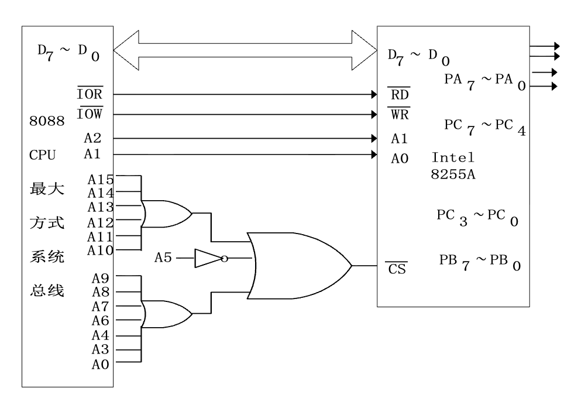
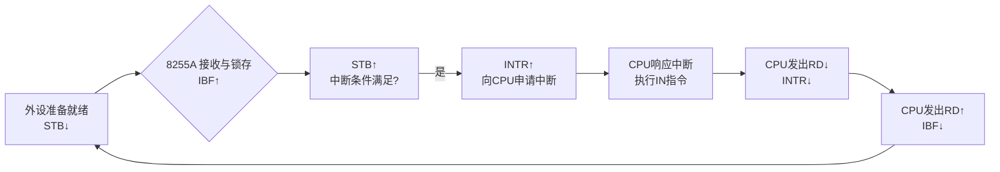
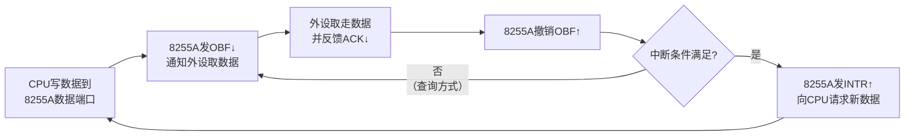

# 8255A 芯片

8255A具有多种工作模式（基本输入输出、选通输入输出、双向总线）。理解每种模式的时序和信号交互是核心。

## 并行接口的输入/输出过程


*并行接口输入\输出过程*

## 概述

8255A 提供了==3个8位的端口==（Port A, Port B, Port C），总计24根可独立控制的输入/输出信号线。

它是Intel 8086/8088微处理器系列的配套外围芯片。这意味着其总线时序与8086/8088 CPU高度兼容。

## 引脚及结构功能


*8255A 内部结构*

|    引脚     | 信号/端口名称 |             方向/功能说明              |
| :-------: | :-----: | :------------------------------: |
| PA0 ~ PA7 |   端口A   | 8位通用I/O端口，连接外部设备。输入/输出方向可通过编程设定。 |
| PB0 ~ PB7 |   端口B   | 8位通用I/O端口，连接外部设备。输入/输出方向可通过编程设定。 |
| PC0 ~ PC7 |   端口C   | 8位通用I/O端口，连接外部设备。输入/输出方向可通过编程设定。 |
|  D0 ~ D7  |  数据总线   |      双向8位数据总线，连接CPU，用于数据传输。      |
|  A0, A1   |  端口地址线  |    输入，连接CPU，用于==选择内部端口或寄存器==     |
|    WR#    |   写使能   |        输入，低电平有效，来自CPU的写信号        |
|    RD#    |   读使能   |        输入，低电平有效，来自CPU的读信号        |
|    CS#    |   片选    |         输入，低电平有效，使能芯片操作。         |
|    VCC    |   电源    |                --                |
|    GND    |    地    |                --                |
### 端口选择


| CS# | A0  | A1  | 端口      |
| --- | --- | --- | ------- |
| 0   | 0   | 0   | PA      |
| 0   | 0   | 1   | PB      |
| 0   | 1   | 0   | PC      |
| 0   | 1   | 1   | 内部控制寄存器 |
| 1   | /   | /   | /       |
- **端口A (PA)** 和 **端口B (PB)**：均为8位数据端口，通常作为主要的==数据传输通道==。
    
- **端口C (PC)**：被物理分割为**高4位** ($PC_7 \sim PC_4$) 和 **低4位** ($PC_3 \sim PC_0$)。（功能比较特殊，既可以传送数据，也可以在特定工作方式下（如方式1、2）充当**控制/状态端口**，传输握手信号（如中断请求、应答信号等），协调CPU与外设的同步。）

### 逻辑分组

虽然物理上有PA、PB、PC三个端口，但在内部逻辑控制上，它们被划分为**A组**和**B组**。这种划分是为了让芯片能同时处理两组不同性质或不同速度的外设任务。

| 项目          | Group A                               | Group B                               |
| :---------- | :------------------------------------ | :------------------------------------ |
| **端口构成**    | 端口A (8位) + 端口C的高4位 ($PC_7 \sim PC_4$) | 端口B (8位) + 端口C的低4位 ($PC_3 \sim PC_0$) |
| **支持的工作方式** | 方式0、方式1、方式2                           | 方式0、方式1                               |
| **功能特点**    | 功能最强，**只有A组支持方式2（双向总线I/O）**           | --                                    |
| **联络线分配**   | 在方式1或2下，端口C的高4位通常用作端口A的联络（握手）信号线      | 在方式1下，端口C的低4位用作端口B的联络信号线              |
## 控制字及工作方式

### 工作方式

| 工作方式 | 描述      | 适用端口  | 特点                                 | 应用场景               |
| :--- | :------ | :---- | :--------------------------------- | :----------------- |
| 方式0  | 基本I/O   | A、B、C | 不使用握手（联络）信号                        | 无条件传送方式            |
| 方式1  | 选通I/O   | A、B   | C口的部分引脚自动变更为控制/状态信号（握手信号）          | 程序查询和中断方式          |
| 方式2  | 双向总线I/O | A     | A口的8条线可发送也可接收数据（双向），需要更多C口引脚作为控制信号 | 双向传送数据的外设，也支持查询和中断 |
> PC可以进行位管理，也就是一位一位的赋值，而PB PA没有这个功能

#### 方式 0

==单向的==、不需要握手信号的数据传输。

*方式 0控制字*

**示例控制字 `93H (10010011B)`**（输入输出可根据实际情况改变）

| 组别  | 端口                    | 工作方式 | 输入/输出方向 |
| :-- | :-------------------- | :--- | :------ |
| A 组 | A口                    | 方式0  | 输入      |
|     | PCA (端口C高4位, PC7~PC4) | 方式0  | 输出      |
| B 组 | B口                    | 方式0  | 输入      |
|     | PCB (端口C低4位, PC3~PC0) | 方式0  | 输入      |
|     |                       |      |         |
>[!example] EG：利用 8255A 控制 LED 灯
>
>在8086最小方式系统中，利用8255A某端口输入8位开关量，并通过另一个端送出，以发光二极管指示数据，8255A的端口地址为280H～287H中的奇地址
>
>
>
>注意需要根据端口地址（`28XH`）来设计连接电路图：A0 置 1 不参与译码（因为有说端口是奇地址）281H ～ 287H 的区分就在 A1 和 A2 上，这两个连接端口选择线，剩下的线连接在片选译码上。
>
>代码：
>
>```asm
>MOV DX, 287H       ; 指向最后一位的控制寄存器
MOV AL, 10010000B  ; 控制字 90H （PA 输入，PB 输出）
OUT DX, AL         
MOV DX, 281H       ; 端口 A 地址
IN AL, DX          
NOT AL             ; 逻辑取反（LED 控制逻辑）
MOV DX, 283H       ; 端口 B 地址
OUT DX, AL         
>```
>

>[!note] 思考题(8段数码管循环显示)
>
>数码管的每一个段（a,b,c,d,e,f,g,dp）本质上就是一个LED。要显示数字“0-8”，CPU需要查表得到对应的**字形码（段码）**，然后通过方式0输出到端口。

>[!example] EG2：波形发生器
>8255A端口地址为20H、22H、24H、26H，设计译码电路及其与系统总线的连接图,并编程实现使端口A的低4位产生如图所示的信号：
>
>
>
>**电路设计：**
>
>
>
>电路设计原理同上，作为练习自己分析。
>
>

**代码：**

```asm
; 该程序段通过 8255A 芯片产生特定的输出信号波形
; 注释说明了8255A端口的配置

        MOV     DX, 26H         ; 设定 8255A 控制寄存器端口地址
        MOV     AL, 10000000B   ; 设置 8255A 工作方式 (方式0，端口A/B/C输出)
        OUT     DX, AL          ; 将控制字写入 8255A

        MOV     DX, 20H         ; 设定 8255A 端口 A 地址 (数据输出端口)

; 主循环：重复产生信号波形
REP1:
        XOR     AL, AL          ; AL 清零 (输出 00H)
        OUT     DX, AL          ; 从端口输出 00H

        MOV     CX, 6           ; 设置循环计数器为 6

; 内循环：产生递增序列
REP2:
        INC     AL              ; AL 递增 (值从 1 递增到 6)
        OUT     DX, AL          ; 输出当前 AL 值
        LOOP    REP2            ; 循环直到 CX=0

        ADD     AL, 9H          ; AL 加 9 (1001B)
        OUT     DX, AL          ; 输出 AL+9 的值
        JMP     REP1            ; 跳回循环开始，重复波形
```

>[!example] 在8088最大方式系统中，由一片8255A构成输入输出接口，端口地址为240H～243H，外设准备好的8位数据已送入8255A的某端口，要求将这一数据的低4位取反（高4不变）后，从另一端口送出。

```asm
; 8255A 可编程并行接口芯片控制程序
; 实现功能：从端口A读取数据，将低4位取反后，从端口B送出
; 端口地址映射：
;   控制口: 243H
;   端口A: 240H
;   端口B: 241H

; 1. 初始化8255A的工作方式
        MOV     DX, 243H         ; 设置DX为8255A控制寄存器的端口地址
        MOV     AL, 10010000B   ; 设置8255A控制字：
                                ;   1xxxxxxx: 控制字特征位
                                ;   xx00xxxx: 端口A - 模式0 (基本输入/输出)
                                ;   xxx1xxxx: 端口A - 输入模式
                                ;   xxxxx0xx: 端口B - 模式0
                                ;   xxxxxx0x: 端口B - 输出模式
        OUT     DX, AL          ; 将控制字写入8255A控制寄存器，完成初始化

; 2. 读取端口A的数据
        MOV     DX, 240H        ; 设置DX为端口A的地址
        IN      AL, DX          ; 从端口A读取一个字节的数据到AL寄存器

; 3. 对数据进行处理 (低4位取反，高4位不变)
        XOR     AL, 0FH         ; 将AL与0FH (00001111B) 进行异或操作
                                ; 效果：AL的低4位按位取反 (0变1, 1变0)，高4位保持不变

; 4. 将处理后的数据从端口B送出
        MOV     DX, 241H        ; 设置DX为端口B的地址
        OUT     DX, AL          ; 将AL寄存器的值输出到端口B
```

#### 方式一

**PC口**不再传输数据，而是被征用作为**联络信号线**。

##### 输入模式


| 信号线      | 方向          | 全称                         | 功能描述                     | 有效电平  | 时序关系                                                   |
| :------- | :---------- | :------------------------- | :----------------------- | :---- | :----------------------------------------------------- |
| **STB**  | 输入 -> 8255A | 选通脉冲 (Strobe)              | 外设发出，表示已将数据放置于端口数据线      | 低电平有效 | 前沿(下降沿)锁存数据                                            |
| **IBF**  | 输出 -> 外设    | 输入缓冲器满 (Input Buffer Full) | 8255A发出，通知外设“数据已锁存，暂勿发送” | 高电平有效 | 在 `STB` 有效后由8255A置位，CPU读操作后由8255A复位                    |
| **INTR** | 输出 -> CPU   | 中断请求 (Interrupt Request)   | 8255A发出，请求CPU读取端口数据      | 高电平有效 | 在 `STB` 结束（变高）且 `IBF` 为高、中断允许 (`INTE=1`) 时置位，CPU读操作后复位 |

| 组别  | 联络信号线   | 信号简称     | 信号功能与方向                                    |
| :-- | :------ | :------- | :----------------------------------------- |
| A组  | **PC4** | `STB_A`  | 输入，外设→8255A。**选通输入**，外设用其通知8255A数据已准备好。    |
|     | **PC5** | `IBF_A`  | 输出，8255A→外设。**输入缓冲器满**，8255A告知外设数据已锁存。     |
|     | **PC3** | `INTR_A` | 输出，8255A→CPU。**中断请求**，8255A通知CPU来读取A口数据。   |
| B组  | **PC2** | `STB_B`  | 输入，外设→8255A。**选通输入**，功能同A口的`STB_A`，用于B口。   |
|     | **PC1** | `IBF_B`  | 输出，8255A→外设。**输入缓冲器满**，功能同A口的`IBF_A`，用于B口。 |
|     | **PC0** | `INTR_B` | 输出，8255A→CPU。**中断请求**，功能同A口的`INTR_A`，用于B口。 |

只有当`STB、IBF、INTE`三者都高时，`INTR`才能被置为高电平（INTE不是外部引脚，而是8255A内部的一个逻辑开关，通过软件将INTE置1，才能开启中断功能，这体现了**软件控制硬件行为**的思想）

###### 工作时序



##### 输出模式


| 端口          | 数据线       | 信号线     | 联络信号名称           | 功能与方向                        |
| :---------- | :-------- | :------ | :--------------- | :--------------------------- |
| **A口 (输出)** | `PA0~PA7` | **PC7** | `OBF_A` (输出缓冲器满) | 输出，8255A→外设。通知外设“数据已就绪，可读取”。 |
|             |           | **PC6** | `ACK_A` (响应)     | 输入，外设→8255A。外设回应“数据已接收”。     |
|             |           | **PC3** | `INTR_A` (中断请求)  | 输出，8255A→CPU。请求CPU发送下一个数据。   |
| **B口 (输出)** | `PB0~PB7` | **PC2** | `ACK_B` (响应)     | 输入，外设→8255A。外设回应“数据已接收”。     |
|             |           | **PC1** | `OBF_B` (输出缓冲器满) | 输出，8255A→外设。通知外设“数据已就绪，可读取”。 |
|             |           | **PC0** | `INTR_B` (中断请求)  | 输出，8255A→CPU。请求CPU发送下一个数据。   |

###### 工作时序



##### 方式一示例

>[!example] 在8088最大方式的扩充槽上,利用8255A和8位A/D转换器开发数据采集系统如图所示。要求计算8255A占用的四个端口地址，并编写程序完成N点数据的采集工作。

#### 方式二


### 控制字

| 控制字类型       | 功能                          | 使用场景                                           |
| :---------- | :-------------------------- | :--------------------------------------------- |
| 工作方式控制字     | 规划A、B、C口是输入还是输出，以及工作方式的选择   | 用于设定8255的基本工作模式和各个端口的输入/输出方向                   |
| PC口置位/复位控制字 | 对端口C的某一位进行置1或清0操作（PC 口的位管理） | 在方式1或方式2下，由软件产生选通信号。也可用于单纯控制C口的位输出，实现开关、指示等功能。 |

#### 工作方式控制字

就是操作8255A内部的==工作方式寄存器==，类似于8259A的操作：


*方式控制字*

- 首先`CS#=0，A0 A1=1 1`，选中该寄存器端口
    
- `D7=1`，就是在写控制字，否则芯片会认为是进行C口的位操作（Bit Set/Reset）。

#### PC口置位/复位控制字

当最高位 $D_7=0$ 时，8255A执行的不再是全局模式配置，而是针对**端口C** 的**位操作**。

在方式1或方式2（涉及握手协议）中，CPU往往需要通过软件单独控制某根信号线（如中断允许标志INTE）的开启或关闭。

>[!note] EG：8255A的地址范围为380H~383H，编写程序段，实现将PC7置1，将PC3置0
>
>由映射关系：
>- $380H \rightarrow$ 端口A
>   
>- $381H \rightarrow$ 端口B
  >  
>- $382H \rightarrow$ 端口C
  >  
>- **$383H \rightarrow$ 控制寄存器**
>
>由此可得代码：
>```assembly
> MOV DX, 383H       
> MOV AL, 00001111B  ; PC7置1
>OUT DX, AL         
>MOV AL, 00000110B  ; PC3清0
>OUT DX, AL         
>```

## 8255A 和总线的连接

# 8253

