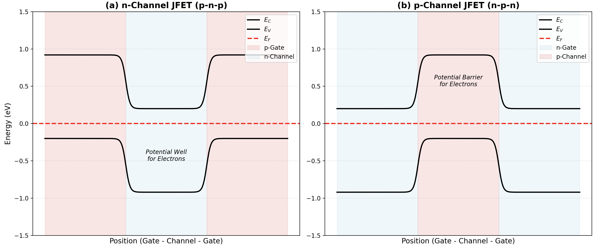

# 金半接触

> [!question] 9.1
考虑Al和Si接触，$N_d = 10^{16} cm^{-3}$，$T = 300 K$。(a)画出它们接触之前的能带图；(b)画出它们接触时零偏压下的能带图；(c)估算$\phi_{B0}$，$E_{max}$和$x_d$的值；(d)对图9.5重做(b)和(c)。

> [!question] 9.2
一个肖特基势垒二极管的衬底材料为掺杂浓度$N_d = 5\times10^{15} cm^{-3}$的n型硅，它的势垒高度$\phi_{B0} = 0.65 V$。(a)求内建电势差$V_{bi}$；(b)当$N_d = 10^{16} cm^{-3}$，求$\phi_{B0}$和$V_{bi}$。这两个值是增大还是减小？(c)当$N_d = 10^{15} cm^{-3}$时，重新计算(b)。

> [!question] 9.3
考虑金与n型硅形成理想异质结，掺杂浓度为$N_d = 10^{16} cm^{-3}$，$T = 300K$，确定$V_{R} = 1V$、5V时的(a)$\phi_{B0}$；(b)$V_{bi}$；(c)$x_n$和$|E_{max}|$。

> [!question] 9.4
金和n型GaAs形成肖特基二极管，$N_d = 5\times10^{15} cm^{-3}$，$T = 300K$，确定$V_{R} = 1V$、5V时的(a)$\phi_{B0}$；(b)$\phi_n$；(c)$V_{bi}$；(d)$x_n$和$|E_{max}|$。

> [!question] 9.5
当$\phi_{Bn} = 0.88V$时，重做习题9.4。

> [!question] 9.6
一个铂与掺杂浓度$N_d = 10^{15} cm^{-3}$的硅组成的结，截面积$A = 5\times10^{-4}cm^2$。令$T = 300K$。使用图9.5中的数据。分别计算$V_{R} = 1V$，5V时的结电容，以及$N_d = 10^{16} cm^{-3}$时的结电容。

> [!question] 9.7
肖特基二极管中$T = 300K$时的$(1/C')^2 - V_R$曲线如图P9.7所示，其中C'是单位面积的电容。计算$V_{bi}$，$N_d$，$\phi_n$和$\phi_{B0}$的值。

> [!question] 9.8
考虑钨与掺杂浓度$N_d = 10^{15} cm^{-3}$的n型硅形成的肖特基二极管，$T = 300K$，使用图9.5中的数据确定势垒高度。试求(i)$V_{R} = 1V$和(ii)$V_{R} = 5V$时(a)$V_{bi}$，$x_n$和$|E_{max}|$的值；(b)利用(a)求得的$|E_{max}|$计算$\Delta\phi$和$x_m$。

> [!question] 9.9
由式(9.12)推导出式(9.14)和式(9.15)。

> [!question] 9.10
金与掺杂浓度为$N_d = 10^{16} cm^{-3}$的n型硅接触形成肖特基二极管，$T = 300K$，使用图9.5中的数据确定势垒高度。求(a)零偏压下的$V_{bi}$，$x_n$以及$|E_{max}|$；(b)确定$\Delta\phi$为势垒高度5%时的反偏电压。

# 结型场效应晶体管

## JFET 概念

> [!question] 13.1
(a) 画出 p 沟道 JFET 结构的能带图，类似于图 13.2； (b) 定性地讨论电流 - 电压特性，包括电流方向以及电压极性，类似于图 13.3 和图 13.4。

（a） 对比能带图：

（b）我们同样以一个对比表格的方式来呈现定性电流-电压特性的区别：

| 特性         | N沟道JFET          | P沟道JFET          |
| :--------- | :--------------- | :--------------- |
| 沟道材料       | n - type (电子)    | p - type (空穴)    |
| 栅极材料       | p - type         | n - type         |
| $V_{DS}$极性 | 正 (+)            | 负 (-)            |
| $V_{GS}$极性 | 负 (-) (反偏)       | 正 (+) (反偏)       |
| 电流$I_D$方向  | D → S            | S → D            |
| 耗尽层扩展      | $V_{GS}$越负，耗尽层越宽 | $V_{GS}$越正，耗尽层越宽 |

> [!question] 13.2
分析图 P13.32 中的 n 沟道 JFET。p 型衬底与 n 型源极相接。大致绘出当 $V_{DS}=0$ 时对于不同的 $V_{GS}$ 的空间电荷区，以及当 $V_{GS}=0$ 时对于不同的 $V_{DS}$ 的空间电荷区。

我觉得沐浩然还没这么无聊。

> [!question] 13.3
一个n沟道GaAs pn JFET在$T=300K$时有如下掺杂浓度$N_d = 3\times10^{16} cm^{-3}$，$N_a = 2\times10^{18} cm^{-3}$，$a = 0.40 \mu m$。(a)估算(i)内建夹断电压$V_{p0}$和(ii)夹断电压$V_p$；(b)计算$V_{GS} = -0.5V$，$V_{DS}$等于以下值时最小未耗尽沟道厚度$a - h$：(i)$V_{DS} = 0$，(ii)$V_{DS} = -2.5V$，(iii)$V_{DS} = -5V$；(c)计算$V_{DS}(sat)$，当(i)$V_{GS} = 0$，(ii)$V_{GS} = -1V$。

> [!question] 13.5
考虑一个p沟道GaAs pn JFET，在$T=300K$时，参数为$N_d = 10^{18} cm^{-3}$，$a = 0.65 \mu m$。(a)计算当内建夹断电压$V_{po}$为$2.75V$时的沟道掺杂浓度；(b)利用(a)的结果，计算夹断电压$V_p$；(c)当$V_{SD}$为$0$时，计算$V_{GS}$，假定最小沟道耗尽层厚度为$0.15 \mu m$；(d)当$V_{GS}=0$时，计算$V_{SD}$，假定沟道正好在漏端夹断。

> [!question] 13.7
考虑一个p沟硅pn JFET，参数为$N_d = 3\times10^{18} cm^{-3}$，$N_a = 2\times10^{16} cm^{-3}$。(a)计算冶金结厚度$a$，假定夹断电压$V_p = +3V$；(b)利用(a)的结果，计算内建夹断电压$V_{p0}$；(c)计算$V_{SD}(sat)$，当(i)$V_{GS} = 0$，(ii)$V_{GS} = 1.5V$。

> [!question] 13.8
当器件为p沟道pn JFET时，重做习题13.7。

> [!question] 13.9
考虑一个n沟道硅pn JFET，其掺杂浓度为$N_a = 4\times10^{18} cm^{-3}$，$N_d = 4\times10^{16} cm^{-3}$。(a)计算沟道冶金结厚度$a$，假定$V_{GS}=0$，$V_{DS}(sat)=5.0V$；(b)利用(a)的结果，计算夹断电压和内建夹断电压。

> [!question] 13.10
考虑一个p沟道GaAs pn JFET，其掺杂浓度为$N_a = 5\times10^{15} cm^{-3}$，$N_d = 10^{18} cm^{-3}$。(a)计算沟道冶金结厚度$a$，假定$V_{GS} = +1.0V$，$V_{SD}(sat)=3.5V$；(b)利用(a)的结果，计算夹断电压和内建夹断电压。

## 非理想因素

## 等效电路和频率限制

