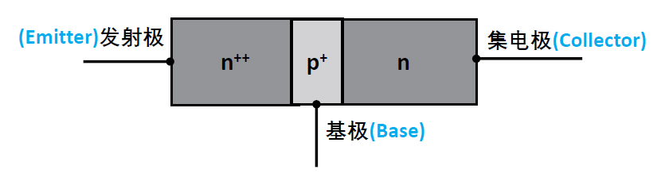
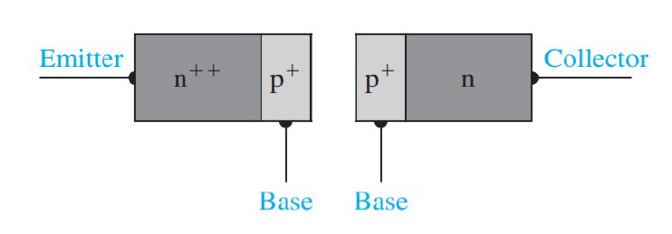
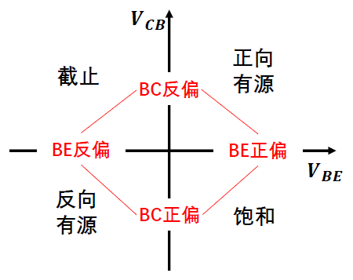
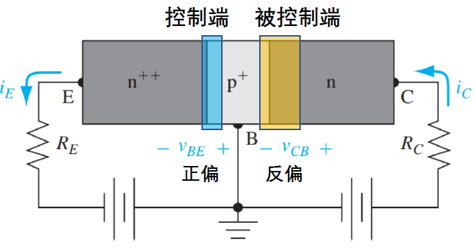

# 双极晶体管的工作原理

## BJT基本结构

*npn BJT内部结构（可以看成是两个PN结反连）*

### 杂质浓度

BJT的工作（在放大模式下）依赖于发射极向基区注入**少数载流子**（对npn而言，是电子注入 $p$ 型基区，少子是基区的少子）

这些少子需要通过**扩散**穿过基区，到达集电结的边缘，并被集电结的反向偏置电场收集。

扩散过程中，少子难免会与基区中的多子发生**复合**，因此设计上要求==基区宽度（$W_b$）必须远小于注入少子在基区内的扩散长度（$L_n$）==。

*理想npn掺杂浓度图*

- **发射极 ($n^{++}$):** 掺杂浓度最高，==杜绝无效电流==，$N_D \approx 10^{19} cm^{-3}$ (重 $n$ 型掺杂)。

工作在放大区时，发射结 (EB) 处于**正向偏置**。正偏 $p-n$ 结的电流由两部分组成：电子从 $n$ 区注入 $p$ 区（ $I_{nE}$ ），以及空穴从 $p$ 区注入 $n$ 区（ $I_{pE}$ ）。
    
在BJT中，我们**只希望**电子从发射极注入基极（ $I_{nE}$ ），因为只有这部分电流才能被集电极收集。而空穴从基极注入发射极（ $I_{pE}$ ）是一种**无效电流**，它只构成了基极电流 $I_B$ 的一部分，降低了增益。
    
根据 $p-n$ 结理论，注入电流的大小与 $p-n$ 结两侧的掺杂浓度**成反比**。通过使发射极掺杂（ $N_{DE}$ ）**远远高于**基极掺杂（ $N_{AB}$ ），我们可以确保 $I_{nE} \gg I_{pE}$。

发射极重掺杂是==实现高电流增益的前提==，它保证了发射极电流 $I_E$ 几乎完全由注入基区的有效载流子构成。
    
- **基极 ($p$):** 掺杂浓度中等，$N_A \approx 10^{17} cm^{-3}$ ($p$ 型掺杂)。

两边浓度约束的中间产物。

- **集电极 ($n$):** 掺杂浓度最低，$N_D \approx 10^{15} cm^{-3}$ (轻 $n$ 型掺杂)。

BJT工作在放大区时，集电结 (CB) 处于**反向偏置**，并且==通常承受系统中最大的电压==，而突变结的击穿电压与**轻掺杂一侧**的掺杂浓度的平方根成反比。

集电极必须采用轻掺杂，使CB结的==耗尽层主要扩展到 $n$ 型集电区==。

## 基本工作原理

| 组态名称           | 公共端（接地端） | 输入电极 | 输出电极 | 特点                             |
| -------------- | -------- | ---- | ---- | ------------------------------ |
| **共发射极 (CE)**​ | 发射极      | 基极   | 集电极  | 最常用，电压/电流放大倍数都较大               |
| **共基极 (CB)**​  | 基极       | 发射极  | 集电极  | 频率响应好，输入阻抗低，输出阻抗高              |
| **共集电极 (CC)**​ | 集电极      | 基极   | 发射极  | 又称“射极跟随器”，电压放大倍数≈1，输入阻抗高，输出阻抗低 |

无论采用哪种接法，要想让晶体管具有==电流放大作用==，其内部的两个 $p-n$ 结必须处于特定的偏置状态。

1. **发射结施加正向偏置电压**：发射区才能起到向基区注入载流子的作用。
        
    - 以npn晶体管为例，给EB结施加正向偏置，会使EB结的势垒降低。

2. **集电结施加反向偏置电压**：使集电结形成较强的电场，把集电结边缘的载流子拉入集电区，使集电区收集载流子。
        
    - 以npn晶体管为例，给CB结施加反向偏置（即 $n$ 型集电极电压 $V_C$ 远高于 $p$ 型基极电压 $V_B$，$V_{CB} > 0$ 或 $V_{BC} < 0$）。

*BJT四象限工作区*

| 工作区        | 工作状态与特点                                                                    |
| ---------- | -------------------------------------------------------------------------- |
| **正向有源区**​ | • 起电流放大作用，具有放大功能。   • 标准的**放大区**。                                       |
| **饱和区**​   | • VCE​电压很低，约为 VCE(sat)​。   • 集电结失去收集能力，无放大作用。   • 类似于**闭合开关**。       |
| **截止区**​   | • 各极电流非常小（仅为漏电流）。   • 无电流通过，无放大作用。   • 类似于**断开开关**。                  |
| **反向有源区**​ | • 发射极和集电极功能互换。   • 由于结构不对称（NE​≫NC​），==注入效率极低==。   • 电流增益 βR​非常小，性能差。 |

# 非理想效应

## 基区宽度调制效应：Early效应

# 大开关特性