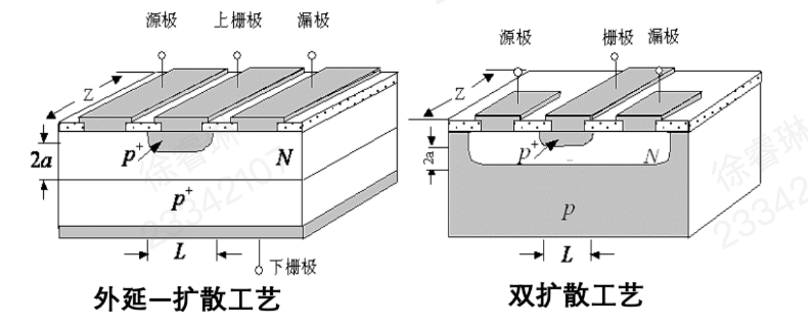
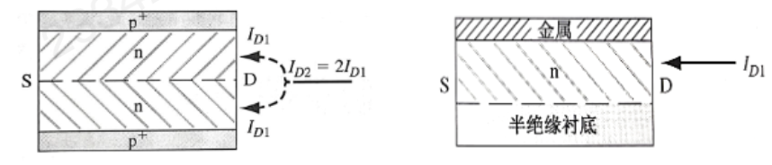

# 金半接触（对应教材第九章）

## 概述

### 常见接触类型分类

- **同质结：** 同种半导体材料（如硅-硅）形成的PN结。
    
- **异质结：** 不同半导体材料（如硅-锗，或GaAs-AlGaAs）形成的PN结。
    
- **金半结：** 特指金属与半导体直接接触形成的结构，也被称为**肖特基势垒二极管**。
    
- **欧姆接触：** 金半接触的特殊情况（或理想情况），指接触界面==没有明显的整流效应==，电流与电压呈线性关系，在电路中不仅不阻碍电流，反而作为低阻抗的连接通道。

### 能量参数定义

- **功函数（$\phi$）：** 费米能级（$E_F$）和真空能级（$E_0$）的差距。

- **电子亲和能（$\chi$）：** 导带底能量（$E_C$）和真空能级（$E_0$）的差距。

半导体功函数表达式：
$$
e\phi_s = \chi + (E_C - E_F)_s = \chi + \phi_n
$$
常见材料能量参数表：

|**金属**​|**功函数 ϕₘ (eV)**​|**半导体**​|**电子亲和能 χ (eV)**​|
|---|---|---|---|
|Ag, 银|4.26|Ge, 锗|4.13|
|Al, 铝|4.28|Si, 硅|4.01|
|Au, 金|5.1|GaAs, 砷化镓|4.07|
|Cr, 铬|4.5|AlAs, 砷化铝|3.5|
|Mo, 钼|4.6|-|-|
|Ni, 镍|5.15|-|-|
|Pd, 钯|5.12|-|-|
|Pt, 铂|5.65|-|-|
|Ti, 钛|4.33|-|-|
|W, 钨|4.55|-|-|
### 金半接触两种情况

**热力学原理**：金属与半导体相接触时，电子将从功函数小的地方跑到功函数大的地方。 系统的热力学平衡要求统一的**费米能级**。

根据电子流动的方向和半导体表面形成的状态，接触被分为两类：

- **整流接触：** 电子流出半导体，或者空穴流出半导体，导致半导体表面载流子耗尽，在半导体表面形成**表面势垒**，即**阻挡层**。与PN结的耗尽层类似，存在内建电场，对电流具有单向导电性（整流作用）。这就是所谓的**肖特基接触**。

- **欧姆接触：** 载流子从金属注入半导体表面，导致表面载流子浓度增加，形成**反阻挡层**（或称为积累层），即高电导区。界面处等效为一个极小的电阻，不阻碍电流流动，没有整流效应。

## 金半肖特基接触

### 金属 - N型半导体接触

*金半接触（和N型半导体）*

**电荷输运过程：**

$\phi_m > \phi_s$， 由于 $\phi_m = E_0 - E_{Fm}$ 且 $\phi_s = E_0 - E_{FN}$，不等式 $\phi_m > \phi_s$ ，可推导出 **$E_{Fm} < E_{FN}$**。

根据热力学原理，电子从==费米能级高的N型半导体流向费米能级低的金属==。

**空间电荷区的形成：**

半导体表面失去电子（多子），留下了带正电的**施主离子**。这些离子作为晶格的一部分，不可移动。金属表面获得了电子，带负电。
    
因此，==在半导体一侧==形成了带正电的**空间电荷区（耗尽层）**。

**能带弯曲与平衡态：**

平衡时，整个系统的 $E_F$ 必须是一条水平线。对于半导体，电子在表面处的电势能更高。因此，半导体的能带（$E_C, E_V$）在表面处**向上弯曲**。

**势垒的形成：**

两边的电子进入另外一侧分别需要克服两种势垒：

|        势垒         |   方向   |             表达式              |       补充说明       |
| :---------------: | :----: | :--------------------------: | :--------------: |
| 表面势垒$e\phi_{B0}$​ | 金属→半导体 |       $e\phi_m - \chi$       |  理想情况下，不随外加电压变化  |
|  内建电势差$eV_{Bi}$   | 半导体→金属 | $eV_{Bi} = \phi_m - \phi_s$​ | 接触前金属与半导体的费米能级之差 |
### 金属 - P型半导体接触

*金半接触（和P型半导体）*

**电荷输运过程：**

$\phi_s > \phi_m$，意味着 $E_0 - E_{FP} > E_0 - E_{Fm}$，即 **$E_{Fm} > E_{FP}$**

半导体的费米能级低，意味着==空穴能量高==。电子从金属流向半导体，即==空穴从半导体流向金属==。这导致半导体表面**空穴浓度降低**（耗尽）。

**空间电荷区与能带弯曲：**

半导体表面空穴被耗尽，留下了带负电的**受主离子**。金属表面带正电。由于半导体表面带负电，这里的电子电势能升高，能带（$E_C, E_V$）相对于内部**向下弯曲**（也就形成了空穴的势垒）。

### 对比总结

|      特性      |        金属 - N型半导体接触        |        金属 - P型半导体接触        |
| :----------: | :------------------------: | :------------------------: |
|  **接触前提**​   |     $\phi_m > \phi_s$      |     $\phi_s > \phi_m$      |
| **费米能级关系**​  |     $E_{Fm} < E_{FN}$      |     $E_{FP} < E_{Fm}$      |
| **载流子输运方向**​ |         电子从半导体流向金属         |         空穴从半导体流向金属         |
|  **空间电荷区**​  | 半导体一侧形成由带正电的**施主离子**组成的耗尽层 | 半导体一侧形成由带负电的**受主离子**组成的耗尽层 |
|  **金属侧电荷**​  |       积累电子，带**负电**​        |       失去电子，带**正电**​        |
| **能带弯曲方向**​  |      半导体表面能带**向上弯曲**​      |      半导体表面能带**向下弯曲**​      |
|   **表面势垒**   |     $e\phi_m - e\chi$      |  $E_g + e\chi - e\phi_m$   |
|  **内建电势差**   |    $e\phi_m - e\phi_s$     |    $e\phi_s - e\phi_m$     |

### 整流效应（以金 - N接触为例）

*整流效应图解*

**平衡状态（左图）：** 电子的双向流动达到动态平衡，净电流为零

系统具有统一的费米能级（$E_{Fm}$ 与 $E_{FN}$ 对齐）

**正向偏置（中图）：** 半导体的费米能级 $E_{FN}$ 相对上移，金属费米能级 $E_{Fm}$ 相对下移，两者能量差为 $qU$

半导体侧的==能带弯曲量减小==。电子从半导体进入金属所需克服的势垒降低为 $e(V_{Bi} - U)$， 由于势垒降低，N型半导体中的多子（电子）极易越过势垒扩散到金属中。电子流呈指数级增加，形成很大的**正向电流**。

**反向偏置（右图）：** $E_{Fm}$ 上移，$E_{FN}$ 下移

半导体侧的能带弯曲增强。电子从半导体进入金属所需克服的势垒升高为 $e(V_{Bi} + U)$。半导体中的电子很难越过这个增高的势垒。==电流主要由金属流向半导体的电子构成==，但金属电子面临的势垒 $e\phi_{B0}$ 几乎不变且很高，因此只有极少的电子能跃过，形成微小的**反向饱和电流（漏电流）**。

### 肖特基势垒二极管

*肖特基势垒二极管*

**肖特基势垒高度 ($\phi_{B0}$)：** 也就是金 - N接触的表面势垒
$$
\phi_{B0} = \phi_m - \chi
$$
理想的肖特基模型下，这个势垒只和材料本身相关。

#### **内建电场**

由泊松方程：
$$
\frac{dE}{dx} = \frac{\rho(x)}{\epsilon_s}
$$
**边界条件：** 在耗尽层边缘 $x = x_n$ 处，电场强度必须连续且归零（中性区无电场），即 $E(x_n) = 0$。
    
电场分布公式：
$$
E = -\frac{eN_D}{\epsilon_s}(x_n - x)
$$
即耗尽区内的电场呈线性分布，当 $x=0$（金半界面）时，电场强度绝对值 $|E|$ 达到最大值。根据电场边界条件，半导体侧存在正电荷区，为了保持电场终止，金属表面必然存在==等量的负电荷==。

#### **内建电势差**

再次对电场 $E(x)$ 积分（或利用泊松方程 $\frac{d^2\phi}{dx^2}$），得到内建电势差 $V_{bi}$ 与耗尽层宽度 $x_n$ 的平方成正比（表明电压主要降落在耗尽区，近似**单边突变结**）：
 $$
 V_{bi} = \frac{eN_D}{2\epsilon_s} x_n^2
 $$
#### **空间电荷区宽度 ($W$ 或 $x_n$)**
$$
W = x_n = \left[ \frac{2\epsilon_s(V_{bi} + V_a)}{eN_D} \right]^{1/2}
$$
#### **势垒电容 ($C_T$)**
$$
C_T = \left[ \frac{e\epsilon_s N_D}{2(V_{bi} + V_a)} \right]^{1/2}
$$
#### **C-V 特性曲线**
$$
\frac{1}{C_T^2} = \frac{2}{e\epsilon_s N_D}(V_{bi} + V_a)
$$

### **非理想因素**

#### 肖特基效应（镜像力）

*镜像效应*

当一个电子（电荷量 $-e$）处于金属表面外的半导体中，距离界面为 $x$ 时，金属表面会感应出正电荷。等效于在金属内部距离界面 $-x$ 处存在一个电荷量为 $+e$ 的“镜像电荷”。

镜像力引起的电势能 $-\phi(x)$ ：
$$
-\phi(x) = \frac{-e}{16\pi\epsilon_s x}
$$

**总势能**：
$$
-\phi(x)_{total} = \frac{-e}{16\pi\epsilon_s x} - Ex
$$

**势垒最高点**距离界面的位置 $x_m$（不再位于界面处 ($x=0$)）：
$$
x_m = \sqrt{\frac{e}{16\pi\epsilon_s E}}
$$
**肖特基势垒降低量 ($\Delta\phi$)**：
$$
\Delta\phi = \sqrt{\frac{eE}{4\pi\epsilon_s}}
$$
实际的肖特基势垒高度 $\phi_{Bn}$ 将小于理想值 $\phi_{B0}$，即 $\phi_{Bn} = \phi_{B0} - \Delta\phi$。且反向偏压越大（电场 $E$ 越大），势垒降低效应越明显，这是导致==反向电流随电压轻微增加==的主要原因。

#### 界面态影响（势垒钉扎效应）

半导体==表面晶格的中断==导致在禁带中引入了==连续的能级==，称为**界面态**。界面态的存在使得半导体表面能够通过填充或排空这些能级来调节表面电荷 $Q_{ss}$。为了维持==界面整体的电中性==，半导体能带的弯曲程度和势垒高度必须自我调整。

*金半结能带图&表面态*

|    **特性**​     |    **施主型表面态**​    |    **受主型表面态**​    |
| :------------: | :---------------: | :---------------: |
| **占据/空置时的电性**​ | 能级被电子占据时呈**中性**​  |   能级空置时呈**中性**​   |
| **电子转移后的电性**​  |  释放电子后呈**正电性**​   |  接受电子后呈**负电性**​   |
| **中性能级φ₀的界定**​ | φ₀以下能级为施主态（易释放电子） | φ₀以上能级为受主态（易接受电子） |
关键项 $D_{it}$（界面态密度），若 $D_{it} \rightarrow \infty$（界面态密度极高）， $\phi_{Bn}$ 将主要由 $\phi_0$ 决定，而与金属功函数 $\phi_m$ 几乎无关。

当界面态密度很高时，费米能级被“钉扎”在 $\phi_0$（中性能级） 附近，这种现象称为**费米能级钉扎**。此时势垒高度主要由半导体表面性质决定，而非金属材料。

**实验验证**：

- **理想理论情况：** $\phi_{B0} = \phi_m - \chi$。势垒高度 $\phi_{B0}$ 应随金属功函数 $\phi_m$ 线性变化，且斜率 $S = d\phi_{B0}/d\phi_m = 1$。

- **实际情况：**

    - **Si（硅）：** 斜率 $S < 1$，说明存在一定的界面态钉扎效应。
        
    - **GaAs（砷化镓）：** 斜率几乎为 0（水平线）。说明 GaAs 表面存在极高密度的界面态，导致势垒高度几乎被完全钉扎，无论换用何种金属（Ag, Al, Au），势垒高度基本不变。

### 电流电压关系

肖特基结主要依靠**多子**的运动来决定电流。

#### 热电子发射理论

只有能量高于势垒顶端的那些“热电子”才能越过势垒。电流的大小取决于越过势垒的载流子数目。

**电流构成：**

- **$J_{s \rightarrow m}$（半导体到金属）：** 电子需克服的势垒随外加电压 $V_a$ 变化，势垒高度为 $e(V_{bi} - V_a)$。该电流分量随电压==指数变化==。
$$
J_{s \rightarrow m} = A^* T^2 \exp\left( \frac{-e\phi_{Bn}}{kT} \right) \exp\left( \frac{eV_a}{kT} \right)
$$
	- **$A^*$ (有效理查德森常数)：** $A^* \equiv \frac{4\pi e m_n^* k^2}{h^3}$，是一个与材料有效质量相关的物理常数。

- **$J_{m \rightarrow s}$（金属到半导体）：** 电子需克服的势垒是 $\phi_{Bn}$（相对固定）。因此，反向饱和电流主要由这一项决定，且==在理想情况下与电压无关==。
$$
J_{m \rightarrow s} = -A^* T^2 \exp\left( \frac{-e\phi_{Bn}}{kT} \right)
$$
- **净电流：** 外部观测到的电流 $J$ 是上述两股电流的代数和。正偏时 $J_{s \rightarrow m}$ 占主导，反偏时仅剩微弱的 $J_{m \rightarrow s}$（类似PN结的正向电流和反向饱和电流）。
$$
J = A^* T^2 \exp\left( \frac{-e\phi_{Bn}}{kT} \right) \left[ \exp\left( \frac{eV_a}{kT} \right) - 1 \right]
$$
写成类似PN结饱和电流的形式：
$$
J_{ST} = A^* T^2 \exp\left( \frac{-e\phi_{Bn}}{kT} \right)
$$

*理想-实际电流电压关系图*

造成这种非理想特性的原因是**肖特基效应**。实际势垒高度 $\phi_{Bn}$ 并非由 $\phi_{B0}$ 恒定决定，而是受到镜像力降低量的修正，修正后的表达式：
$$
J_{ST} \propto \exp\left( \frac{e\Delta \phi}{kT} \right)
$$
### 肖特基二极管与PN结二极管的区别

|   **特性类别**​   |             **肖特基二极管**​             |            **PN结二极管**​             |
| :-----------: | :---------------------------------: | :--------------------------------: |
|   **反向电流**​   |                                     |                                    |
|     物理机制      |               热电子发射理论               |              少子扩散理论​​              |
|      数量级      |      反偏电流比PN结大2~3个数量级，受势垒降低主导。      | 反偏电流密度约10e−7A/cm2（小，受空间电荷区产生电流支配）。 |
|  **正向导通特性**​  |                                     |                                    |
|     导通电压      |                ~0.3V                |               ~0.7V                |
|     物理原因      | 反向饱和电流JST​远大于PN结JS​，由二极管方程，同电流下V更小。 |        反向饱和电流JS​小，同电流下需更高V。        |
|     性能总结      |        低压降（低功耗），高漏电（反向电流大）。         |       高压降（较高功耗），低漏电（反向电流小）。        |
| **开关特性（高频）**​ |                                     |                                    |
|     输运机制      |        多子器件：多子热发射+漂移（无少子参与）。        |           少子器件：少子扩散运动为主。           |
|    电荷存储效应     |        无（无少子注入与积累，几乎无扩散电容）。         |      有（正向导通时少子积累，需时间复合/扩散返回）。      |
|    反向恢复时间     |             极短（纳秒级或更低）。             |         较长（存在反向恢复时间trr​）。          |
|     高频特性      |           优异（开关速度快，适合高频）。           |          受限（存储效应限制高频能力）。           |

## 金半欧姆接触

### 金属 - N型半导体接触

$\phi_m < \phi_s$，意味着金属的费米能级高于N型半导体的费米能级：$E_{Fm} > E_{FN}$。

在接触瞬间，为了达到热力学平衡（费米能级拉平），电子从能量较高的**金属**流向能量较低的**半导体**。
    
- **表面状态：** 电子流入半导体表面，使得表面处的多数载流子（电子）浓度远高于体内浓度，形成**积累层**。

### 金属 - P型半导体接触

|半导体材料|N型欧姆接触合金材料|P型欧姆接触合金材料|
|---|---|---|
|**锗 (Ge)**​|锡、锡锑合金、锡砷合金、铅锑合金、铅锑锡合金、金锑合金|铟、铟铅合金、铟镓合金、金镓合金、金锗合金|
|**硅 (Si)**​|金锑合金、金砷合金、银铅锑合金、镍、铝|铝、铝镓合金、铝锡合金、金硼镓合金、镍|
|**砷化镓 (GaAs)**​|金锡合金、金硒合金、银合金、锡铝合金、铟|金锌合金、银锌合金、银铋合金、银锰合金、铟、铟锌合金|

# 结场效应晶体管

## JFET 基本概念

*结型晶体管*

**场效应**：半导体电导被垂直于半导体表面的电场调制的现象

**多子器件：** 与 BJT 利用少子扩散不同，FET主要依靠**多数载流子**的==漂移==运动导电。

**单极型晶体管：** 因为只涉及一种载流子参与导电，故称为单极型。

### 分类

| 类型      | 说明                  |
| :------ | :------------------ |
| pn结JFET | 利用PN结的反偏耗尽层宽度来调制沟道。 |
| MESFET  | 利用金半接触（肖特基接触）来调制沟道。 |
### 制备工艺

## pn-JFET

### 基本工作原理

*工作沟道示意图*

上下两个 $P^+$ 区之间夹着的 N 区构成了电子流通的路径，称为**导电沟道**。因为沟道（n 型）的多子是电子，所以称为 ==N 沟道 JFET==。

#### 电流形成机制

当栅极电压没有关断沟道时，施加漏源电压 $V_{DS}$。该电压在 N 型沟道内部产生沿轴向的电场。N 区中的多子（电子）在电场作用下，从源极向漏极做**漂移运动**，形成宏观电流 $I_D$（电流方向定义为与电子运动方向相反，即从 D 流向 S）。

#### 沟道开关控制机制

##### $V_{GS}$ 控制机制

- 施加使 PN 结反向偏置的垂直控制电压 $V_{GS}$，使 pn 结空间电荷区（耗尽层）变宽。
    
- 由于 N 区掺杂浓度通常低于 $P^+$ 区，==耗尽层主要向 N 型沟道一侧扩展==。
    
- 当施加的电压使得上下两侧的耗尽层在沟道中央相遇时，导电沟道被完全夹断，此时 $I_D$ 降为零，晶体管关断。

##### 定量分析

###### $V_{GS} = 0$

此时沟道电阻最小。$I_D - V_{DS}$ 表现为一条斜率较大的线性关系。

###### $V_{GS} < 0$

耗尽层向沟道中心扩展，有效导电沟道的截面积减小，反映在图上就是直线的**斜率变小**。

###### $V_{GS} \ll 0$

负偏压进一步增大，接近夹断电压。耗尽层占据了绝大部分沟道，剩下的导电通道极窄。$I_D - V_{DS}$ 曲线极其平缓，斜率接近于零，电流微弱。

##### $V_{DS}$ 控制机制

###### $V_{GS} = 0$ 时

**线性&过渡区：** 如图可见，随着 $V_{DS}$ 的增大，类似 MOSFET 的沟道夹断机制，因为 N 区的电势高于 P 区的电势，形成 PN 反偏，所以在沟道内部形成了耗尽层，而且越靠近漏端夹断程度越严重。同时也使有效导电沟道的平均截面积减小，使==电阻增加，斜率变缓==。

**饱和区：** 当 $V_{DS} \ge V_{DS(sat)}$ 时，漏端的反向偏置电压足以使上下两侧的耗尽层在中心**相遇**，此时沟道刚好被夹断。

**击穿区：** $V_{DS} > BV_{DS}$（漏源击穿电压）

###### $V_{GS} < 0$ 时

沟道内的初始耗尽层**厚度增加**。即在未加漏源电压之前，导电沟道的有效横截面积就已经被==预收缩==了

**饱和点偏移：** 由于栅极已经提供了一部分反向电压（$V_{GS}$），漏极只需要提供较小的 $V_{DS}$ 就能使总电压达到夹断条件，即：

$$
V_{DS(sat, V_{GS}<0)} < V_{DS(sat, V_{GS}=0)}
$$
**击穿电压降低**：击穿主要发生在反偏最强的**栅-漏结**。击穿条件取决于栅漏两端的总压差 $|V_{GD}| = |V_{GS} - V_{DS}| = |V_{GS}| + V_{DS}$。由于 $|V_{GS}|$ 的存在，只需要较小的 $V_{DS}$ 就会达到雪崩击穿临界场强。因此，**$V_{GS}$ 越负，击穿电压 $BV_{DS}$ 越低**。

**$V_{GS}$ 足够小时**，使得上下两侧的耗尽层在沟道中央**完全闭合（接触）** 时，这个电压值称为夹断电压 $V_P$（或 $V_{GS(off)}$）。

#### 输出特性

我们仍然分析典型 N 沟道耗尽型 JFET 的输出特性：

总结起来就一句话：**栅结反偏压可改变耗尽层大小，从而控制漏电流大小。** 即场效应的精髓

#### JFET 特性汇总（和 BJT 多维比较）

|     对比维度     |           JFET            |   BJT    |                         解释                         |
| :----------: | :-----------------------: | :------: | :------------------------------------------------: |
| **高频/开关特性**  |          **优异**           |    较差    |        JFET是多子器件，无少子存储效应，截止频率$f_T$高，开关速度快。         |
|   **输入电阻**   | **极高** (约$10^9 \ \Omega$) |    较小    | JFET输入端是反偏PN结，反偏电阻极大。易于级间直接耦合，不从信号源抽电流，便于微波系统阻抗匹配。 |
|  **抗辐射能力**   |           **强**           |    较弱    |        辐射通过产生晶格缺陷降低**少子寿命**影响器件，而JFET为多子器件。        |
| **工艺兼容性与材料** |    结构简单，与BJT、MOS工艺兼容。     | 标准硅基工艺成熟 |           JFET工艺（外延、扩散）与BJT/MOS兼容，便于集成。            |
## MESFET

### 基本工作原理

|        |         PN-JFET          |              MESFET              |
| :----: | :----------------------: | :------------------------------: |
| **栅极** | 利用 $P^+N$ 结的反向偏置耗尽层控制沟道。 |     直接利用**金属-半导体肖特基接触**充当栅极。     |
| **原理** |   PN结耗尽层随反偏电压变化调制沟道宽度。   | 肖特基结耗尽层随偏压变化控制沟道，类似PN结但为金属-半导体结。 |
相比于 PN 结，肖特基结的制作工艺更加简单，而且无需高温扩散过程，有利于保持材料的高迁移率特性。

#### MESFET 基本结构

肖特基耗尽层宽度：
$$
W = x_n = \left[ \frac{2\epsilon_s(V_{bi} + V_a)}{eN_d} \right]^{1/2}
$$

>  我们一般选用  GaAs 来制作 MESFET的 ==N 型沟道==部分：GaAs 的电子迁移率是 Si 的 5-6 倍。这意味着在相同的几何尺寸下，电子飞越沟道的速度更快，器件的**工作频率更高**（适合微波/射频应用）。而且也可以生长在==半绝缘衬底==上，减小期间的

##### 增强型 mesfet

 和增强型  BJT 原理相同，在控制电压为 0时，已经关断了沟道，需要施加正向栅压来打开沟道。

## pnFET 器件特性

传统的 JFET 结构是上下两个 $p^+$ 区夹着中间的 n 沟道。为了简化分析，我们可以将这种**双边器件**看作是==两个**单边器件**的并联==。

<b>后续我们将分析双边结的器件特性。</b>

由于结构的对称性，双边器件的总漏极电流 $I_D$ 等于单边电流的 2 倍：

$$
I_D = I_{D2} = 2I_{D1}
$$
### 内建夹断电压

基于单边突变结近似，我们可推导反偏条件下（$V_{GS} < 0$）耗尽层宽度 $h$ 的表达式：

$$h = \left[ \frac{2\epsilon_s(V_{bi} - V_{GS})}{eN_d} \right]^{1/2}$$
设沟道的半宽度为 $a$（即从中心到冶金结边界的距离）临界条件即当耗尽层宽度 $h$ 扩展到等于沟道半宽度 $a$ 时，导电沟道被完全夹断。

将 $h=a$ 代入上述公式，反解出夹断电压 $V_{P0}$，即==临界条件下$(V_{bi} - V_{GS})$ 的表达式==：

$$
V_{P0} = \frac{e a^2 N_d}{2\epsilon_s}
$$
### 夹断电压（阈值电压）

|     参数     |    符号    |             物理意义             |                                                   说明                                                    |
| :--------: | :------: | :--------------------------: | :-----------------------------------------------------------------------------------------------------: |
| **内建夹断电压** | $V_{P0}$ | 沟道（假设$V_{GS}=0$）内部耗尽所需的总电势差。 | 由半导体掺杂浓度$N_D$、介电常数$\varepsilon_s$、沟道厚度$a$等本征参数决定，例如对均匀掺杂N沟道：$V_{P0} = \frac{q N_D a^2}{2\varepsilon_s}$ |
|  **夹断电压**  |  $V_P$   |  为耗尽沟道，需要在**栅源端口**外部施加的电压。   |                   在$V_{GS} = V_P$时，沟道被完全夹断。通常$V_P = V_{bi} - V_{P0}$，其中$V_{bi}$为内建电势。                   |
$$
V_{bi} - V_P = V_{P0}
$$
对于通常的耗尽型 JFET，要实现沟道夹断，所需的总电势 $V_{P0}$ 通常大于内建电势 $V_{bi}$。因此，$V_P = V_{bi} - V_{P0} < 0$。
    
即 N 沟道耗尽型 JFET 的夹断电压（阈电压）是一个**负值**。

**约束条件**：

- $|V_P|$ 必须小于结的击穿电压，否则器件在关断前就会击穿。

- 沟道掺杂浓度 $N_d$ 减小会导致 $V_{P0}$ 减小，进而使 $|V_P|$ 变小，容易关断，但同时也会导致器件的==电流驱动能力下降==。

#### p 沟道 pn JFET

**内建夹断电压 $V_{P0}$**： 依然定义为耗尽 $a$ 宽度所需的总电势：
$$
V_{P0} = \frac{e a^2 N_a}{2\epsilon_s}
$$
**电压关系：** 
$$
V_{bi} + V_P = V_{P0} \Rightarrow V_P = V_{P0} - V_{bi}
$$

### 饱和漏源电压

当我们施加了漏源电压之后，

$$
h_1 = [ \frac{2\epsilon_s(V_{bi} - V_{GS})}{eN_a} ]^{1/2}
\quad
h_2 = [ \frac{2\epsilon_s(V_{DS} + V_{bi} - V_{GS})}{eN_a} ]^{1/2}
$$
显然 $h_2 > h_1$，这验证了沟道在漏端最窄的结论,当漏端耗尽层宽度 $h_2$ 增加到等于沟道半宽度 $a$ 时，发生夹断。

此时漏端的总反偏电压为 $V_{bi} + V_{DS}(sat) - V_{GS}$，即：

$$V_{bi} + V_{DS}(sat) - V_{GS} = V_{p0}$$

| 器件类型 |                   饱和电压公式                   |
| :--: | :----------------------------------------: |
| n 沟道 | $V_{DS}(sat) = V_{p0} - (V_{bi} - V_{GS})$ |
| p 沟道 | $V_{DS}(sat) = V_{p0} - (V_{bi} + V_{GS})$ |

### 理想直流 I/V 特性

#### 电流 - 电压微分关系

我们取沟道中坐标为 $x$ 处、长度为 $dx$ 的一小段微元。其电阻由电阻定律决定：   
$$
dR = \frac{\rho dx}{A(x)} = \frac{dx}{\sigma A(x)}
$$
由 $\sigma = e \mu_n N_d$（N沟道），且 $A(x)$（有效沟道面积）由于是单边模型，截面积为宽度 $W$ 乘以有效高度 $[a - h(x)]$。

代入微分电阻公式：
$$
dR = \frac{dx}{e \mu_n N_d [a - h(x)] W}
$$
由：    
$$
dV(x) = I_{D1} dR
$$
将 $dR$ 的表达式代入并整理，得到关于 $x$ 和 $V$ 的微分方程：

$$
I_{D1} dx = e \mu_n N_d W [a - h(x)] dV(x)
$$
#### 积分求解

由：    
$$
h(x) = [ \frac{2\epsilon_s(V_{bi} + V(x) - V_{GS})}{eN_d} ]^{1/2}
$$
    
对上式两边微分，可以将电压微分 $dV(x)$ 转化为耗尽层宽度微分 $dh(x)$ 的表达式：   
$$
dV(x) = \frac{e N_d h(x) dh(x)}{\epsilon_s}
$$
将 $dV(x)$ 代回原微分方程，消去电压项，得到纯粹关于 $h(x)$ 的积分式：
    
$$
I_{D1} dx = \frac{\mu_n (eN_d)^2 W}{\epsilon_s} [a - h(x)] h(x) dh(x)
$$
积分运算 $\int (ah - h^2) dh = \frac{a}{2}h^2 - \frac{1}{3}h^3$，得到电流 $I_{D1}$ 的初步表达式：
$$
I_{D1} L = \frac{\mu_n (eN_d)^2 W}{\epsilon_s} \left[ \frac{a}{2}(h_2^2 - h_1^2) - \frac{1}{3}(h_2^3 - h_1^3) \right]
$$
#### 简化与最终结果

为简化公式，我们定义**夹断电流 $I_{P1}$**：
$$
\boxed{
I_{P1} = \frac{\mu_n (eN_d)^2 W a^3}{6 \epsilon_s L}
}
$$
**物理意义**：栅极零偏（$V_{GS}=0$）且内建电势可以忽略（或 $V_{bi}=0$）时的==理论最大漏极电流==。反映了器件导电能力的上限。

将所有需要代入的量（$h_1$ 和 $h_2$，$V_{p0}$ 和 $I_{P1}$）代入漏源电流公式进行化简：

$$
\boxed{
I_{D1} = I_{P1} \left[ 3 \frac{V_{DS}}{V_{p0}} - 2 (\frac{V_{DS} + V_{bi} - V_{GS}}{V_{p0}})^{3/2} + 2 (\frac{V_{bi} - V_{GS}}{V_{p0}})^{3/2} \right]
}
$$
#### 公式适用范围

- $0 \le |V_{GS}| \le |V_P|$：栅压不能超过夹断电压。
        
- $0 \le |V_{DS}| \le |V_{DS}(sat)|$：漏源电压不能超过饱和电压。

#### 沟道跨导

沟道电导 $g_d$ 定义为：
$$
g_d = \frac{\partial I_{D1}}{\partial V_{DS}} \Bigg|_{V_{DS} \to 0}
$$
代入漏源电流公式：
$$
g_d = \frac{3I_{P1}}{V_{p0}} \left[ 1 - \left( \frac{V_{bi} - V_{GS}}{V_{p0}} \right)^{1/2} \right]
$$
观察可得**最大电导 $G_{01}$：**
$$
G_{01} = \frac{3I_{P1}}{V_{p0}}
$$
**物理意义：** 这是当栅压为零（$V_{GS}=0$）且忽略内建电势（$V_{bi}=0$）时的理想最大沟道电导，和刚才的理想最大电流匹配。

#### 饱和电流

当 $V_{DS}$ 达到饱和电压时，即 $V_{DS} = V_{DS}(sat) = V_{p0} - (V_{bi} - V_{GS})$，代入方程：

$$
\boxed{
I_{D1(sat)} = I_{P1} \left[ 1 - 3 \frac{(V_{bi} - V_{GS})}{V_{p0}} \left( 1 - \frac{2}{3} \sqrt{\frac{V_{bi} - V_{GS}}{V_{p0}}} \right) \right]
}
$$
#### 经验公式

理论公式（含有 $3/2$ 次方项）过于复杂，不便于电路设计和手算估算，工业界常采用一个简化的二次函数来拟合饱和漏电流：

$$
I_{Dsat} = I_{DSS} \left( 1 - \frac{V_{GS}}{V_P} \right)^2
$$

### 跨导

跨导 $g_m$ 描述了==栅源电压 $V_{GS}$ 对漏极电流 $I_D$ 的控制能力==：

$$
g_m = \frac{\partial I_D}{\partial V_{GS}} \Bigg|_{V_{DS} = \text{const}}
$$
对通用电流方程关于 $V_{GS}$ 求偏导，得到中间公式：
$$
g_{mL} = \frac{3I_{P1}}{V_{p0}} \sqrt{\frac{V_{bi} - V_{GS}}{V_{p0}}} \left( \sqrt{\frac{V_{DS}}{V_{bi} - V_{GS}} + 1} - 1 \right)
$$
使用泰勒展开化简：
$$
g_{mL} \approx \frac{G_{01}}{2} \frac{V_{DS}}{\sqrt{V_{p0}(V_{bi} - V_{GS})}}
$$
在线性区，跨导 $g_{mL}$ 与漏源电压 $V_{DS}$ 成正比。这意味着在线性区，$V_{DS}$ 越小，栅极对电流的控制能力越弱。

对饱和电流方程 $I_{D1(sat)}$ 关于 $V_{GS}$ 求导，得到：

$$
g_{ms} = \frac{\partial I_{D1(sat)}}{\partial V_{GS}} = G_{01} \left( 1 - \sqrt{\frac{V_{bi} - V_{GS}}{V_{p0}}} \right)
$$
使用工业平方律电流公式进行化简：

$$
g_{ms} = - \frac{2I_{DSS}}{V_P} \left( 1 - \frac{V_{GS}}{V_P} \right)
$$
对于 N 沟道 JFET，$V_P$ 是负值，因此系数 $- \frac{2I_{DSS}}{V_P}$ 是==正值==，保证了跨导 $g_{ms}$ 为**正值**（即 $V_{GS}$ 增加，电流 $I_D$ 增加）。

## MESFET 器件特性

## 非理想因素

### 沟道长度调制效应