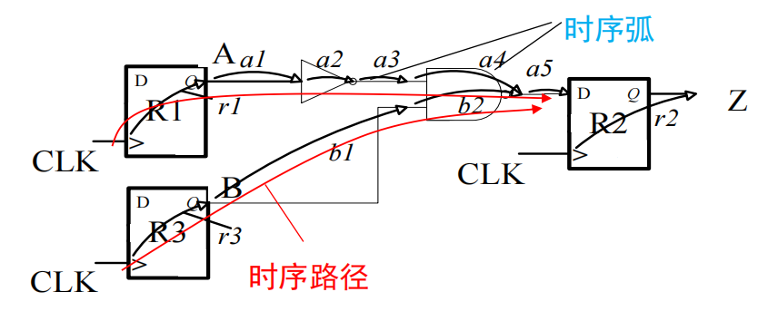

# MOS 管核心参数模型

# 逻辑门的静态特性

# 数字电路的延时模型

# 复杂逻辑门的延时特性

# 逻辑努力与延时优化

# 关键路径

时序路径由==时序弧==组成，包括逻辑门时序弧（逻辑门内部延时）和互联线时序弧（导线引发的延时）。时钟频率由路径延时最长的时序路径组成。

*时序弧与时序路径*

在一个同步数字系统中，时钟频率（性能）受限于**路径延时最长**的那条路径。这条延时最长的路径被称为**关键路径**（需要考虑==输入条件==，有些路径只有在特定输入条件下才会导通）。电路优化时不需要对每一个逻辑路径和每一个逻辑门都进行优化，关键在于优化关键路径。

# 逻辑延时模型及其优化

## 总延时模型

$$
D = \sum_{i=1}^{N} (p_i + g_if_i / \gamma) = \sum_{i=1}^{N} (p_i + h_i / \gamma)
$$

$p_i$ 是固有延时，动不了，所以只能优化$g_if_i$，但是需要考虑全局，所以需要让整条路径的路径努力最小，即让：
$$
H = \prod_{i=1}^{N} h_i = G \cdot F \cdot B = \prod_{i=1}^{N} g_i \cdot \prod_{i=1}^{N} f_i = \prod_{i=1}^{N} g_i \cdot \frac{C_L}{C_{g1}}
$$
最小化，一般这种情况就是让每一级的级努力都相等就行，即：
$$
h_1 = h_2 = \dots = h_N = h
$$
于是最小延时：
$$
\hat{D} = \sum_{j=1}^{N} p_j + \frac{N(\sqrt[N]{H})}{\gamma}
$$
## 尺寸优化

## 反相器链优化

## 大扇入优化

## 大扇出优化

## 关键翻转方向优化

## 逻辑级优化

