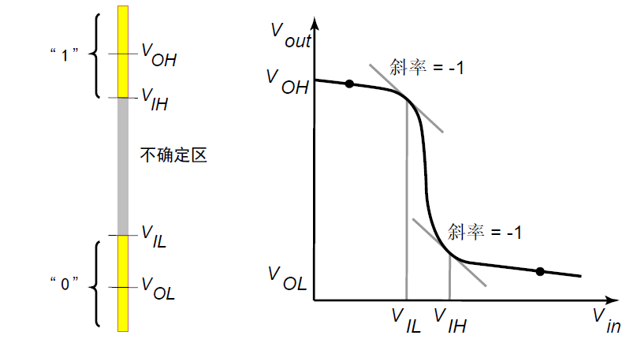
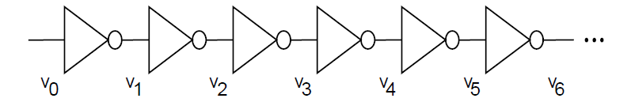
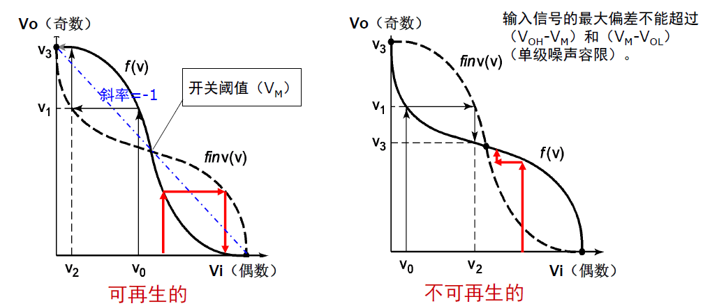

# 信号完整性

## 信号完整性

**主要研究电路在存在噪声的情况下如何保持正确的功能**

**定义**：一个信号在传播通过电路时能多好地保持它原来的形状。

在物理层面上，所有信号本质上都是模拟波形，在这里，我们需要脱离单纯的逻辑功能，转而关注电压随时间变化的物理过程。

**完整性的指标**：

- **幅度完整性**：信号的高电平（$V_{OH}$）和低电平（$V_{OL}$）必须保持在规定的噪声容限内，不能因为衰减或噪声叠加导致==逻辑电平误判==。
    
- **时序完整性**：信号的上升沿和下降沿必须==在规定的时间窗口内到达==。如果信号发生过度延迟或边缘退化，会导致建立时间或保持时间违例。

**2. 两个关键维度** 信号完整性主要包含两个物理维度的指标：

## VLSI 中的噪声和噪声性能

### 噪声分类

*噪声模型*

$$
\overline{V_{no}^2} = f(\overline{V_{ni}^2}) + g(\overline{V_{ngate}^2})
$$

- **输入噪声（$\overline{V_{ni}^2}$）**：指输入信号本身携带的随机扰动。级联电路中，前一级的输出噪声会成为当前级的输入噪声。
    
- **电路噪声（$\overline{V_{ngate}^2}$）**：指本级电路内部引入的随机扰动。这包括该级电路自身的器件热噪声、以及受到的电源噪声和耦合噪声干扰。

>[!note] 电路噪声的具体来源
> 1. **电感耦合**：在高频、高转换速率的数字电路中，急剧变化的电流会导致显著的电感耦合噪声
>
> 	- **物理机制**：当电流流过导线时会产生磁场。相邻导线存在互感（$M$），变化的电流（$di/dt$）会在邻近导线上感应出电压噪声 ($v = M \cdot di/dt$)。
>
> 2. **电容耦合**：==与信号的摆幅成正比==。信号摆幅越大，$dv/dt$ 和 $di/dt$ 通常越大，耦合能量也就越强。
>
> 	- **物理机制**：导线之间存在寄生互电容（$C_m$）。当一条导线（攻击线）的电压发生变化（$dv/dt$）时，会通过互电容向相邻导线（受害线）注入电流，引起电压波动。常被称为**串扰**。
>
>3. **电源线和地线噪声**：全局干扰，幅度主要取决于电源网络的阻抗特性和瞬态电流总和。
>
>	- **物理机制**：电源分配网络（PDN）并非理想的零阻抗。当==大量门电路同时翻转==时，会在电源线和地线的寄生电感上产生 $L \cdot di/dt$ 压降（即地弹和电源塌陷）。

- **输出噪声（$V_{no}$）**：最终叠加在输出信号上的总噪声。

## 噪声容限

假设输入信号叠加了噪声 $v_n$，即 $V_{in}' = V_{in} + v_n$，对输出电压 $V_{out}'$ 泰勒展开（ $\frac{\partial V_{out}}{\partial V_{in}}$ 是传输曲线的斜率，即反相器增益）：
$$
V_{out}' \approx f(V_{in}) + v_n \cdot \frac{\partial V_{out}}{\partial V_{in}} + \dots
$$

#### 噪声抑制判据

$$
\left| \frac{\partial V_{out}}{\partial V_{in}} \right| < 1
$$

为防止噪声在级联传输中逐级累积，必须要求噪声经过一级传输后幅度变小，而标准反相器VTC曲线正好符合这一点（我们考虑的是==正常完整信号==所在的稳定区的斜率，即==曲线两端的斜率==，而非恢复信号所使用的高增益中间段区域）。

### 噪声容限的计算

- **$V_{IL}$**：输入低电平的最大值。（输入比这个低，VTC斜率绝对值 $<1$，保证逻辑“0”的输入噪声被衰减）
    
- **$V_{IH}$**：输入高电平的最小值。（输入比这个高，VTC斜率绝对值 $<1$，保证逻辑“1”的输入噪声被衰减）
    
- **$V_{OL}$**：前一级输出低电平额定值。
    
- **$V_{OH}$**：前一级输出高电平额定值。

- **高电平噪声容限** ($NM_H$)：高电平信号传输过程中允许叠加的最大负向噪声
$$
NM_H = V_{OH} - V_{IH}
$$
    
- **低电平噪声容限** ($NM_L$)：低电平信号传输过程中允许叠加的最大正向噪声
$$
NM_L = V_{IL} - V_{OL}
$$
## 信号再生（理想无噪声条件下）

利用CMOS反相器的==高电压增益==特性。在电压传输特性曲线（VTC）的转折区，反相器的增益远大于1。这意味着输入端的一个微小变化会被放大并推向输出端的电源轨（$V_{DD}$ 或 GND）。

**数学几何解释**：只要输入信号偏离 $V_M$ 进入稳定区，经过级联迭代，信号电平会迅速收敛至 $V_{OH}$ 或 $V_{OL}$。

**去噪效应**：只要噪声幅度没有超过（在上面和在下面都算超过）电路的**噪声容限**，使得输入电压进入了逻辑阈值的禁区，那么经过几级门电路的放大和整形，信号就会剥离掉叠加的噪声，重新恢复成标准的逻辑电平。这就是信号再生。

# 不确定性

## PVT 扰动

## 设计边界

## 扰动的统计分析

## 容扰动设计

# 可靠性

## 概述

**定义**：系统持续正常工作的可信度（在数学统计上表征为==出现故障的概率==）

系统包含的**器件数目越多**，出现故障的联合概率就越高，系统工作的**时间越长**，累积发生故障的次数越多。

### 量化指标

1. **MTBF (平均故障间隔时间)**：可修复产品两次相邻故障之间的平均工作时间
$$
MTBF = \frac{\text{器件数} \times \text{工作时间}}{\text{失效次数}}
$$   
	==数值越大，表示系统越可靠==。
        
2. **FIT (时基故障率)**：半导体行业描述失效率的标准单位。
        
    - **定义**：1 FIT 表示在 $10^9$（十亿）个器件-小时内发生1次失效。(1000 FIT 意味着一个器件在 $10^6$ 小时（约114年）内会发生一次失效。==FIT值越小，表示系统越可靠==。

### 故障类型

1. **永久性故障 (Hard Error)**：不可恢复，造成永久损害，一旦发生，硬件即宣告损坏，必须更换。
    
	- **成因**：通常是物理结构的破坏（金属连线断裂（开路）、绝缘层击穿（短路）或器件本身的老化烧毁）

2. **暂时性故障 (Soft Error)**：发生后会自行消失，硬件物理结构并未受损。会导致==数据丢失或程序逻辑错误==，进而引发系统崩溃。

	- **成因**：常见于高能粒子撞击芯片存储单元，导致电荷状态翻转，即单粒子翻转（SEU）。

### 浴缸曲线

产品失效率随时间变化的典型统计分布规律：

*浴缸曲线*

## 影响因素

### 互联线损耗（电迁移）

在高电流密度下，流动的电子流具有巨大的动量。当电子与金属晶格原子发生碰撞时，会将动量传递给金属原子。如果动量转移足够大，金属原子会沿着电子流动的方向发生迁移。

交流电 (AC) 中电子来回震荡，原子迁移效应会被部分抵消；而直流电是单向持续轰击，效应会累积。因此，**电源线和地线**（通常==承载大直流电流==）是主要受害者。

$$
MTTF \propto \frac{e^{\frac{E_a}{kT}}}{J_{dc}^n}
$$
- $J_{dc}$：**直流电流密度**，指数 $n$ 一般等于2。
- $T$：**温度**，温度越高，原子扩散越快，寿命越短。
- $E_a$：**激活能**，材料属性，激活能越高，原子越难移动，抗电迁移能力越强。

#### 限制措施

- 设计时必须严格限制金属线中的电流密度（**$J_{dc}$ 极限值**）

- **温度每升高10°C，电迁移率所要求的金属宽度大约需要翻倍**（或者说寿命减半）。

- 接触孔处电流密度设限：电流从宽金属线流入窄小的接触孔时，会产生==电流拥挤效应==，局部的电流密度极大，因此接触孔往往是电迁移失效的首发位置。

- 铜具有更高的激活能（$E_a$），比铝更难发生原子迁移，因此现代先进工艺==普便采用铜互连==来提高芯片的可靠性和性能。

### 自热效应

当电流流过具有有限电阻的导线时，会产生功耗（$P=I^2R$），转化为热能，导致导线及其周围区域温度升高。金属的电阻率通常随温度升高而增加。温度升高导致电阻变大，进而导致发热更多，形成恶性正反馈。
    
同时，自热引起的温升会显著加速**电迁移**过程。

### 栅氧损耗

### 过电压失效