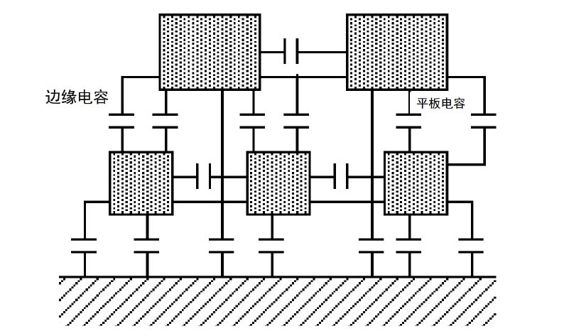
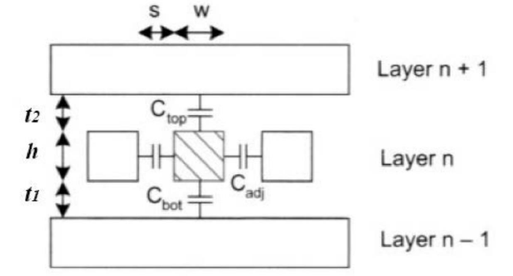
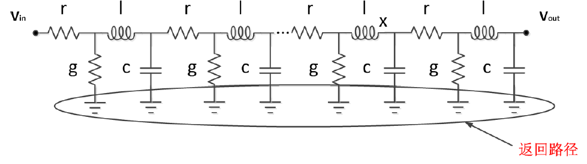
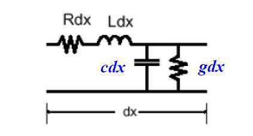
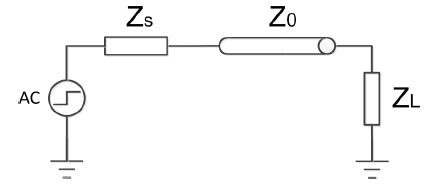
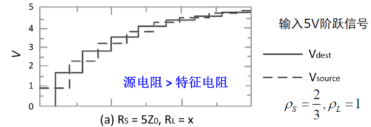
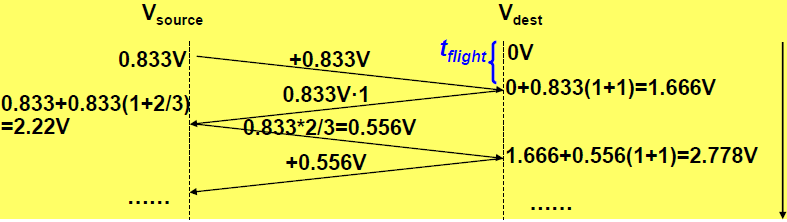

# 互联线模型

## 概述

*多层布线*

早期及传统工艺主要使用**铝**，而现代先进工艺为了==降低电阻率==和==抗电迁移能力==，普遍采用**铜**互连。导线与导线之间并不是真空，而是填充了绝缘介质，主要成分是**二氧化硅（$SiO_2$）**。这一绝缘层不仅起到机械支撑和电气隔离的作用，其介电常数（$\epsilon$）直接决定了寄生电容的大小。

- **多层布线：** 现代集成电路是三维立体的。先进工艺可达10层左右。导线不仅在同一平面内邻接，在垂直方向上也有堆叠。
    
- **垂直连接：** 不同布线层之间的电气连接是通过**通孔**垂直实现的。

*导线模型*

### 寄生电阻参数（$R$）

#### 导线自身电阻

对于一段长度为 $L$、宽度为 $W$、厚度为 $H$ 的矩形导线，其电阻 $R$：
$$
R = \frac{\rho L}{A} = \frac{\rho L}{H W}
$$
在工艺中，某一层金属或多晶硅的**厚度 $H$ 是由工艺制程固定的**，设计者无法改变，只能改变长（$L$）和宽（$W$）。因此，我们将公式中的常数项$\frac{\rho}{H}$提取出来，定义为一个新的参数，即方块电阻，符号为$R_{\square}$（或 $R_s$）。
$$
R_{\square} = \frac{\rho}{H}
$$
对于正方形，==无论边长是多少==，$L = W$，代入公式 $R = R_{\square} \times \frac{L}{W}$，结果都是 $R = R_{\square} \times 1$。

引入方块电阻后，导线总电阻的计算就变得非常直观：
$$
\text{导线总电阻} = \text{串联的方块数} (N) \times \text{方块电阻} (R_{\square})
$$
其中 $N = L/W$。在版图设计中，只需要数一下==导线相当于由几个正方形串联而成==，即可快速估算电阻。

| 材料类型         | 方块电阻（Ω/□） | 特点与应用说明                  |
| ------------ | --------- | ------------------------ |
| 金属（Al/Cu）    | 0.05      | 电阻极低，适合长距离信号传输和电源布线。     |
| 多晶硅（Poly-Si） | 10 ~ 15   | 电阻较高，仅适合短距离栅极连接，不适合长线布线。 |
| 扩散区（N+）      | 20 ~ 30   | 电阻最高，寄生电阻大。              |

#### 接触电阻

- **接触孔（Contact）：** 通常指金属层与半导体器件（如多晶硅、扩散区）之间的连接。
    
- **通孔（Via）：** 通常指不同金属层（如Metal 1到Metal 2）之间的连接。

电流流经这些垂直结构时产生的电阻称为**接触电阻**。

**电流集聚效应**：对于较大尺寸的接触孔，电流并不是均匀流过整个接触面积，而是倾向于集中==在接触孔的周边或边缘流动==。

基于电流集聚效应，工程上的最佳实践：**采用多个小尺寸接触孔并联，而不是使用一个大尺寸接触孔。**

#### 寄生电感参数（$L$）

当电流流过导线时会产生磁场，从而表现出电感特性。模型中电感与电阻串联。

$$
cl = \varepsilon\mu
$$
    
- 其中：
    
    - $c$：单位长度的电容。
    - $l$：单位长度的电感。
    - $\varepsilon$：周围介质的**介电常数**。
    - $\mu$：周围介质的**磁导率**。

对于均匀传输线，其单位长度的电感和电容并不是独立的，而是受到介质电磁特性的约束。这意味着，一旦介质确定，$l$ 和 $c$ 是成==反比关系==的。

信号在导线中的传播的速度（主要由介质材料决定，==介电常数越大，信号传播越慢==）：
$$
v = \frac{1}{\sqrt{lc}} = \frac{1}{\sqrt{\varepsilon \mu}} = \frac{c_0}{\sqrt{\varepsilon_r \mu_r}}
$$

##### 电感影响适用条件

在大多数传统的芯片内部设计中，导线的**寄生电感值很小**，通常可以忽略不计，只考虑RC延迟即可。

必须同时满足以下条件时，电感效应变得显著：

- **低电阻：** 导线采用低阻抗金属，且截面较大（如果电阻 $R$ 很大，阻尼效应强，会掩盖电感 $L$ 的作用）
    
- **高开关频率：** 感生电动势 $V = L \cdot \frac{di}{dt}$。只有在频率极高、电流变化率（$di/dt$）极快时，电感产生的电压降和噪声才不可忽略。

##### 寄生电感产生的电路效应

- **振荡：** 在阶跃响应中，如果 RLC 网络处于欠阻尼状态（电阻 $R$ 较小），输出信号会在==稳定值附近上下波动==。
        
- **过冲：** 信号电压瞬间超过电源电压或低于地电压，可能导致器件可靠性问题（如栅氧击穿）或误触发。
        
- **阻抗失配引起的信号反射：** 在高频下，导线表现为传输线。如果负载阻抗与传输线特征阻抗不匹配，信号会在终端发生反射，叠加在原信号上造成波形畸变。

- **线间互感：**  邻近导线之间存在==磁场耦合==。一根导线上的电流变化会在邻近导线上感应出==噪声电压==，这是一种磁耦合导致的**串扰**。
        
### 寄生电容参数（$C$）
    
- **对地电容/衬底电容：** ==导线与衬底==之间存在电容。

1. **平行板电容模型**：导线宽度（$W$）远大于其距离衬底的高度（$t_{di}$，绝缘介质厚度）时，电容主要由底面决定。

*对地电容*

$$
C_{int} = \frac{\epsilon_{di}}{t_{di}} WL
$$

- $\epsilon_{di}$：绝缘介质的介电常数。
    
- $W$：导线宽度。
    
- $L$：导线长度。
    
- $t_{di}$：绝缘层厚度。

*边缘电容*

电场线不仅仅垂直分布在导线底面和衬底之间，还会从导线的**侧壁**发出，弯曲延伸至衬底（如图所示）。这部分电容被称为边缘电容（$C_{fringe}$）。

**总电容构成：** $C_{wire} = C_{pp} + C_{fringe}$。即总电容等于平行板电容与边缘电容之和。

- **大 $W/H$（宽高比大）：** 平行板效应占主导，总电容接近平行板电容计算值。
    
- **小 $W/H$（宽高比小）：** 随着工艺微缩，线宽变窄，边缘电场效应变得非常显著，此时**边缘电容占主要部分**，不可忽略。

- **线间电容：** ==相邻的导线之间==存在电容。当导线间距减小时，同层导线之间的侧壁平行面积相对增加，距离缩短，导致**线间耦合电容**显著增大。

*互联线电容模型*

**电容分量定义（假设周围导线都是固定电位）：**

- **$C_{top}$：** 中心导线与上层金属（Layer n+1）之间的电容（主要是平板电容）。
    
- **$C_{bot}$：** 中心导线与下层金属（Layer n-1）之间的电容（主要是平板电容）。
    
- **$C_{adj}$：** 中心导线与左右相邻导线之间的侧壁电容。

总对地电容：
    $$C_{total} = C_{top} + C_{bot} + 2 \times C_{adj}$$
    
## 集总模型

*互联线简化模型*

当==导线很短==，其自身的==寄生电阻（$r$）远小于驱动门的输出电阻==，且电感（$l$）在高频下产生的阻抗也可以忽略时，导线可以被视为一个**等电位体**（理想导线）

延时计算：
$$
\tau = RC = rcL^2
$$
在这种情况下，整根导线被简化为一个==单一的电容元件（集总电容）==，作为驱动门的负载。这是数字电路中最简单的分析模式。

## 分布模型

*分布RC模型*

当导线长度较长、信号速度较快时需要考虑==寄生电阻==，导线不再是一个点，而被切分成了无数个微小的片段（$\Delta L$），每一个片段都由一个串联电阻（$r\Delta L$）和一个并联电容（$c\Delta L$）组成。

- **条件1  $t_{pRC} > t_{pgate}$：**
    
    - $t_{pRC}$ 是互连线的RC延迟，$t_{pgate}$ 是逻辑门的固有延迟。
    - 当==导线引起的延迟超过了逻辑门自身的延迟==时，互连线成为制约电路速度的主要因素。
        
- **条件2  导线输入信号的 $t_{edge} < R_w C_w$：**
    
    - $t_{edge}$ 是信号的上升/下降沿时间。
    - $R_w C_w$ 是导线的RC时间常数。
    - ==信号变化得比导线的响应速度还要快==，导线就表现出明显的分布效应，信号还没传到终点，源端可能已经变了。

根据KCL，对于虚线框选的节点：
$$
c\Delta L \frac{\partial V_i}{\partial t} = \frac{(V_{i+1} - V_i)}{r\Delta L} + \frac{(V_{i-1} - V_i)}{r\Delta L}
$$
将微元长度 $\Delta L$ 趋近于 0 时，差分转化为微分：$\frac{V_{i+1} - V_i}{\Delta L}$ 变成了电压对位置的一阶偏导数 $\frac{\partial V}{\partial x}$：
$$
rc \frac{\partial v}{\partial t} = \frac{\partial^2 v}{\partial x^2}
$$
这是经典的**扩散方程**，揭示了在仅考虑 R 和 C 的长导线中，**电压像热量一样慢慢“扩散”过去**。

假设在导线输入端（$x=0$）施加一个理想的阶跃电压（0V -> 2.5V）

*扩散方程求解可视化*

分布RC模型会导致信号不再具有统一的跳变时间。==距离源端越远，波形上升时间越长==，延迟越大。

### RC 链的 Elmore 延时

**Elmore延时**（$\tau_{DN}$）：对于RC树状或链状网络，总延时等于每一个节点上的电容乘以==从输入端到该节点之间的总电阻的累加和==。

$$
\tau_{DN} = \sum_{i=1}^{N} C_i \left( \sum_{j=1}^{i} R_j \right)
$$
当分段数 $N$ 趋向于无穷大（$N \rightarrow \infty$）时，离散模型就变成了连续的分布模型：
$$
\tau = \frac{RC}{2} = \frac{rcL^2}{2}
$$
比简单的集总模型要快一倍。

好的，已经根据图片中的表格内容进行了整理，并按照您的要求用 `$`包裹了其中的数学符号。

### 延时分析：集总 v.s. 分布

| 电压范围                            | 指标说明          | 集总RC网络   | 分布RC网络   |
| :------------------------------ | ------------- | :------- | :------- |
| $0 \rightarrow 50\\%$ ($t_p$)   | 数字集成电路中最常用的指标 | $0.69RC$ | $0.38RC$ |
| $0 \rightarrow 63\\%$ ($\\tau$) |               | $RC$     | $0.5RC$  |
| $10\rightarrow90\\%$ ($t_r$)    |               | $2.2RC$  | $0.9RC$  |

*分布：集总模型最严厉的父亲*

虽然这在时序分析中是安全的，但可能导致设计过剩。

### 考虑驱动器内阻的情况

*考虑驱动器内阻的情况*

对于导线上的每一个微元电容 $c\Delta L$，电流流向它不仅要经过导线本身的电阻（$r\Delta L, 2r\Delta L...$），还必须先经过**源电阻 $R_s$**。

总的时间常数：
$$
\tau_D = R_s C_w + \frac{1}{2} r c L^2
$$
最终得到50%翻转延时：
$$
t_{p} = \underbrace{\textcolor{blue}{0.69 R_{s} \cdot cL}}_{\text{逻辑门延时}} + \underbrace{\textcolor{red}{0.38 r c L^{2}}}_{\text{互连线延时}}
$$
## 传输线模型

*传输线模型*

传输线模型是==考虑电感作用==的分布模型，在此模型下，信号不再是电势的建立过程，而是以==电磁波==的形式在介质中传播。

**条件**：**$t_r / t_f$ 可与信号波形“飞跃”导线的时间（$L/v$）相比拟**。（信号变化极快，快到在信号还没传到导线终点时，源端电压已经发生了显著变化，此时导线上不同位置的电压不再相等，必须考虑波动效应）

### 波动方程

*传输线单元*

**电压变化率：** 
$$
\frac{\partial v}{\partial x} = -ri - l\frac{\partial i}{\partial t}
$$
电压沿导线空间（$x$）的下降，是由电阻上的压降（$ri$）和电感上的感应电动势（$l \cdot di/dt$）共同引起的。
        
**电流变化率：
$$
\frac{\partial i}{\partial x} = -gv - c\frac{\partial v}{\partial t}
$$

电流沿导线空间（$x$）的减少（分流），是由介质电导漏电流（$gv$）和电容位移电流（$c \cdot dv/dt$）共同引起的。

为了求解，通常假设介质绝缘良好，即忽略漏电导，令 $g=0$，将上述两个一阶方程联立消元，得到关于电压 $v$ 的二阶偏微分方程：
$$
\frac{\partial^2 v}{\partial x^2} = rc \frac{\partial i}{\partial t} + lc \frac{\partial^2 v}{\partial t^2}
$$

### 无损传输线

- **忽略电阻：** $r=0$（导线是理想导体）。
    
- **忽略电导：** $g=0$（介质是理想绝缘体）。
$$
\frac{\partial^2 v}{\partial x^2} = lc \frac{\partial^2 v}{\partial t^2} = \frac{1}{v^2} \frac{\partial^2 v}{\partial t^2}
$$
电磁波在传输线上的传播速度仅由介质的电磁参数（介电常数 $\varepsilon$ 和磁导率 $\mu$）决定，**是一个常数**。与导线的几何尺寸无关。
$$
v = \frac{1}{\sqrt{lc}} = \frac{1}{\sqrt{\varepsilon \mu}}
$$
通过单位导线长度的传播延时：
$$
t_{wave} = 1/v = \sqrt{lc}
$$
### 特征阻抗（$Z_0$）

利用电流的定义 $i = \frac{dq}{dt}$，电荷 $dq$ 等于单位长度电容 $c$ 乘以长度 $dx$ 再乘以电压 $v$，即 $dq = c \cdot v \cdot dx$
        
代入后：$i = c \cdot v \cdot \frac{dx}{dt}$，因为 $\frac{dx}{dt}$ 就是波的传播速度 $v$，且已知 $v = \frac{1}{\sqrt{lc}}$

整理得到：
$$
i = c \cdot v \cdot \frac{1}{\sqrt{lc}} = \sqrt{\frac{c}{l}} \cdot v
$$
根据阻抗定义 $Z_0 = \frac{V}{I}$，将上述电流表达式代入，分子分母约分后得到：
$$
Z_0 = \sqrt{\frac{l}{c}}= \frac{\sqrt{\epsilon \mu}}{c}
$$
$Z_0$ **与导线长度和频率无关**（无损耗近似下），它只取决于单位长度的电感和电容的比值。

1. $Z_0$ 只与**绝缘介质**（决定 $\epsilon$）以及导线和绝缘体的**几何形状**（决定 $l$ 和 $c$ 的大小）有关。

2. 如果导线发生拐弯（改变几何形状）、材料变化或介质厚度变化，都会导致特征阻抗发生变化。

3. 在集成电路环境中，导线的特征阻抗典型值范围是： **约 $10 \sim 200$ 欧姆（$\Omega$）**

#### 瞬态特性

*经典传输线系统*

左侧是激励源（阶跃电压源 $V_{in}$ 和源内阻 $Z_s$/$R_s$），中间是特性阻抗为 $Z_0$ 的传输线，右侧是负载阻抗 $Z_L$。

在 $t=0$ 时刻（信号刚发出），传输线本身表现为一个阻值为 $Z_0$ 的电阻。因此，根据分压原理，==注入传输线的初始入射电压==波幅值为：
$$
V_{source} = V_{in} \frac{Z_0}{Z_0 + R_s}
$$
>[!note] 反射系数
>
>当波传输到阻抗不连续点（即阻抗发生突变的地方）时，会发生反射。
>
>**源端反射系数 ($\rho_S$)**： 发生在波从负载返回源端时。
>   
> $$\rho_S = \frac{R_s - Z_0}{R_s + Z_0}$$
>
>**终端/负载反射系数 ($\rho_L$)**： 发生在波从源端到达负载时。
>
>$$\rho_L = \frac{Z_L - Z_0}{Z_L + Z_0}$$
> 
 >$\rho$ 的取值范围在 -1 到 +1 之间。正值代表同相反射（电压叠加），负值代表反相反射（电压削减），0 代表不反射（完全吸收）。

**实际电压 = 原电压 + 入射波 + 反射波**。传输线上任一点的电压是所有经过该点的行波电压的代数和。

##### 源阻抗大于传输线阻抗（$R_s > Z_0$）

这种情况对应于**欠驱动**或**过阻尼**系统：由于 $\rho_S$ 是正数，每次反射回来的波都与原电压==同极性叠加==。电压呈现**阶梯状上升**，逐步逼近最终的电源电压。像是在一点一点地充电。

*过阻尼系统*

 假设$R_s = 5Z_0$，负载是开路（$Z_L = \infty$）：
        
- $\rho_S = (5Z_0 - Z_0) / (5Z_0 + Z_0) = 4/6 = 2/3$。**正的反射系数（导致变化越来越大）**。
            
- $\rho_L = 1$（开路全反射）。
            
**晶格图分析：**

*过阻尼系统晶格图*

- **初始发射 ($t=0$)：** 由于 $R_s$ 很大，初始分压 $V_{source}$ 很小，仅为 $1/(1+5) = 1/6 \approx 0.167 V_{in}$。

- **第一次到达负载 ($t_{flight}$)**：波到达负载，发生全反射 ($\rho_L=1$)。负载端电压 = 入射波 + 反射波 = $0.833 + 0.833 \times 1 = 1.666V$。

- **第一次返回源端 ($2t_{flight}$)**：反射波回到源端，遇到 $\rho_S = 2/3$。再次反射回去的波幅值为 $0.833 \times (2/3) = 0.556V$。此时源端电压==进一步抬升==。

##### 源阻抗小于特性阻抗（$R_s < Z_0$）：虽然最终会稳定在5V，但强烈的过冲可能损坏栅极氧化层，下冲可能导致逻辑误判。

*欠阻尼系统*

- $\rho_S = (0.2Z_0 - Z_0) / (0.2Z_0 + Z_0) = -0.8/1.2 = -2/3$。**负的反射系数（导致变化越来越小）**。
    
- $\rho_L = 1$（依然开路）

##### 源阻抗匹配（$R_s = Z_0$）

理想的传输状态，称为**源端匹配**。

- $\rho_S = (Z_0 - Z_0) / (2Z_0) = 0$。**无反射**。
            
- $\rho_L = 1$。

只需经历一次波的往返（即一次波的传播），电路就建立了最终稳态。没有阶梯，也没有振铃，信号完整性最好。

## 估计传输线效应的准则

### 判据一：导线总电阻的影响（阻尼状态）
    
- **RC线（$R \gg 2Z_0$）：** 系统处于深度过阻尼状态。阶梯效应变得极其细密，看起来就像是RC电路的指数上升曲线。此时，==互连线显示为RC线==。

- **传输线（$R < 5Z_0$)**

- **无损传输线（$R < Z_0/2$）：** 当源阻极小时，损耗可忽略，完全按照无损传输线（LC网络）处理。
        
### 判据二：信号速度与飞行时间
    
当信号的上升时间 $t_r$ 小于或接近信号在导线上的飞行时间 $t_{flight}$ 时，传输线效应（反射）将无法被信号的转换沿掩盖，必须考虑传输线模型。

反之，如果信号变化很慢（$t_r \gg t_{flight}$），在反射波回来之前，源端信号还没变完，反射被掩盖，就可以当作集总参数处理。

>[!warning] 课堂练习
> 已知电路中的反相器的等效驱动电阻为 10 $\ohm$ ，本征电容可以忽略，被驱动的导线长度为 1 mm，单位长度导线的寄生电阻 r 和寄生电容 C 分别为 10 $\ohm/\mu m$和 0.2 $fF/\mu m$，那么反相器加上导线的总延时等于？
> 
> 

>  解：此为考虑驱动器内阻的分布模型，公式见[考虑驱动器内阻的延时公式](vlsi-lecture-06.md###考虑驱动器内阻的情况)

1. 准备阶段：

	- 导线总电容 ($C_{wire}$ = $CL$)：
$$
C_{wire} = c \times L = 0.2 \, fF/\mu m \times 1000 \, \mu m = 200 \, fF = 0.2 \, pF
$$
    
	- 导线总电阻 ($R_{wire}$ = $rL$)：
$$
R_{wire} = r \times L = 1 \, \Omega/\mu m \times 1000 \, \mu m = 1000 \, \Omega
$$

2. 反相器驱动导线电容产生的延时：
$$
t_{gate} = 0.69 \times R_s \times C_{wire}=1.38ps
$$

3. 导线自身的分布RC延时：
$$
t_{gate} = 0.69 \times R_s \times C_{wire}=76ps
$$
4. 最终求和：
$$
t_{total} = t_{gate} + t_{wire}=77.38ps
$$
## 导线延时优化

### 长导线延时优化

#### 插入中继器

##### 不考虑负载

##### 考虑负载

### 传输线延时优化

# 互联线的信号完整性问题

## 电容串扰

## IR Drop

## Ldi/dt 问题

# 互联线的 Scaling down

# 新型互联技术

## 降摆幅电路

## 电流模传输

## 片上网络