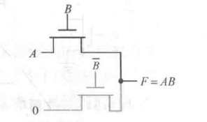
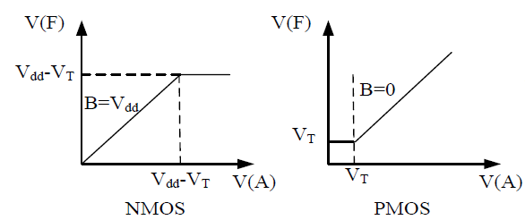
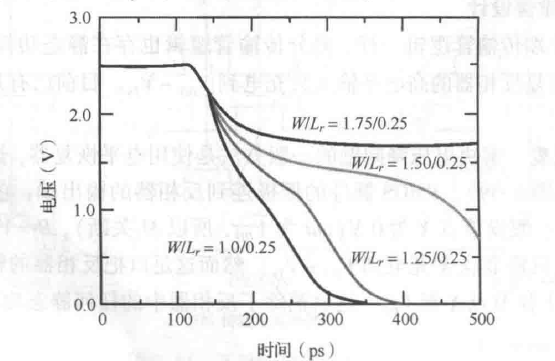
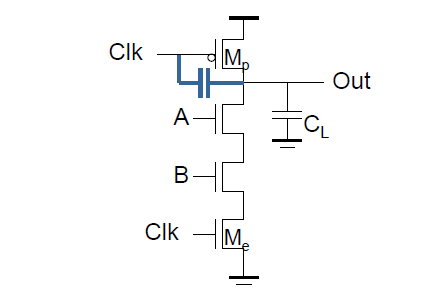
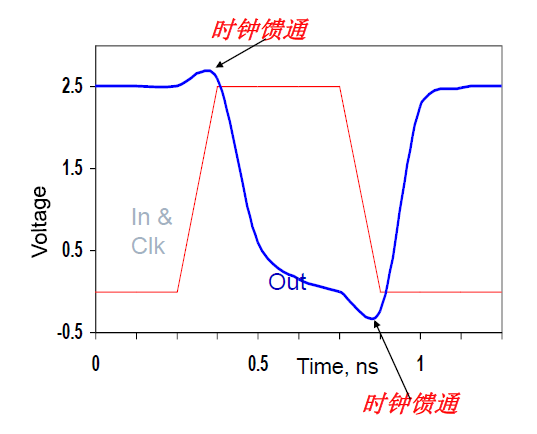

# 静态逻辑
## 静态互补 CMOS 反相器

### 开关阈值电压 $V_M$

由电流相等：

$$ k_n' V_{DSATn} \left( V_M - V_{Tn} - \frac{V_{DSATn}}{2} \right) + k_p' V_{DSATp} \left( V_M - V_{DD} - V_{Tp} - \frac{V_{DSATp}}{2} \right) = 0 $$

可以推导得到开关阈值$V_M$表达式： 
$$ V_M = \frac{\left( V_{Tn} + \frac{V_{DSATn}}{2} \right) + \left( V_{DD} + V_{Tp} + \frac{V_{DSATp}}{2} \right) r}{1 + r}, \quad r = \frac{k_p' V_{DSATp}}{k_n' V_{DSATn}} = \frac{\mu_{p} W_p}{\mu_{n} W_n} $$

改变$W_p/W_n$（即$r$，通常为$2$）会平移电压传输特性曲线（VTC），$r$增大则$V_M$右移；互补CMOS静态反相器的$V_M$对器件参数不敏感。

当阈值电压$V_M$恰好等于$\frac{V_{DD}}{2}$时，噪声容限最大，

- **增加 P 管的宽度使 VM 移向 VDD，VM >VDD /2 时，称为HI Skewed反相器；**

- **增加 N 管的宽度使 VM 移向 GND，VM <VDD /2 时，称为LO Skewed反相器** 

#### 电源电压对 VTC 曲线的影响

*电源电压对 VTC 曲线的影响*

>[!note] Homework 4-1 (2)
>
>写出如图电路的逻辑布尔表达式
>
>

根据电路图列式子即可：
$$
\begin{aligned}
S &= \overline{A}BC + A\overline{B}C + AB\overline{C} + ABC \\
  &= (\overline{A}\overline{B} + AB)C + (\overline{A}B + A\overline{B})\overline{C} \\
  &= A \oplus B \oplus C
\end{aligned}
$$
## 有比逻辑

### 概述

当输出应该为低电平时，上拉部分并没有完全关闭。==输出低电平($V_{OL}$)取决于上拉电阻和下拉网络导通电阻之间的比例==。

**目的：减少实现所需晶体管数目（实现一个N输入的逻辑门，从 2N 个晶体管减少到 N+1 个晶体管）**

*有比逻辑三种经典负载*

我们讨论一下三种电路输出低电平的情况：

- **电阻负载**（在集成电路中制造高质量、小面积的电阻非常困难。因此，==纯电阻负载极其罕见==）：

	PDN导通时，形成一个从F到地的通路（等效电阻为$R_{PDN}$，即 PDN 的导通电阻），形成了一个==从 VDD 到 VSS 的分压器==，输出电压（为让$V_{OL}$尽可能接近0V，必须让$R_L$远大于$R_{PDN}$）：
$$
V_{OL} = V_{DD} \frac{R_{PDN}}{R_L + R_{PDN}}
$$

- **耗尽型负载NMOS**（早期NMOS逻辑的主流技术，制作8086的工艺）：

	使用的是特殊类型的NMOS管，其 $V_T < 0$ 。意味着它==始终处于导通状态==，表现得像一个非线性的电阻（类似于模集中的一类管子）。

- **伪NMOS (Pseudo-NMOS)**（我们最关心的有比逻辑）：

	PMOS管的栅极永远接地，==永远处于导通状态==，作为一个非线性电阻工作，负责上拉。

### 共性分析

都会形成一条==分压通路==，通过上面的负载（纯电阻、导通N/PMOS管）和 PDN 的导通电阻决定输出低电平的值。

#### 输出电平

$$
V_{OH} = V_{DD}
$$
$$
V_{OL} = V_{DD} \frac{R_{PN}}{R_{PN}+R_{L}}
$$
可以看出是**非对称逻辑**：上拉通过一个==阻值很大的负载$R_L$==来实现的，而下拉通过可以设计得==阻值很小的NMOS网络$R_{PN}$==来实现。

#### 速度

|                                  | 充电 (输出 0 → 1)          | 放电 (输出 1 → 0)              |
| -------------------------------- | ---------------------- | -------------------------- |
| **电阻**​                          | 负载电阻 ($R_L$)           | 驱动网络电阻 ($R_{PDN}$)         |
| **速度**​                          | **慢**​                 | **快**​                     |
| **时间常数 $\tau$**​                 | $R_L C_L$              | $R_{PN} C_L$               |
| **上升/下降延时（$t_{plh}$/$t_{phl}$）** | $t_{plh}=0.69 R_L C_L$ | $t_{phl}=0.69 R_{PDN} C_L$ |

#### 静态功耗

输出为低电平($V_{OL}$)时，上拉负载$R_L$和下拉网络PDN同时处于导通状态。这就形成了一条从VDD，经过$R_L$，再经过PDN，最终流向GND的直流电流通路。

$$
P_{static} = V_{DD}^2 / (R_L + R_{PN})
$$

### 伪 NMOS 逻辑

*伪NMOS电路及输出低电平随 PMOS 管尺寸设计变化特性*

**输出低电平推导**：

*伪NMOS反相器电路*

以最基础的伪 NMOS 反相器为例，上下管子的导通电流相等，即$I_{DS,n} = I_{SD,p}$：

$$
k_n \left[ \left( V_{DD} - V_{Tn} \right) V_{OL} - \frac{V_{OL}^2}{2} \right] + k_p \left[ \left( - V_{DD} - V_{Tp} \right) \cdot V_{DSATp} - \frac{V_{DSATp}^2}{2} \right] = 0
$$
$V_{OL}$（注意，这个只是反相器的输出低电平）可近似为：
$$
V_{OL} \approx \frac{k_p(V_{DD}+V_{Tp})V_{DSATp}}{k_n(V_{DD}-V_{Tn})}
$$
要使$V_{OL}$足够小，就必须==让PMOS拉电流的强度($\mu_p W_p$)远小于NMOS拉电流强度($\mu_n W_n$)==

> 如无特别说明，本笔记的伪 NMOS 逻辑采用 $W_p = \frac{W_n}{2}$

####  逻辑努力

|           |                 **逻辑努力 (Logical Effort, g)**​                 |                 **本征延时 (Parasitic Delay, p)**​                  |
| :-------: | :-----------------------------------------------------------: | :-------------------------------------------------------------: |
|  **基准**​  |                       标准CMOS反相器​ (g=1)                        |                        标准CMOS反相器​ (p≈1)                         |
| **物理层面**​ |                   为提供相同驱动电流，==输入电容==的增大倍数。                    |                    在相同驱动电流下，==自身寄生电容==的增大倍数。                    |
| **物理意义**​ |                    被驱动的难度。输入电容越大，对前级负载越重。                     |                 自身寄生效应导致的==固有延迟==。与负载无关，是门的固有属性                 |
| **优化目标**​ |                       越小越好，意味着驱动下一级更高效。                       |                        越小越好，意味着门自身的速度越快。                        |
| **计算方式**  | $\frac{1}{3} \sum_{i=1}^{n} \text{尺寸系数}_{\text{输入直连晶体管},\,i}$ | $\frac{1}{3} \sum_{i=1}^{n} \text{尺寸系数}_{\text{输出节点直连晶体管},\,i}$ |

##### 伪 NMOS 反相器

> **前置条件**
> 
> 1. 上拉电流是下拉电流的1/4。（为了保证输出低电平 $V_{OL}$ 足够低（通常要求 $V_{OL} < V_{t}$））
>
> 2. 设NMOS尺寸为 $a$，PMOS尺寸为 $a/2$（基于前面的笔记宏设定）
>
> 3. 相同尺寸下，==PMOS的驱动能力是NMOS的1/2==。设单位NMOS驱动力为1，则单位PMOS驱动力为1/2。

正如伪 NMOS 门具有极端的电流**不对称性**，我们在评估它时，必须把上拉和下拉拆开来进行==两次独立的思想实验==，以分别确定上下拉的逻辑努力等参数。

**上拉分析：**

输入为低时，NMOS截止，输出仅由PMOS驱动上拉，此时 PMOS 应提供单位电流（尺寸系数 * 单位驱动能力）

$$
\frac{a}{2} \times \frac{1}{2} = 1
$$
由此确定两个管子的尺寸系数：NMOS尺寸为4，PMOS尺寸为 $4/2 = 2$。

|        参数        |                   公式                   |                                                    计算                                                    |     数值结果      |
| :--------------: | :------------------------------------: | :------------------------------------------------------------------------------------------------------: | :-----------: |
| **逻辑努力 ($g_u$)** |   $g_u = \frac{C_{in}}{C_{in\_ref}}$   |               输入电容 $C_{in} = 4$（仅NMOS栅极） 基准电容 $C_{in\_ref} = 3$ $g_u = \frac{4}{3}$                | $\frac{4}{3}$ |
| **本征延时 ($p_u$)** | $p_u = \frac{C_{diff}}{C_{diff\_ref}}$ | 扩散电容 $C_{diff} = 6$（PMOS:2 + NMOS:4） 基准电容 $C_{diff\_ref} = 3$（PMOS:2 + NMOS:1） $p_u = \frac{6}{3}$ |      $2$      |
**下拉分析：**

尺寸系数求解（下拉电流减上拉电流等于单位电流）：
$$
a \times 1 - \frac{a}{2} \times \frac{1}{2} = 1
$$
所以，NMOS尺寸为 $4/3$，PMOS尺寸为 $2/3$。

|        参数        |                   公式                   |                                                计算                                                 |     数值结果      |
| :--------------: | :------------------------------------: | :-----------------------------------------------------------------------------------------------: | :-----------: |
| **逻辑努力 ($g_d$)** |   $g_d = \frac{C_{in}}{C_{in\_ref}}$   | 输入电容 $C_{in} = 4/3$（输入NMOS栅电容等效） 基准电容 $C_{in\_ref} = 3$ $g_d = \frac{4/3}{3} = \frac{4}{9}$ | $\frac{4}{9}$ |
| **本征延时 ($p_d$)** | $p_d = \frac{C_{diff}}{C_{diff\_ref}}$ |   扩散电容 $C_{diff} = 2$（下拉网络等效） 基准电容 $C_{diff\_ref} = 3$ $p_d = \frac{2}{3} = \frac{6}{9}$    | $\frac{6}{9}$ |
##### 伪 NMOS 与非门 (NAND2)

NMOS 尺寸系数：
$$
\frac{a}{4} \times \frac{1}{2} = 1 \Rightarrow \frac{a}{8} = 1 \Rightarrow a=8
$$

|         参数         |                 上拉                  |          下拉          |
| :----------------: | :---------------------------------: | :------------------: |
|  **NMOS尺寸系数 (a)**  |                 $8$                 |        $8/3$         |
| **PMOS尺寸系数 (a/4)** |                 $2$                 |        $2/3$         |
|   **逻辑努力 ($g$)**   | $g_u = \frac{8}{3} = \frac{24}{9}$  | $g_d = \frac{8}{9}$  |
|   **寄生延时 ($p$)**   | $p_u = \frac{10}{3} = \frac{30}{9}$ | $p_d = \frac{10}{9}$ |

##### 伪NMOS或非门 (NOR2)

|         参数         |                 上拉                  |          下拉          |
| :----------------: | :---------------------------------: | :------------------: |
|  **NMOS尺寸系数 (a)**  |                 $4$                 |        $4/3$         |
| **PMOS尺寸系数 (a/4)** |                 $2$                 |        $2/3$         |
|   **逻辑努力 ($g$)**   | $g_u = \frac{4}{3} = \frac{12}{9}$  | $g_d = \frac{4}{9}$  |
|   **寄生延时 ($p$)**   | $p_u = \frac{10}{3} = \frac{30}{9}$ | $p_d = \frac{10}{9}$ |

#### 静态功耗

仅在输出低电平的时候有静态功耗 $P_{low} = V_{DD} I_{low}$ ：

$$
P_{low} \approx V_{DD} \left| k_p \left( (-V_{DD} - V_{Tp}) V_{DSATp} - \frac{V_{DSATp}^2}{2} \right) \right|
$$
如果前一级的输出低电平 $V_{OL}$ 抬高，那么连接到后级NMOS栅极的电压就变高了（不再是0），这使得后级NMOS更难以完全关断，==增加了亚阈值泄漏==。

>[!tip] 改进方案：门控NMOS
>
>可以用一个使能信号控制负载管栅极，在待机状态下将pMOS关闭，PMOS的栅极不再直接接地，而是连接到一个控制信号 $\overline{en}$（或者通过反相器接 $en$）

## 传输管逻辑

### 概述

*传输门实现的AND门*

与传统的静态CMOS将晶体管仅作为电源和地的连接开关不同，传输管逻辑允许==输入信号直接驱动晶体管的源/漏端==。

**特点**：

- **晶体管数少**：N输入逻辑门仅需要N个晶体管

- **无静态功耗**：理想状态下，路径中没有直通电源到地的电流。

#### 阈值损失

*传输管阈值损失特性*

#### 速度

*传输管延时求解基本模型*

传输管不仅引入了额外的电阻 $R_t$，还增加了节点电容，这会增加信号传播延时，根据 Elmore 延时模型：

$$
t_p = 0.69(R_d + R_t)C_L + 0.69R_d C_A
$$

>[!tip] 延时改进方案：Low-skewed 反相器（输出反相器）
>
> 由于阈值损失，传输管输出上升到高电平的速度很慢，且幅度有限（最高仅 $V_{dd}-V_T$）。
> 
> **Low-skewed**：将反相器的开关阈值（$V_M$）设计得较低（减小PMOS尺寸或增大NMOS尺寸）
> 
> 由于传输管输出的“高电平”本身就比较低且上升慢，降低后级反相器的翻转阈值，可以让后面级联的反相器在输入信号还没升得很高时就==提前翻转==，从而补偿了传输管上升速度慢的缺陷，缩短整体延时。

#### 功耗

从电源抽取的能量与摆幅成==正比==，小摆幅传输确实==节省了充放电的动态功耗==：

$$
E_{0 \to 1} = C_L \cdot V_{dd} \cdot (V_{dd} - V_t)
$$
但阈值电压损失会==引起下一级门电路的静态功耗==：

如图是NMOS传输管，输出的“弱1”（ $2.5V - V_T$）直接驱动下一级CMOS反相器，下一级反相器的PMOS管（$M_2$）源极接 $V_{dd}$（$2.5V$），栅极接 $V_{dd}-V_T$。此时PMOS的源栅电压 $|V_{GS}| \approx V_T$。如果 $V_T$ 不足以使PMOS完全截止，或者处于亚阈值区，==PMOS将保持微弱导通==，导致上下同时导通，形成静态功耗。

#### 信号完整性

传统的CMOS门具有电平恢复功能（输出总是标准的 $V_{dd}$ 或 $GND$），能够“整形”信号。而传输管逻辑是“==损耗型==”传输，级联多级会导致信号幅度不断衰减。因此，必须在传输管逻辑后定期插入静态CMOS反相器来恢复信号电平。

### 互补传输管逻辑（CPL）

CPL同时处理原信号（如 $A, B$）和反相信号（$\bar{A}, \bar{B}$），并同时产生互补输出（$F$ 和 $\bar{F}$）

### 阈值电平恢复电路

#### PMOS 硬拉

*电平恢复电路示意图*

在传输管（$M_n$）输出节点 $X$ 上，增加了一个由后续反相器（$M_1, M_2$）反馈控制的PMOS管（$M_r$），借助这个 PMOS 管把有损失的电平拉到 VDD。

**缺点**：

- **翻转竞争**：当节点 $X$ 需要从高变低时（输入 $A$ 变为0），传输管 $M_n$ 必须强行将 $X$ 拉低。但在放电初期，由于 $X$ 原为高，反相器输出为低，$M_r$ 仍处于导通状态，试图维持高电平。

*电平恢复器尺寸选择（越大下拉时间越长）*

此时，$M_n$（下拉）和 $M_r$（上拉）形成竞争。$M_n$ 应强于 $M_r$（有比电路）。必须设计 $M_n$ 的驱动能力显著大于 $M_r$，才能成功拉低节点 $X$，否则电路将锁死在高电平。

由于存在竞争，放电电流被 $M_r$ 抵消了一部分，且 $M_r$ 增加了节点 $X$ 的寄生电容，导致下降延时变大。
#### 差分电平恢复电路

*摆幅恢复传输管逻辑*

这是针对互补传输管逻辑的恢复手段。

*SRPL简化图*

实际上是构成了一个弱的PMOS锁存器。当左侧输出为低时，它会自动开启右侧的PMOS，将右侧输出强力拉高至 $V_{dd}$。反之亦然。

#### $V_T=0$ 的单管传输门

从原理上消除了阈值电压损失，但$V_T=0$ 的晶体管非常==难以关断==。即使栅极电压为0，由于亚阈值摆幅的存在，漏电流会非常大。这会导致电路在待机时消耗==巨大的静态功耗==。

#### CMOS 互补传输门

*CMOS互补传输门*

和静态互补CMOS逻辑门一样，各拉各的，损失消失。

**并联电阻 $R_n || R_p$**：两条曲线并联后，==总电阻在整个电压范围内变化较小，基本恒定==。这使得传输门的延时特性比较线性且可预测。

**通常 $W_p = W_n$**：通常设计两者尺寸相同。虽然PMOS迁移率低，但由于两者是并联工作且主要目的是全摆幅而非极致驱动，相同尺寸能平衡版图复杂度和电容。

>[!note] Homework 4-1（1）
>
>写出如图电路对应的输出布尔表达式
>
> 
> 

**解：**

根据 $k3k2k1k0$ 的值，可以得到逻辑是：$F=AB + \overline{A}B=B$

# 动态逻辑

## 基本原理

1. **预充电阶段**（时钟信号 $CLK = 0$）：

	- **预充电管导通**：PMOS预充电管（$M_p$）在栅极低电平作用下导通，建立了电源 $V_{DD}$ 到输出节点 $Out$ 的低阻抗路径（无论输入逻辑状态如何，输出节点 $Out$ 均被无条件充电至高电平 $V_{DD}$）。
	    
	- **求值管关断**：NMOS求值管（$M_e$）在栅极低电平作用下截止（Cut-off），切断了下拉网络（PDN）与地（GND）之间的物理连接（电源 $V_{DD}$ 与地之间也不存在直流通路。因此，该机制消除了在预充电期间可能发生的任何静态功耗）。
2. **求值阶段**（时钟信号 $CLK = 1$）

	- **预充电管关断**：PMOS预充电管（$M_p$）截止，断开了输出节点与电源 $V_{DD}$ 的连接。
	    
	- **求值管导通**：NMOS求值管（$M_e$）导通，将下拉网络（PDN）的底部接入地（GND）。此时，电路的输出状态完全取决于下拉逻辑网络（PDN）的导通情况。

3. **有条件放电（求值阶段）**

	- **输入逻辑使得PDN导通**
	    
	    如果在输入信号作用下，下拉网络形成导通路径，则输出节点 $Out$ 通过PDN和导通的求值管 $M_e$ 形成到地的低阻抗通路。存储在输出节点的电荷被泄放，输出电压降至逻辑“0”（GND）。
	    
	- **输入逻辑使得PDN关断**
	    
	    如果下拉网络未形成通路，输出节点无法放电。此时，预充电的高电平值（$V_{DD}$）被维持在负载电容 $C_L$ 上。

>[!note] 关键特性（高阻态）
>**高阻抗状态（High-Z）**：在PDN关断的情况中，由于 $M_p$ 关断且 PDN 未导通，输出节点既不连接 $V_{DD}$ 也不连接 GND，处于==悬浮的高阻抗状态==。这与静态逻辑总是存在低阻通路截然不同。

>[!note] 关键特性（放电不可逆性）
**放电不可逆性**：在求值阶段，输出节点与电源之间唯一的可能路径是连接到 GND。因此，一旦 $Out$ 发生放电，就不可能再次充电恢复高电平，直到下一个预充电周期（$CLK=0$）到来。
>
>这意味着，在求值期间，门的输入最多只能发生一次变化（通常要求==单调变化==），否则可能导致错误的逻辑输出。

综上，右侧示例电路动态逻辑输出的布尔表达式：

$$Out = \overline{CLK} + \overline{(A \cdot B + C)} \cdot CLK$$
动态电路依靠把信号值暂时存放在高阻抗节点的电容上来代替低阻抗路径。但由于依靠电容存储电荷来维持电压，电荷会因为**泄漏电流**而逐渐流失，因此动态电路不能无限期地维持状态，必须周期性地进行**预充电**和刷新，这也是其被称为“==动态==”的原因。

设计N输入逻辑仅需要==N+2==个晶体管。

### 有足、无足门

- **有足门**：电路底部包含受时钟控制的NMOS管$M_e$，预充电阶段始终有$M_e$防止输入信号导致充放电竞争。

- **无足门**：没有对应的$M_e$，设计时需要确保预充电阶段PDN不会有输入导致GND导通。

### 具体设计约束

- 输入信号必须严格控制，避免误放电。

- 设计时确保==PDN的等效电阻等于单位电阻==，保证基本的下拉能力。

- **预充电管（$M_p$）**：**可选择较小的预充电管尺寸**（即电阻较大，如两倍单位电阻，这可以降低栅极电容，减轻时钟分布网络的负担）。

- **求值管（$M_e$）**：**选择求值管的尺寸比其他NMOS管大。**（加快放电（求值）速度）

### 工作特性

- **全摆幅输出**：输出电压可以完整地达到$V_{DD}$和$GND$，没有电压损失。

- **无比逻辑**：逻辑电平的高低不依赖于晶体管的尺寸比例（这个从原理就能看出来）。

- **阈值电压**：因为全靠$M_e$来操控高低电平，所以阈值电压就是的$M_e$导通阈值电压$V_{Tn}$。

- **噪声容限小**：只要输入端的噪声电压略微超过$V_{Tn}$，PDN就会导通并开始泄放电容上的电荷，导致逻辑错误。

- **输入稳定性要求**：输入只允许在预充电阶段变化，==在求值阶段必须保持稳定==。

- **无毛刺**：输出在求值阶段要么保持高电平，要么单调地放电至低电平，不会出现静态CMOS中常见的竞争冒险导致的毛刺。

## 串联动态门

试分析如图所示的级连动态门（反相器）：

1. **预充电阶段**：两个门同步同时充电。

2. **求值阶段**：由于放电延迟时间， $Out1$ 有一段时间是高电平，作为第二级的输入，它会导致第二级的NMOS求值管**误导通**。

### 多米诺逻辑

**定义**：多米诺逻辑 = 动态逻辑门 + **静态反相器**。（在每个动态门的输出端（$Out1$）后固定连接一个静态CMOS反相器。反相器的输出作为下一级动态门的输入。）

仅能实现非反相逻辑（毕竟连了一个反相器），加反相器把下一级的初始状态（预充电后的状态）从**默认常开**变成了**默认常关**，确保了信号像多米诺骨牌一样，必须前一张倒下（变1），才能撞倒后一张。

>[!note] Homework 4-4
> 请说明为了优化延时应该如何设计多米诺逻辑中反相器的尺寸？

核心思想就是：**轻预充，重求值**。

#### np-CMOS多米诺

不使用静态反相器，而是交替使用**PDN**和**PUN**（n型级在 $Clk=0$ 时预充电（高），p型级在 $Clk=0$ 时预放电（低）。）。（让默认输出相反，也就不会相互影响了）

- **在PDN输入端（n型级）**：只允许 $0 \rightarrow 1$ 的过渡。
    
- **在PUN输入端（p型级）**：只允许 $1 \rightarrow 0$ 的过渡。

相比标准多米诺逻辑，np-CMOS**可以实现反相逻辑**（因为它没有强制添加静态反相器）。

#### NORA（无竞争）逻辑

标准多米诺和np-CMOS多米诺混合使用

- **对噪声非常敏感**

- **p-logic的逻辑努力大于n-logic门**（由于空穴的迁移率低于电子，PMOS管的导电能力弱于同尺寸的NMOS管。为了获得相同的驱动电流，p-logic中的PMOS器件必须设计得更宽。这导致其输入电容增大，从而增加了前一级的驱动负担）

#### 多输出多米诺逻辑 (MODL)

在数字逻辑设计中，经常会出现一个复杂逻辑函数包含另一个简单逻辑函数的情况。例如$F = F_1 \cdot F_2$，其中$F_2$本身也是一个需要输出的逻辑。

MODL的做法是将逻辑电路“==堆叠==”起来。利用同一棵下拉逻辑树（Logic TREE），在不同的节点引出输出。

- **扇出小**：对于驱动$F1$逻辑块的输入信号来说，它们只需要驱动一个栅极，而不是两个分离逻辑门的两个栅极，降低了前级电路的负载。

- **出现了多个逻辑电平**：由于串联的晶体管数量不同，不同输出节点的放电速度和电压特性可能不一致，增加了电路时序分析和设计的复杂性。

>[!note] MODL例子 - 超前进位加法器
>**核心递归公式**：
>- 进位产生（Generate）：$g_i = a_i b_i$
>
>- 进位传播（Propagate）：$p_i = a_i \oplus b_i$
> 1. **进位产生信号电路**
> 
> 虽然最中间的点，两个电路之间有导通的点的存在，但是因为电流直往下流，也就是只存在放电或者保持的情况，所以两个电路并不会相互干扰。上方的电路既无法给 $g_1$ 节点“补充电荷”（把它拉高），也无法绕过 $a_1, b_1$ 把它“强行拉低”（因为它本身不接地，必须通过 $g_1$ 节点才能接地）。
> 2. **进位传播信号电路**
> 

#### 组合多米诺

>[!note] Homework 4-3
> 请分析动态逻辑门串联的影响？应该如何避免？

见笔记内容即可。

## 动态逻辑的速度和功耗

### 逻辑努力

也就是输入信号在待求电路接的电容（MOS管总尺寸）/在静态反相器接的电容（MOS管总尺寸）

- **动态无足反相器**：只有一个NMOS控制放不放电，所以和静态反相器的PDN尺寸相同。

- **动态有足反相器**：因为比无足多串联了一个CLK控制的NMOS，所以尺寸 $*$ 2。

==动态门的逻辑努力显著小于静态CMOS门和伪NMOS门==。

### 动态逻辑速度

- **求值速度**：主要由**PDN**决定。
    
- **预充电时间**：主要由**PMOS预充电管**决定。

#### 时钟频率上限

预充（求值）脉冲宽度要大于输出上升（下降）的最长时间。

意味着时钟的高电平时间必须足够长，以保证最复杂的PDN也能完成放电；低电平时间必须足够长，保证节点能完全充电至$V_{DD}$。这直接决定了==系统的最大工作频率==。

#### 并行与串行特性

- **预充电是并行的：
    
    - 当$Clk=0$时，所有级的PMOS管同时导通。
        
    - 无论级联链路有多长，整个系统的复位时间仅取决于单个门的预充电延迟（P只需要两级门的延时，通常指预充管+反相器）。这是一个**全局同步**操作。
        
- **求值是逐级完成的**：
    
    - 当$Clk=1$时，信号像波浪一样传播。第一级求值完成（输出变高）后，才能开启第二级的下拉网络，以此类推。
        
    - 这是一个**串行传播**过程，总延迟是各级求值延迟的累加。

#### 取消求值管

在多米诺级联结构中，由于前一级的输出在预充电时**严格为0**，这保证了第二级的PDN（由NMOS构成）处于**截止状态**。即使没有底部的$M_e$，第二级在预充电期间也不会形成直流通路。

但是对于无足的第二级而言，会发生：PMOS预充电管导通（因为 $Clk=0$），同时PDN也导通（上一级复位需要时间，而上一个求值阶段的导通效果会在这个时间内保持，直到上一级充电完成）。这就形成了一条从电源 $V_{DD}$ 直通地 GND 的**短路电流**路径。

##### 解决竞争方案：时钟延迟

不让所有级同时开始预充电。而是强制要求——只有当前一级预充电完成并建立起安全的高电平（使得下一级输入变为0，PDN关断）之后，本级才允许开始预充电。

### 功耗

如果在求值阶段，电路输出为逻辑0（电容放电）。那么在紧接着的下一个预充电阶段，电路**必须**对节点进行充电，使其恢复到 $V_{DD}$。因此，开关活动性 = 输出为0的概率 ($p_0$)

| 电路类型 | 符号                     | 原理推导                                                               | 开关活动性              |
| ---- | ---------------------- | ------------------------------------------------------------------ | ------------------ |
| 静态电路 | $\alpha_{0 \to 1 sta}$ | 仅当输出从0翻转到1时消耗电源能量，需满足前一状态为0（概率 $p_0$）、当前状态为1（概率 $p_1$），开关活动性为该联合概率 | $\alpha = p_0 p_1$ |
| 动态电路 | $\alpha_{0 \to 1 dyn}$ | 每个周期开始前强制预置为1，若结果为0，即发生“1 $\to$ 0 $\to$ 1”完整能量循环，开关活动性仅取决于结果为0的概率  | $\alpha = p_0$     |

- **晶体管少**：N输入逻辑仅需N+2个管子，且无足结构更少。

- **时钟功耗**：时钟信号必须驱动每一个动态门和预充/求值管，时钟网络的负载极重，时钟树的功耗在总功耗中占比巨大。

- **开关活动性高**：如前所述，$\alpha_{dyn} > \alpha_{sta}$，导致更高的动态开关功耗。（总体来讲，功耗大于静态互补CMOS电路）

## 动态设计中的信号完整性问题

|     影响因素      |              对信号完整性的影响              |
| :-----------: | :---------------------------------: |
|   **电荷泄露**    |  动态节点高阻抗，漏电流使存储电荷衰减，高电平漂移，可能逻辑翻转。   |
|   **电荷共享**    | 动态节点与内部节点电容连通，电荷重分配导致输出电压下降，造成逻辑错误。 |
|  **回栅电容耦合**   |    后级信号跳变通过寄生电容耦合到前级动态节点，造成电压干扰。    |
|   **时钟馈通**    |   时钟跳变通过栅漏电容耦合到动态节点，产生电压过冲/下冲的毛刺。   |
| **其他干扰源**  |   相邻信号、衬底噪声或电源波动通过耦合或体效应干扰动态节点电平。   |

### 电荷泄露

动态逻辑电路的根本性弱点：**动态节点无法长期保持电荷**（因为是电容存电）。

在动态逻辑的**求值阶段**，如果输入组合使得PDN不导通，输出节点应维持预充电的高电平（$V_{DD}$）。此时，该节点与电源$V_{DD}$（PMOS关断）和地GND（PDN关断）均无低阻抗连接，处于**悬浮的高阻抗状态**。

尽管晶体管处于截止状态，但在物理上仍存在==微小的漏电流==。

- **反向偏置二极管漏电（$I_{diode}$）**：源/漏扩散区与衬底之间形成寄生PN结二极管。
    
- **亚阈值漏电（$I_{sub}$）**：栅源电压$V_{GS}=0$时，沟道内仍有微弱电流流过。

$$I_{Leak} = (I_{N\_sub} + I_{N\_diode}) - (I_{P\_sub} + I_{P\_diode})$$

在求值阶段（时钟为高），如果没有放电回路，输出电压$V_{out}$本应保持平直。但由于$I_{Leak}$的存在，$V_{out}$会随时间缓慢下降。

约束：

- **$t_{sw}$**：动态节点电荷泄漏掉导致逻辑翻转所需的时间。取决于节点电容$C_{DYN}$、允许的电压摆幅$V_{SW}$以及漏电流$I_{Leak}$。
    
- **$f_{min}$**：为了保证==在电荷漏光之前完成求值并进入下一个预充电周期==，时钟周期必须小于$t_{sw}$。

>[!tip] 时钟频率
>到这里为止，一共有两个因素在约束时钟频率：
>
>1. **多米诺求值时间**：时钟的高电平需要延迟到所有级电路求值结束。
>2. **漏电时间**：CLK高电平延迟时间不能大于逻辑翻转漏电时间

#### 电荷泄露解决方案

*电荷泄露改进电路*

和传输门阈值电平恢复同理，找一个PMOS管硬拉即可，注意尺寸设计。

### 电荷共享

$A$ 发生阶跃（变高），$M_p$ 导通；但 $B=0$，这意味着 $M_b$ 截止，PDN并未导通到地，但由于 $M_a$ 导通，==输出节点 $Out$ 与内部节点 $X$（即A输入下面的那个节点） 连通==。$C_L$ 上的高电位电荷会流向低电位的 $C_a$，直到两点电位平衡。

动态逻辑门驱动传输门时也会出现去电荷分享的情况：

#### 电荷共享后的输出电压计算

1. **输出降幅较小**（$C_L$ 远大于 $C_a$，电荷足够多，使得最终平衡电压仍较高，大于 $V_{DD} - V_{Tn}$。）：

此时，$M_p$ 漏极（$X$）电压上升，直到 $V_x = V_{DD} - V_{Tn}$（考虑到体效应后的阈值）。一旦 $V_x$ 达到此值，$M_a$ 截止，电荷停止流动。

跟据电荷守恒：
    
$$
C_L V_{DD} = C_L V_{out}(t) + C_a (V_{DD} - V_x)
$$
输出电平损失公式：
$$
\Delta V_{out} = V_{out}(t) - V_{DD} = - \frac{C_a}{C_L} (V_{DD} - V_x)
$$
2. **输出降幅较大** ($C_a$ 较大，分享走了大量电荷，导致最终平衡电压很低)：

$$
C_L V_{DD} = V_x(C_L + C_X)
$$
- 压降公式：
    
$$
\Delta V_{out} = - V_{DD} \left( \frac{C_a}{C_a + C_L} \right)
$$
    
    这直接反映了两个电容并联分压的结果。

#### 电荷共享解决方案

*电荷共享解决方案：增加预充电内部节点充电管*

电荷分享之所以发生，是因为内部节点电容 $C_a$ 初始是空的（0V）。如果我们能让 $C_a$ 在预充电阶段也充上电（变高），那么在求值时，即使 $M_a$ 导通，由于 $V_{out}$ 和 $V_x$ 都是高电平，就不会发生电荷分享。

但是代价是增加了功耗（给内部节点充电）和面积（多了一个晶体管）

>[!note] Homework 4-2
>
> 
> 
> 如图的动态电路中，若预充电节点处的电容为$20fF$，其余所有内部节点处的电容均为$15 fF$。
> 
> 在这个动态电路后面接一个栅电容为25 fF的理想反相器，它在$V_M = V_{dd}/2$时发生翻转（阈值电压刚刚好）。
> 
> **问：** 在什么情况下，由于电荷分享将使动态电路后面连接的反相器错误翻转？求出此时反相器输入端的电平Vo（用Vdd来表示），忽略NMOS 管的阈值损失。指出如何才能避免这一问题的发生。（注意：动态电路预充电节点处的电容20fF不包括后面所接反相器的栅电容在内）

**解：**

（1）

首先分析让反相器错误翻转的两种情况：

1. 低电平错输成高电平（大概率只是延时的问题，时间久一点都是可以降到低电平的，不是电荷共享的问题）

2. 高电平错输成低电平

由于$\Delta V_{out}$已经达到了$V_{dd}/2$，所以是电荷共享计算的情况2，即：

$$
C_L V_{DD} = V_x(C_L + C_X)
$$
由于该动态逻辑是多 NMOS 串联（多扇入与非），所以可能会有多个节点共享电荷，这也是题干中所谓“什么情况”。修正后的方程：

$$
C_L V_{DD} = V_x(C_L + n C_X)
$$
达到错误输出的临界$V_{out} = \frac{V_{DD}}{2}$，此时求解$n =3$，注意到这道题的求值管放在最上面，所以第一个节点是默认电荷共享的，因此临界需要导通的晶体管数量为 3-1 = 2。

最后只需要凑齐≥2个晶体管导通即可，但是注意由于电荷共享需要通络，所以是从$A1A2$开始往下顺延到$A1A2A3A4A5$即可，再分别代入$n$计算$V_{out}$即可。

（2）见题目上面。

### 回栅电容耦合

后级信号的变化通过寄生电容反向影响前级动态节点。

#### 解决方案

动态门驱动静态门时，**应当驱动静态门中靠近电源/地的管子**，减少耦合路径的影响，或者利用其它管子的屏蔽作用。但更通用的做法通常是==加缓冲器==。

### 时钟馈通

预充电PMOS管（$M_p$）和求值NMOS管（$M_e$）中，栅极与漏极之间存在寄生电容（栅漏重叠电容和沟道电容的一部分）。

由于栅极连接的是时钟信号 $Clk$，时钟信号的==快速跳变会通过这些电容直接耦合到高阻抗的动态节点 $Out$ 上==。

*时钟馈通效应*

1. **预充电结束：**

 $Clk$ 从 $0 \to 1$（低变高），时钟的上升沿通过PMOS的栅漏电容==耦合到输出节点==，导致输出电压 $V_{out}$ 瞬间上升超过 $V_{DD}$

2. **求值结束：**

当 $Clk$ 从 $1 \to 0$（高变低）时，时钟的下降沿通过耦合电容将输出节点电压拉低至 GND 以下。

#### 时钟馈通与电荷共享联动

### 其他干扰源

- **电容耦合**：来自相邻导线的信号跳变通过线间电容耦合到悬浮的动态节点。
    
- **衬底耦合**：其它电路模块产生的衬底噪声通过体效应或衬底接触影响动态节点。
    
- **电源噪声**：$V_{DD}$ 或 $GND$ 的波动直接影响节点电平。

#### 工程上的防御措施

- **远离干扰源**：将动态节点布置在远离时钟线、大电流IO线的地方。
    
- **保护与屏蔽**：在动态节点周围增加保护环以吸收衬底注入电荷；使用地线屏蔽信号线以减少电容耦合。

# 电路选择指南