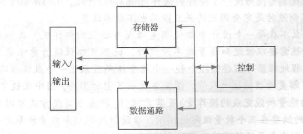
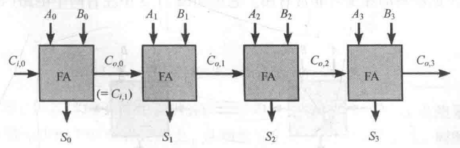
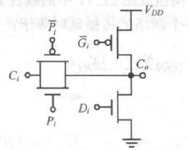
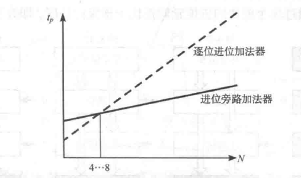
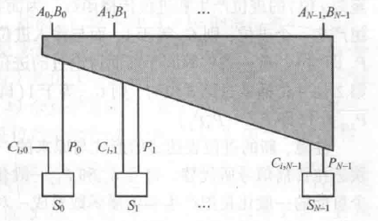

# 数据通路

*一般数字处理器的组成*

首先需要建立设计复杂算术逻辑单元（ALU）或处理器数据通路时的**方法论基础**。在设计像加法器这样的复杂电路时，我们遵循以下核心原则：

*位片式数据通路结构*

1. **规整性 & 位片式实现**：

为了处理$N$位的数据，我们不需要设计$N$种不同的电路，而是设计一个==标准位片单元==，然后将其复制$N$次。

**位片就是一个能够独立处理单位长度数据（可以是字节，字，也可能是比特）的完整功能模块**（如xx位全加器，xx位寄存器，多路选择器等）。而位片式结构就是很多处理单位长度的数据的模块的叠加。

2. **局域性**：
    
    - 指信号的交互主要发生在==相邻的位片之间==或==模块内部==。
        
运算往往是顺序执行或级联的。相邻连接体现了局域性，有利于减少长线互连带来的寄生效应和延迟。
        
3. **正交性**：
    
    - 指 **控制流** 与 **数据流** 在几何结构和逻辑上的解耦。
            
4. **层次化**：
    
    - 设计是分层进行的。从高位到低位，或从多位宽模块分解为少位宽模块。不同层次可以采用不同的物理实现方式，以平衡面积和速度。
        
5. **模块化**：
    
    - 将功能封装为IP模块（如加法器、乘法器）。这使得设计可以像搭积木一样复用成熟的子电路。

# 加法器设计

加法是最常用的运算操作，也常常是限制处理器速度的元件。

| 结构                | 逻辑级数              | 最大扇出              | 布线通道          | 单元数             |
| :---------------- | :---------------- | :---------------- | :------------ | :-------------- |
| Carry-Ripple      | $N-1$             | 1                 | 1             | $N$             |
| Carry-bypass (4段) | $\frac{N}{4} + 5$ | 2                 | 1             | $1.25N$         |
| 平方根进位选择           | $\sqrt{2N}$       | $\sqrt{2N}$       | 1             | $2N$            |
| Brent-Kung        | $2\log_{2}N - 2$  | 2                 | 1             | $2N$            |
| Sklansky          | $\log_{2}N$       | $\frac{N}{2} + 1$ | 1             | $0.5N\log_{2}N$ |
| Kogge-Stone       | $\log_{2}N$       | 2                 | $\frac{N}{2}$ | $N\log_{2}N$    |

## 二进制加法器概述

### 基本单元

- **半加器**：仅考虑两个本位输入 $A$、$B$，==不考虑低位进位==（也就是全加器的式子里把 $C_i$ 全置为0）。由一个XOR门（产生Sum）和一个AND门（产生Carry）组成。

- **全加器**：多位加法的基础，须处理三个输入：本位操作数 $A$、$B$ 以及来自低位的进位输入 $C_{in}$。输出为本位和 $Sum$ 及向高位的进位输出 $C_{out}$。

*最基本的 -- 逐位进位加法器*

### 基本逻辑方程

$$
\begin{aligned}
S &= A \oplus B \oplus C_i \\\\
&= A\bar{B}\bar{C}_i + \bar{A}B\bar{C}_i + \bar{A}\bar{B}C_i + ABC_i \\\\
C_o &= AB + BC_i + AC_i\\\\
&= AB + C_{in}(A+B)
\end{aligned}
$$
### 全加器真值表

高速加法器基础：

| 类型                  | 达成条件         | $C_o$ 表达式      | 说明                                                                    |
| ------------------- | ------------ | -------------- | --------------------------------------------------------------------- |
| **Delete（进位消除）**    | $A=0,\; B=0$ | $C_o = 0$      | 低位的进位 $C_{in}$ 传到这一级会被**消除**，无论 $C_{in}$ 是什么，$C_{out}$ 恒为0            |
| **Propagate（进位传播）** | $A \neq B$   | $C_o = C_{in}$ | 当 $A$ 与 $B$ 取值相异时，低位进位信号直接**传播穿过这一级**，$C_{out} = C_{in}$，同时影响本级和下一级运算 |
| **Generate（进位产生）**  | $A=1,\; B=1$ | $C_o = 1$      | 该位**主动产生一个新的进位信号**向高位发送，无论 $C_{in}$ 是什么，$C_{out}$ 恒为1                 |

## 行波进位加法器

第 $i$ 位的最终结果不仅取决于 $A_i, B_i$，还隐含地取决于 $A_{i-1}...A_0$ 和 $B_{i-1}...B_0$。

**进位链**：最高位的 $C_{out}$ 必须==等待最低位的 $C_{in}$ 经过所有中间位的处理==后才能确定。

*行波进位加法器*

### 时序延迟

延迟时间公式：

$$
t_{adder} = (N-1)t_{carry} + t_{sum}
$$

**最坏情况的延时与加数位数 N 成线性关系，即时间复杂度**：$t_d = O(N)$。

意味着如果我们把位数翻倍，运算延迟将也增加一倍。在高速计算中是不可接受的瓶颈，因此设计的关键在于==加快进位信号传播的速度==。

### 进位信号的抽象重构

#### 进位产生、进位取消、进位传播信号

| 类型      | 逻辑表达式                          |
| ------- | ------------------------------ |
| **G**   | $G = AB$                       |
| **K/D** | $K = \overline{A}\overline{B}$ |
| **P**   | $P = A \oplus B$               |
#### 加法逻辑表达式重构

- $S(G, P) = P \oplus C_i = (A \oplus B) \oplus C_i$
    
- $C_o(G, P) = G + PC_i$

### 全加器的反向特性

标准的CMOS逻辑门（NAND, NOR）输出天然是反相的。要得到正逻辑（AND, OR），通常需要==级联一个反相器。这会增加延时==。

$$
\overline{S}(A, B, C_i) = S(\overline{A}, \overline{B}, \overline{C}_i)
$$
    
$$
\overline{C}_o(A, B, C_i) = C_o(\overline{A}, \overline{B}, \overline{C}_i)
$$

如果将全加器的所有输入 ($A, B, C_{in}$) 都取反，那么输出 ($S, C_{out}$) 也会自动变成原来输出的反码。此特性允许我们在处理反相信号时，不需要通过反相器将其恢复为正信号再运算，而是==直接用反相信号进行运算，得到反相的结果==。

### 单级全加器设计及优化

#### 经典静态互补设计

如果直接分别使用两套电路计算求和结果以及进位结果，晶体管统计：

|    项目     |                                                                                                                                         |    数量    |
| :-------: | :-------------------------------------------------------------------------------------------------------------------------------------: | :------: |
|   **S**   | $S = A \oplus B \oplus C_{i} = ABC_{i} + \overline{A}B\overline{C}_{i} + \overline{A}BC_{i} + \overline{A}\overline{B}\overline{C}_{i}$ | 需 16 个管子 |
| **$C_o$** |                                                       $C_{o} = AB + C_{i}(A + B)$                                                       | 需 10 个管子 |
|  **反相器**  |                                                                   3 个                                                                   | 需 6 个管子  |
|  **总共**   |                                                                                                                                         |  36个管子   |

记住这两个电路，非常经典。

#### 无XOR复合门实现方案

利用 $Carry-out$ 信号产生 $Sum$，省去了庞大的XOR门结构，总管子数降为28个：

*互补静态全加器实现电路（进位电路复用）*

在本电路中，设计者利用了 $C_{out}$ 信号来辅助生成 $Sum$：

$$
C_o = AB + BC_i + AC_i
$$

$$
S = ABC_i + \overline{C_o}(A+B+C_i)
$$

由于$Sum$ 是由 $C_{out}$ 推导出来的，所以 $Sum$ 的生成肯定晚于 $C_{out}$，但在行波进位加法器中，==关键路径是进位链==。只要 $C_{out}$ 够快，$Sum$ 稍微慢一点是可以接受的（高位的 $Sum$ 反正要等低位的 $C_{out}$）。

>[!note] 进位输入的晶体管位置
>
>$C_i$ 信号连接的晶体管靠近输出节点 $X$
>
>在串联的晶体管链中（如 NAND 的 PDN 结构），靠近地（GND）或电源（VDD）的管子开启后，内部节点需要先放电/充电。如果最晚到达的信号（通常是 $C_{in}$）连接在最靠近输出端的晶体管，那么在它到达之前，之前的内部节点已经完成了预充放电，一旦它开启，输出端能以最快的速度翻转。这是减少**Elmore Delay**的标准做法。

**劣势：**

**节点电容负载超大**导致时间常数增大，让充放电时间变长，==导致进位信号传播变慢==。

**负载组成**：

1. **本级负载**：进位输出反相器的源漏扩散电容。
    
2. **内部耦合**：因为 $Sum$ 的生成依赖 $C_o$，所以 $C_o$ 还要驱动本级内部产生 $Sum$ 的电路。
    
3. **下一级负载**：驱动下一级全加器的6个栅电容 (数一下一级全加器正好是六个$C_i$的输入端) 以及级间连线的布线电容 。

#### 消除输出反相器的行波进位加法器

**目的**：

*之前的进位/求和结果输出是带反相器的*

这两个反相器会或多或少影响延时，因此可以利用全加器的反相特性来减免这两个延时（主要是减少进位链的延时，求和结果减不减无所谓）。

*消除输出反相器的行波进位加法器*

0级全加器直接去除进位反相器，1 级的全加器把输入也变成反的，由于取消了输出反相器，所以全加器把进位信号再次取反，回到了正的进位信号。如此奇偶交替则逻辑正确，速度也变快了。

#### 镜像加法器

*镜像电路演变过程*

一般的静态互补逻辑如左图所示，上下需要设计不同的拓扑电路结构以满足==同输入下拥有正好相反的导通结果==，但是加法逻辑不一样，只需要把输入反过来（即输入添加一个反相器），就可以让一个拓扑电路结构重复使用。

然而正好 PMOS 和 NMOS 的导通逻辑相反，所以直接反相器也不用加了，直接 PMOS 和 NMOS 镜像结构就能实现加法逻辑，当然，<b>这个情况仅限于拥有反相特性的加法逻辑</b>。

最后把管子数优化到 <b>24 </b>个。

*镜像加法器电路图*

记住这个电路，也很重要。

#### 传输门加法器

*传输门加法器电路图*

P set-up 电路的左半边不是很理解，$P$ 和 $\overline{P}$ 都会多加一份没必要的逻辑？

**特点：**

- **24个晶体管**：与镜像加法器数量持平，具有较高的面积效率。
    
- **时序对称性**：$SUM$ 和 $Carry$ 的延时时间相同，从结构来看也是高度对称的。

### 高速进位链设计

#### 曼彻斯特进位门

*静态、动态曼彻斯特进位门*

彻底利用抽象的进位标志来传播进位，而且使用了传输门逻辑，电路还是好理解的，而且==加法逻辑的互斥性==保证两个进位标志不会同时为 1，防止充放电冲突。

#### 曼彻斯特进位链

*曼彻斯特进位链*

曼彻斯特进位链呈现出**多米诺**风格的级联结构。

进位链传输管只用N管，==节点电容很小==，为四个扩散电容。

根据Elmore延时模型，$N$级曼彻斯特进位链的延时：
$$
t_{p}=0.69\sum_{i=1}^{N} C_{i}\left(\sum_{j=1}^{i} R_{j}\right)=0.69\frac{N(N+1)}{2} RC
$$

## 进位选择加法器

### 概述

注意这是==加法块之间==的进位传递优化，针对的加法数据也是大位宽的数据。

*进位选择加法器设计蓝图*

**动机**： 在传统的行波进位加法器中，第 $k$ 级（假设分为4位一级）必须等待第 $k-1$ 级的进位输出 $C_{o, k-1}$ 到达后才能开始有效计算。为了打破这种等待，我们采用==预测==的方法（有点像微机原理的分支预测），硬件开销增加了约==30%==。

#### 双路径并行计算 

由于输入进位 $C_{in}$ 只有两种可能性（“0”或“1”），对于每一位的加法，两条独立的进位传播路径：

- **"0" 进位传递**：假设本级进位输入为 **0**，预先计算出一套结果（和与进位输出）。
    
- **"1" 进位传递**：假设本级进位输入为 **1**，预先计算出另一套结果。
    
- **设置电路**：用于生成所有位所需的 $P$ 和 $G$ 信号，供上述两条路径使用。

> 进位选择是==分块双路==而非==全局裂变==：每一块只需为当前的 $C_{in}$（0或1）准备两套剧本，前级送来的进位只是一个负责二选一的‘开关’，它在每一级末尾都把状态收敛回了‘1’，所以没有引爆指数级。

每一级使用一个 $MUX2$ 选择剧情走向即可。

### 线性进位选择加法器

#### 关键路径分析

如图一共是计算 16 位数（即总位数 $N$ ）的运算，分成 4 块 4 位（即分块位数 $M$ ）的加法。

$$
t_{\text{add}} = t_{\text{setup}} + M t_{\text{carry}} + \left(\frac{N}{M}\right) t_{\text{mux}} + t_{\text{sum}}
$$
- **解释：** 总时间 = 准备时间（所有块一起准备，所以算作1个） + M 个 块内进位传递时间（块内是线性）+$\frac{N}{M}$ 个选择器时间 + 最后的求和时间

对比传统行波加法器的 $O(N)$ 延迟，这里虽然项中仍含有 $N$，==但 $t_{mux}$ 通常远小于 $t_{carry}$，因此速度有显著提升==。

#### 信号时间分配不均衡

在线性进位选择加法器中，我们将 $N$ 位加法器划分为固定长度（例如均为 $M=4$ 位）的块。

每个块内部的两条进位链是并行计算的。内部计算在 $t_{setup} + M \cdot t_{carry}$ 时刻就已经完成了。

进位链的结果在多路开关信号到达之前很久就已经稳定下来。因此使这==两条路径的延时相等==是有意义的。

### 平方根进位选择加法器

既然高位模块必须等待更久的 MUX 信号，那么不妨让高位模块==承担更多的计算任务==（处理更多位数，比如每高一级就多算一位）。

*平方根进位加法选择器*

于是总位数 $N$ 变成了一个等差数列求和：

$$
N = M + (M+1) + ... + (M+P-1)
$$

经求和公式推导，得出近似关系：==如果 $N$ 很大，**$P \approx \sqrt{2N}$**。（P 就是MUX链的长度，也就是级数）==

因此，总延时表达式修正为：

$$
t_{add} = t_{setup} + M t_{carry} + \sqrt{2N} t_{mux} + t_{sum}
$$

**此时延时正比于 $\sqrt{2N}$ (亚线性关系)，而不是 $N$ (线性关系)，当 $N$ 很大时，延时几乎变为常数**

*进位选择的优势*

## 进位旁路加法器

相比于标准的行波进位加法器，只是在电路末端增加了一个MUX（==硬件开销多了20%==）。它的作用是决定最终输出的进位 $C_{o,3}$ 是来自行波进位链的末端，还是直接来自输入进位 $C_{i,0}$。

定义 $BP$ 为该块内所有进位传播信号的“与”逻辑，即 

$$
BP = P_0 P_1 P_2 P_3
$$
**最坏情况分析**：如果是 $BP=0$ 的情况（不能旁路或者差一位就旁路），或者虽然 $BP=1$ 但==旁路路径延迟大于行波路径==（在小位宽时可能发生），那么关键路径依然是传统的行波进位。此设计==旨在优化超长距离进位传播==。

#### 关键路径分析

*分块的进位旁路加法器*

$N$ 位加法器被分成 $N/M$ 个组，每组 $M$ 位。

总延时公式：

$$
t_{adder} = t_{setup} + M t_{carry} + (N/M - 1) t_{bypass} + (M-1) t_{carry} + t_{sum}
$$

*进位旁路加法器的优势 -- 适合长距离，位数越大越好*

一般N 在==4~8== 之间采用旁路进位。
## 超前进位加法器 

*超前进位加法器原理图*

每一位的进位输出只与最初的进位输入有关，而与比它低位的其他进位输入无关：

$$ C_{o,k}=G_{k}+P_{k}C_{o,k-1} $$

展开：

$$ C_{o,k}=G_{k}+P_{k}\left(G_{k-1}+P_{k-1}\left(\ldots+P_{1}\left(G_{0}+P_{0}C_{i,0}\right)\right)\ldots\right) $$

$$ =G_{k}+P_{k}\left(G_{k-1}+P_{k-1}\left(\ldots\left(G_{1}+P_{1}G_{0}\right)\ldots\right)\right)+P_{k}\ldots P_{1}P_{0}C_{i,0} $$

可见，进位输出的运算可以变成==递归链==，一直递归到最底层的输入进位 $C_{i,0}$。

$$ S_{k}=P_{k}\oplus C_{o,k-1} $$
理论上，第1位和第32位的进位是**同时计算出来**的（理想化的 $O(1)$ 时间复杂度结论，实际的延时至少随位数线性增加）

*镜像-4位超前进位加法器*

### 缺陷

- **大扇入导致速度变慢**：
    
    - 图中最左侧的NMOS支路是5个晶体管串联。串联的晶体管越多，等效电阻 $R_{on}$ 越大，同时内部节点电容增加，导致放电时间 $\tau = RC$ 急剧增加。
        
- **大扇出导致延时加大**：
    
    - 最低位的信号（如 $G_0, P_0, C_{i,0}$）参与了所有高位进位的计算。意味着 $P_0$ 信号源需要同时驱动第1位、第2位……直到第N位的进位生成电路。驱动的负载电容（栅电容）巨大。
        
    - 为了驱动这么大的负载，信号源必须非常强，或者插入巨大的缓冲器，这本身就会带来巨大的延时。
        
- **面积膨胀**：
    
    - 实现 $N$ 位CLA所需的晶体管数量并不是随 $N$ 线性增长的，而是接近几何级数或平方级增长。对于大位宽，其版图面积将变得不可接受。

## 树形加法器

似乎是选修章节，暂且不整理这部分的笔记了。