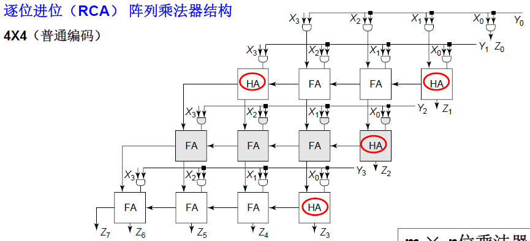

# 二进制乘法器

## 乘法运算解构

### 无符号数乘法

$$
\begin{array}{ccccccccc}
 & & & 1 & 0 & 1 & 0 & 1 & 0 \\
\times & & & & & 1 & 0 & 1 & 1 \\
\hline
 & & & 1 & 0 & 1 & 0 & 1 & 0 \\
 & & 1 & 0 & 1 & 0 & 1 & 0 & \\
 & 0 & 0 & 0 & 0 & 0 & 0 & & \\
+ 1 & 0 & 1 & 0 & 1 & 0 & & & & \\
\hline
1 & 1 & 1 & 0 & 0 & 1 & 1 & 1 & 0 & \\
\end{array}
$$

$$
M \text{位} (X=\sum_{i=0}^{M-1} X_i 2^{i}) \times N \text{位} (Y=\sum_{j=0}^{N-1} Y_j 2^{j})
$$
结果（将 Z 展开为 X 和 Y 的乘积形式）：

$$ 
Z=X \times Y=\sum_{k=0}^{M+N-1} Z_k 2^{k} = \left(\sum_{i=0}^{M-1} X_i 2^{i}\right)\left(\sum_{j=0}^{N-1} Y_j 2^{j}\right)
$$
$$
=\sum_{i=0}^{M-1}\left(\sum_{j=0}^{N-1} X_i Y_j 2^{i+j}\right) =\sum_{i=0}^{M-1}\sum_{j=0}^{N-1}(X_{i}Y_{j})\cdot 2^{i+j}
$$
我们可以构建一个M行N列的**位积矩阵**（这个$M$行$N$列的矩阵中的每一个元素$X_iY_j$都代表一次**AND**操作）：

$$ 
\text{位积矩阵}=\begin{bmatrix}
X_{M-1}Y_{N-1}&X_{M-1}Y_{N-2}&\cdots &X_{M-1}Y_{0}\\
X_{M-2}Y_{N-1}&X_{M-2}Y_{N-2}&\cdots &X_{M-2}Y_{0}\\
\vdots&\vdots&\ddots&\vdots\\
X_{0}Y_{N-1}&X_{0}Y_{N-2}&\cdots &X_{0}Y_{0}
\end{bmatrix} 
$$

最终乘积$Z$是这个矩阵中所有元素乘以其对应的二进制权重后的总和。矩阵中位于第$i$行、第$j$列的元素$X_{i}Y_{j}$的权重是$2^{i+j}$。

### 有符号数乘法

由于符号位有负的权重，所以 X 和Y 可以解构为：

$$ 
X=-x_{m-1}2^{m-1}+\sum_{i=0}^{m-2} x_{i}2^{i} 
$$ $$ 
Y=-y_{n-1}2^{n-1}+\sum_{i=0}^{n-2} y_{i}2^{i} 
$$
由此，乘积结果可表示为：

$$ 
XY = x_{m-1}y_{n-1}2^{m+n-2} + \sum_{i=0}^{i=n-2}\sum_{j=0}^{j=m-2} x_jy_i 2^{m+n-4} - \left(x_{m-1}\sum_{i=0}^{n-2}y_i 2^{m+i-1} + y_{n-1}\sum_{i=0}^{m-2}x_i 2^{n+i-1}\right) 
$$

难点在于出现了**减法**。在数字集成电路设计中，我们希望只使用加法器阵列。因此，必须利用==补码==的性质将“减法”转换为“加法”。

$$
\begin{array}{ccccccccc}
 & & & & x_3 & x_2 & x_1 & x_0 & & \\
 & & & & y_3 & y_2 & y_1 & y_0 & \\
\hline
 & & & & & x_2y_0 & x_1y_0 & x_0y_0 & & \\
 & & & & x_2y_1 & x_1y_1 & x_0y_1 & & & \\
 & & & x_2y_2 & x_1y_2 & x_0y_2 & & & & \\
 & x_3y_3 & & & & & & 1 \\
 & 1 & \overline{x_2y_3} & \overline{x_1y_3} & \overline{x_0y_3} & 1 & 1 & 1& \\
 & 1 & \overline{x_3y_2} & \overline{x_3y_1} & \overline{x_3y_0} & 1 & 1 & 1& \\
+ & & & & & & & 1 \\
\hline
 & S_6 & S_5 & S_4 & S_3 & S_2 & S_1 & S_0 \\
\end{array}
$$

# 部分积的产生

*部分积产生电路*

这里的与门使用的是 NAND ，由于加法器的反相特性，虽然NAND门的输出是AND门输出的**反码**，但后续的电路（如加法器）通常可以设计为接受反相输入，或者利用加法器本身的逻辑特性来==抵消这个反相==。

## 部分积压缩 -- Booth 编码

如果乘数中某一位是0，该行部分积全为0，对结果无贡献。但我们无法控制输入数据中0的数量。

**编码目标**：通过对乘数进行编码，将连续的“1”序列转换为==更稀疏的形式==，从而减少实际需要运算的非零项数目。

每次乘数中取 $k$ 位（例如2位），即取： 00 、 01 、 10 、 11

## 改进的 Booth 编码

如果经典 Booth 编码每次取2位（基4 Booth），根据原本的二进制权重是 $1$ 和 $2$，组合起来可能出现 $1+2=3$ 的情况。

在硬件中，计算 $3 \times X$ 需要将 $X$ 左移一位（得到 $2X$）再通过加法器加上 $X$（得到 $3X$）。但是这个==加法操作会带来延时==。

在常规二进制中，权重只能是正的（$2^0, 2^1$）。但是改进的 Booth 编码将其扩展为==带符号的数字集== 如 $\{-2, -1, 0, 1, 2\}$。通过引入负系数，将 $3$ 重新编码。在更高基数下，可以将 $3$ 表示为 $4 - 1$。

其中：

- $4X$ 是左移两位（无延时）。
    
- $-1X$ 是取反加一（简单逻辑）。

$$
2^{i+k-1} + 2^{i+k-2} + \dots + 2^i = 2^i(2^k - 1) = 2^{i+k} - 2^i
$$

正常的逻辑是凑低位的相加得到任意数字（但是可能要加很多次，延时变长），但是现在思路换成：==无论连续的“1”有多长，我们都可以用**一次高位加法**和**一次低位减法**来替代中间所有的加法运算==。

# 部分积的累加

## 逐位进位阵列乘法器

*逐位进位阵列乘法器结构*

- **HA**：半加器
- **FA**：全加器

第一行：

- $x_1y_0 + x_0y_1$：由于没有来自后面的进位，所以半加器就足够了

- $x_3y_1$：
# 最终相加

# 高性能乘法器架构

# 其他数据通路设计

## 移位器

