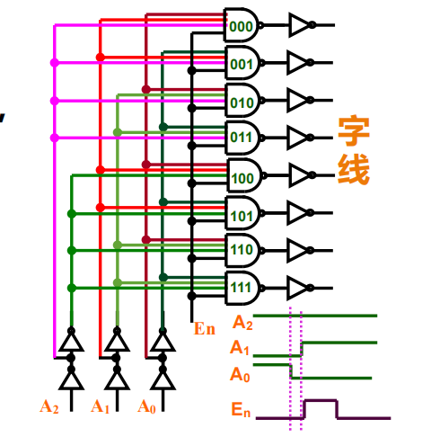
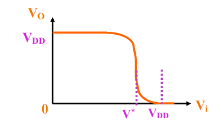
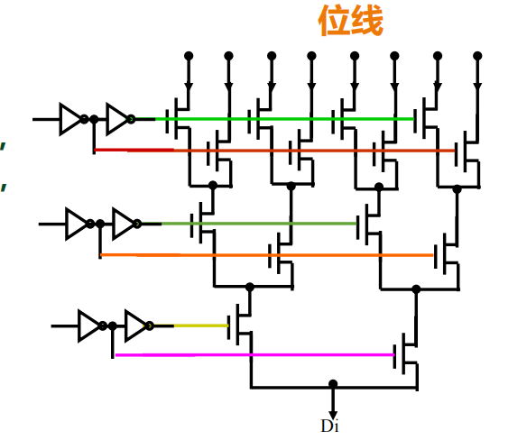
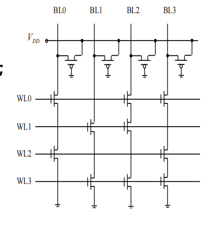
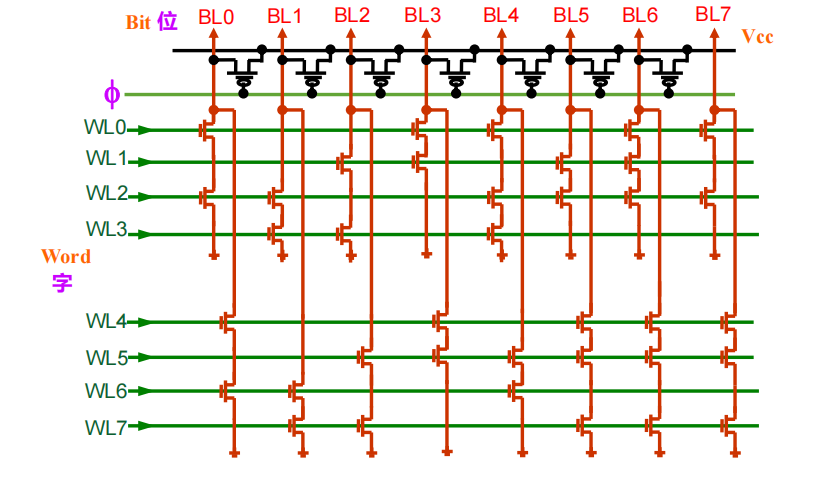
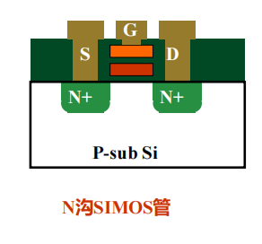
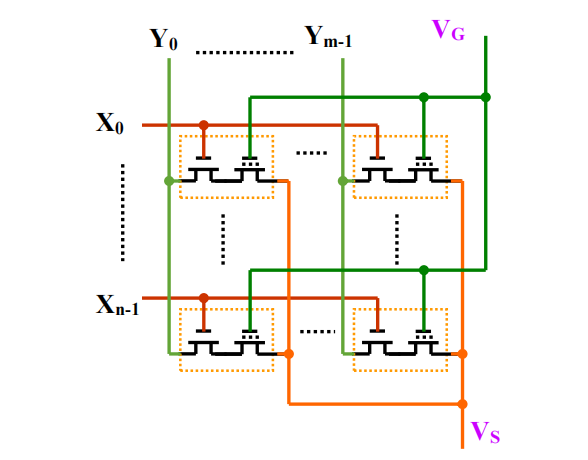

# 存储器分类

## 基于数据存储特性

### 只读存储器（ROM）
    
**非易失性**：核心物理特性，电源断开后，存储的数据不会丢失。

| 类型          | 名称      | 主要特点                                          | 数据擦除方式         |
| ----------- | ------- | --------------------------------------------- | -------------- |
| **固化ROM**​  | 掩膜只读存储器 | 数据在芯片制造时写入，**完全不可更改**。成本低，用于大批量固定程序。          | 不可擦除           |
| **可改写ROM**​ | EPROM   | 可擦除可编程ROM。允许用户编程写入，需要特殊设备。                    | 紫外线照射擦除（窗口式）   |
|             | E²PROM  | 电可擦除可编程ROM。可以按字节进行擦写，无需从电路上取下。                | 使用电信号擦除        |
|             | Flash​  | 当前最主流的可改写ROM。结合了EPROM的高集成度和E²PROM的电擦除优点，按块擦除。 | 使用电信号擦除（按块或扇区） |

### 随机存取存储器（RAM)
    
**易失性**：局限性所在，电源断开后数据即刻丢失。

| 类型        | 全称        | 存储原理             | 主要特点                                                 |
| --------- | --------- | ---------------- | ---------------------------------------------------- |
| **SRAM**​ | 静态随机存取存储器 | 利用==双稳态触发器==存储数据 | **速度快**，无需刷新；但**结构复杂，集成度低，面积大，成本高**。常用作高速缓存（Cache）。  |
| **DRAM**​ | 动态随机存取存储器 | 利用==电容==上的电荷存储数据 | **集成度高**，容量大，成本低；但**速度较慢**，且电荷会泄漏，**需要定时刷新**。常用作主内存。 |
### 特殊用途存储器

| 类型          | 全称       | 工作方式 / 特点                                        | 应用场景                     |
| ----------- | -------- | ------------------------------------------------ | ------------------------ |
| **FIFO**​   | 先进先出存储器  | 数据按照写入的顺序依次读出，即先写入的数据先读出。                        | 数据缓冲、异步通信、不同时钟域的数据交换     |
| **LIFO**​   | 后进先出存储器  | 数据按照与写入相反的顺序读出，即最后写入的数据最先读出。                     | 堆栈操作、程序调用、算法中的回溯         |
| **CAM**​    | 按内容寻址存储器 | ==通过输入数据内容进行并行搜索==，直接返回匹配项的地址，而非通过地址访问数据。查找速度极快。 | 网络路由器的路由表查找、缓存标签匹配、数据库加速 |
| **多端口存储器**​ | 多端口存储器   | 具有多个独立的访问端口，允许两个或以上的设备同时读写。                      | 多核处理器数据共享、通信交换芯片、图形处理    |

# 存储器结构

无论SRAM、DRAM还是ROM，其外部接口与内部逻辑架构大体一致，遵循**地址解码-阵列访问-数据I/O**的模式：

*阵列结构的存储器组织*

- **存储体（$N \times M$）**：核心数据存储区，形式为二维矩阵。
    
- **地址解码系统**：
    
    - **行译码器**：接收$n$位行地址，激活存储阵列中的某一行。
        
    - **列==预==译码器**：接收$m$位列地址，控制列选开关。
        
- **列选开关**：由于物理阵列的==列数通常多于逻辑字长==，该模块用于从激活的行中筛选出目标数据。
    
- **读写控制**：接收外部控制信号（如WE、OE、CS），协调输入/输出电路的工作时序。
    
- **输入/输出**：数据总线的接口缓冲。

**信号流向逻辑**：地址信号（$n$位行 + $m$位列）定位单元 $\rightarrow$ 控制信号决定读/写操作 $\rightarrow$ 数据通过I/O端口传输。

# 存储体

**容量**：$N \times M$

- **$N$（字数）**：存储器能够存储的数据单元的总数量。
    
- **$M$（位数）**：每一个数据单元包含的二进制位数（8位、32位）。

为了使版图接近正方形以减少延迟和面积，设计者通常会将==多个逻辑字放在同一个物理行==中。

- **行数 $\le N$**：物理行的数量通常小于或等于逻辑字数。
        
- **列数 $\ge M$**：物理列的数量通常大于或等于字长。
        
- **总容量守恒**：$物理行数 \times 物理列数 = N \times M$。

### 字线（行选）与位线（列选）

字的存储单元通常是**按位的顺序分插排放**的

- **非交织**：字1的所有位排在一起，接着是字2的所有位。
    
- **实际工程**：为了匹配列选开关（MUX）的电路设计和减少寄生效应，==通常会将不同字的相同位放在相近的位置==，或者按照特定的多路复用规律排列。

#### 字线

在存储阵列的物理行上，同一行中所有存储单元的**选择控制端**是物理连接在一起的。这条连线被称为**字线**。

字线直接与**行译码器**的输出端相连，当$n$位行地址输入行译码器后，译码器会对地址进行解码，并仅将对应的那一条字线置为有效电平，激活该行所有的存储单元。其他未被选中的字线保持无效状态。

#### 位线

在存储阵列的物理列方向上，同一列中所有存储单元的**数据输入/输出端**是连接在一起的。这条连线被称为**位线**。

位线连接到**列选开关**的数据端，负责承载读出的信号或写入的信号。
    
当某一条字线被激活时，该行所有单元的数据都会被放到各自对应的位线上。

# 地址译码器

## 概述

- **行地址译码器**：接收 $n$ 位行地址信号。驱动水平方向的信号线，即**字线**。
    
- **列地址译码器**：接收 $m$ 位列地址信号。控制垂直方向的数据通路，即**位线**的选择。

>[!note] 正交寻址机制
>存储体是一个由 $N \times M$ 个单元组成的二维矩阵。为了从中精准定位某一个特定的存储单元或字，系统采用了**行**与**列**分离的寻址策略。
>
>通过同时选定“某一特定行”和“某一特定列”，两条信号线的==交叉点==即为目标存储单元。

## 行地址译码器

*行地址译码器示意图*

这个不懂就去翻翻图灵完备那个 3-8 译码器是怎么设计的（每位都有 1 和 0 两种情况，组合成特定组合就点亮对应的字线）。

输入端的 $N$ 位二进制地址（$A_0, A_1, \dots$）首先经过**缓冲器**（增强驱动能力，并产生一对==互补地址信号==）。

对于任意一个特定的 $N$ 位地址输入，在 $2^N$ 条字线中，==**有且仅有一条**==字线会被置为有效电平（高电平），其余字线保持无效（多了就会冲突，你到底是读的哪一条字线上的值）。

### 多级译码技术

当存储容量增大时，单级译码面临扇入过多的物理限制，于是需要和普通逻辑门一样，需要分级输入。

*常用译码器设计（作为预译码级）*

**核心思想**：将长地址拆分为若干短地址组，先分别译码，再组合。

实际的行选择是==由 $H$ 组信号和 $L$ 组信号在末级进行“与（AND）”操作== 完成的，要选中某一行，需要特定的 $H_x$ 和 $L_y$ 同时有效。

### 地址同步控制

*地址同步控制示意图*

由于布线长度不同或驱动能力差异，$A_0, A_1, A_2$ 等地址信号==到达译码器输入端的时间绝对不一致==。在地址切换的瞬态过程中，译码器可能会短暂输入一个错误的中间地址，导致非目标行的字线瞬间产生波动，产生错误结果以及额外的动态功耗。

#### 解决方案

- **引入 $E_n$**：在译码电路中增加一个全局同步控制信号，通常称为时钟信号或使能信号。在地址信号尚未稳定时，令 $E_n$ 无效（==封锁译码器输出==），以达到强行同步的效果。

#### 电路优化

##### 使能控制的位置

因为时钟同步使能控制是最关键的一步，在它有效之前，路径必须被物理切断，而时钟上升沿到来之后，必须让门电路快速输出，因此将同步使能信号（$E_n$）控制的晶体管（通常是NMOS）放置在**靠近输出端**的位置。

##### 反相器阈值电压调整

*阈值电压调整*

前级与非门输出低电平，后级反相器需要输出高电平来驱动字线。我们希望字线==能尽快升起（被选中）==。

因此，我们将产生字线信号的反相器设计为具有**较高的阈值电压 $V_M$**（在翻转中间，只要感到了一点的翻转，反相器就立马输出为相反的电平）。

## 列地址译码器

*列地址译码器示意图（传输管方式实现）*

本质上依然是一个多路选择器（MUX），接收 $M$ 位列地址，将其解码为控制信号，用于接通特定的位线与数据总线之间的通路。

# 读写控制及输入输出电路

# 各类存储器详解

## Mask ROM（固化 ROM）

**Mask** 指的是光刻环节所使用的光罩。该存储器的编程方式是在芯片制造的==物理层面==上完成的。Mask ROM 仅适用于存储那些大批量生产且不再需要修改的固定信息（如==固件、字库==等）。

**编程机制：**

**不可更改性（非易失性）**：芯片一旦制造完成，其内部电路结构即固定，存储的信息永久无法改变。

### 伪 NMOS 或非存储阵列

*伪 NMOS 或非存储阵列*

- **存储“0”**：在字线与位线的交叉点**制作**一个NMOS存储管。
    
- **存储“1”**：在字线与位线的交叉点**不制作**NMOS存储管。

对于每一根位线而言，只要挂接在它上面的任意一条被选中的字线对应的位置有管子(NMOS)导通，位线就会呈现低电平。符合“或非（NOR）”逻辑的特性（输入为高，输出为低）。

#### 读取逻辑

|           | 字线选中 (WL=1)​ | 字线未选 (WL=0)​ |
| --------- | ------------ | ------------ |
| **有存储管**​ | 输出“0”​       | 高阻态（HZ）      |
| **无存储管**​ | 输出“1”​       | 高阻态（HZ）      |

#### 特性分析

##### **速度特性**

为降低静态功耗，通常使用小尺寸存储管，其驱动能力较弱，导致位线电容==放电速度较慢==，即**下降沿较缓**（可以通过缓冲输出电路改善）。

##### **静态功耗**

当输出为 “0” 时，上方的负载管（PMOS）和下方的存储管（NMOS）==同时导通==，形成了一条从电源（Vcc）直通地（GND）的直流电流通路，导致**静态功耗**的产生。

采用**小尺寸**的存储管有利于限制直流通路电流，从而降低静态功耗，同时也有助于减小芯片面积。

#### **输出电平**

由于伪 NMOS 属于有比逻辑，输出低电平并非理想的0V，而是==由负载管导通电阻与存储管导通电阻的分压比决定==的。

同时由于输出的低电平较高（$V_{OL} > 0V$），导致==输出逻辑摆幅较小==，==噪声容限降低==。

#### 版图特点

*伪NMOS或非存储阵列版图设计*

##### **资源共享策略（提高集成度）**
    
为了减小芯片面积，版图设计采用了==高度复用==的策略。

- **共用地线**：相邻两行（字线）的存储单元共享同一个**接地有源区**（两个背靠背的晶体管共用一个源极接地触点）。

- **共用位线**：相邻两行也可以共享**位线有源区**或位线引线孔。
        
这种“折叠”式的排列方式极大地压缩了单个比特单元的物理尺寸。
        
##### **数据修改的版图层级**

如果在设计迭代中需要改变存储的数据（例如修复Bug或更新固件），==必须更改**有源区**和**引线孔**这两层版图==。

>数据的“0”和“1”是由“是否有晶体管”决定的。
>
>有源区定义了晶体管的沟道区域，引线孔定义了连接关系。改变这两层就能物理上“生成”或“消除”一个晶体管，从而改变数据。

### 预充电结构或非存储阵列

*预充电结构或非存储阵列*

相比于伪NMOS结构，这里的负载管（PMOS）不再恒定接地导通，而是其栅极接了一个**时钟信号 $\phi$**。此时，负载管被称为**预充管**。

和动态逻辑类似，电路的工作分为两个时钟相位：

- **预充电阶段（$\phi$ 低电平）**：预充管导通，位线被充电至高电平（$V_{CC}$），即逻辑“1”。此时存储管不工作。
    
- **求值/读操作阶段（$\phi$ 高电平）**：预充管截止（关断）。如果被选中的存储管导通（存“0”），位线电荷被放掉，输出变为“0”；如果存储管截止（存“1”），位线电荷维持，输出保持“1”。

### 伪NMOS与非（NAND）存储阵列

与NOR结构的并联不同，NAND结构中，同一位线上的存储管是**串联**连接的

|           | 字线选中 (WL=0)​ | 字线未选 (WL=1)​ |
| --------- | ------------ | ------------ |
| **有存储管**​ | 输出“1”​       | 高阻态（HZ）      |
| **无存储管**​ | 输出“0”​       | 高阻态（HZ）      |
**约束**：==字线不宜过多==，由于同一位线上所有的 NMOS 都是串联的，串联越多，总串联电阻越大，会抬高输出低电平的电压值，减缓放电速度。

#### 动态逻辑

*动态逻辑用法*

### 与或非存储阵列

*与或非存储阵列*

**两级结构**：

- **第一级（局部块）**：观察每一列位线，存储管被分成了若干个小块。每个小块内部是**串联**的，这构成了局部**与非**逻辑。
    
- **第二级（全局）**：这些串联的小块（局部NAND串）再并联挂接到位线上，这构成了全局**或非**逻辑。

#### 优点

- 相比纯NAND，它==减短了串联链的长度==（例如图中每块只有4个管子），从而改善了放电速度（解决NAND太慢的问题）。
    
- 相比纯NOR，它==减少了位线上的接触孔数量==（每4个管子共用一个接触孔连接位线），减小了位线寄生电容，有助于提高速度和密度。

#### 输出电路

##### 设置输出级电路的必要性

**信号质量问题**：

- **摆幅小**：P直接从位线读出的==信号摆幅很小==。特别是输出低电平时，由于伪NMOS是有比逻辑，由于长位线的寄生电阻分压，==低电平往往显著高于0V==（即$V_{OL}$较高）。
    
- **驱动能力差**：位线具有巨大的寄生电容，且驱动它的存储管通常尺寸很小（为了高密度），因此==信号变化的边沿（特别是下降沿）非常缓慢==。

### Mask-ROM 的应用实例：存储点阵字符

- **对象**：$5 \times 7$ 点阵字符。每个字符由35个像素点（开/关）组成。
    
- **映射**：这35个点的信息被“固化”在ROM中。

## EPROM（紫外线可擦除可编程 ROM）

### 概述

与Mask ROM不同，**EPROM** 允许用户根据需求进行数据的擦除和重写（

- **擦除过程**：利用==紫外线（UV）或X射线照射芯片窗口进行全局清除数据==，即一次性擦除芯片内的所有信息，无法针对单个字或局部区域进行擦除。整个擦除过程过程较慢，通常需要约30分钟。

- **写入过程**：使用专用的==编程器==，写入时需要比正常工作电压更高的电压，以触发后物理注入效应。

无论是擦除还是写入，芯片通常都需要从系统中取下，即全部都是==脱机操作==。虽然可以擦写，但在正常使用中，==掉电后信息不丢失==，因此仍归类为ROM。

### 基本器件单元

### FAMOS（浮栅雪崩注入MOS）

#### 器件结构

*FAMOS 示意图*

- **浮栅（Floating Gate）**：存储数据的核心部件，栅极四周完全被二氧化硅（绝缘介质）包裹，处于电学上的==悬浮状态==，没有直接的电气连接引出。
            
- **初始状态**：浮栅上没有电荷。

#### 存储机理

- **截止状态（无电荷）**：当浮栅上无电荷时，源漏之间无法形成导电沟道，MOS管处于截止状态。
    
- **导通状态（有电荷）**：当浮栅上积累了足够的负电荷时（注入机制），这些负电荷会在N型基底表面感应出空穴，形成P型导电沟道，使MOS管导通。
    
这两种物理状态（截止/导通）分别对应二进制数据的“0”和“1”。

#### 浮栅充电原理

**核心**：利用雪崩击穿实现电荷注入

高反向电压使得漏区与衬底之间的PN结发生**雪崩击穿**。在强电场作用下，载流子剧烈碰撞电离，产生大量的电子-空穴对。高能电子穿过氧化层进入浮栅。由于浮栅是绝缘的，==电子进入后无法逃逸，从而在浮栅上积累负电荷==。

#### 存储单元阵列

*FAMOS 存储单元阵列*

单个FAMOS管虽然能存储数据，但在阵列中需要寻址控制。每个存储单元实际上由**两个管子**串联组成：
        
- **FAMOS管**：负责存储数据。
            
- **普通MOS管**：作为==门控管==，用于地址选择。

先通过打开门控管，再流经存储管，看有没有电荷，以分辨逻辑。

#### SIMOS

#### 器件结构

*SIMOS 器件结构*

为了==改善FAMOS的控制性==，技术演进到了**SIMOS（Stacked-gate Injection MOS）**，即**叠栅注入MOS**。

与FAMOS最大的区别在于，SIMOS在浮栅之上增加了一层**控制栅**。
    
- **下层**：浮栅，用于存储电荷，依旧是悬浮的。
    
- **上层**：控制栅，有==电极引出，可施加电压进行控制==。

#### 存储机理

存储的本质是**浮栅电荷的变化引起开启电压的改变**。

- **浮栅无电荷**：开启电压较低。当控制栅加高电平时，管子容易导通。
    
- **浮栅有负电荷**：负电荷屏蔽了控制栅的电场，使得管子开启变得困难，开启电压**升高**。
    
**读取原理**：在控制栅施加一个介于“低开启电压”和“高开启电压”之间的读取电压。
    
- 若无电荷（存“1”）：管子导通。

- 若有电荷（存“0”）：管子截止。

#### 浮栅充电原理

在漏极（D）和源极（S）之间施加较高电压，建立水平电场，使沟道中的电子加速成为高能电子。在**控制栅**上施加**正电压**，在垂直方向上建立电场，对沟道中的热电子产生**吸引力**，把电子吸入浮栅之中。

相比FAMOS单纯依靠雪崩击穿的随机性，SIMOS利用控制栅的主动吸引，使得编程效率更高，控制更精确。注入后浮栅带负电，导致器件的开启电压变高，完成“写入”操作。

## EEPROM（电可擦除可编程 ROM）

### 概述

**擦写灵活性**：

- **在线操作**：擦除和写入可以在电路板上直接进行，不需要将芯片取下放入专用编程器（尽管也可以用编程器）。
    
- **细粒度控制**：EPROM只能全片擦除，而EEPROM支持==逐字、逐位或分区擦写==。

**电气特性**：

- **高压需求**：擦写过程仍需要==较高的电压==（通常高于工作电压$V_{DD}$）。现代芯片通常在内部集成==电荷泵电路==来产生这个高压，无需外部提供。
    
- **非易失性**：写入后掉电数据不丢失。
    
- **速度限制**：由于擦写机制（隧道效应）较慢，EEPROM通常用于存储那些不需要频繁变更的配置信息或固件，而==非作为高速缓存==。

### 基本器件单元

#### Flotox（浮栅隧道氧化物）

##### 器件结构

*Flotox 器件结构*

为了实现“电擦除”，器件结构必须允许电子在电场作用下双向穿过绝缘层，基于此，设计了新型器件 Flotox ，依然采用**叠栅结构**（浮栅+控制栅），但有关键改进：
    
- **隧道氧化层**：在浮栅的一个延伸区域下方，氧化层被做得**极薄**（通常小于10nm）。这个区域是==电子穿梭的特殊通道==。

- **埋N+区**：在超薄氧化层下方，通过离子注入形成了一个高浓度的N型掺杂区。这个区==直接与MOS管的漏极相连==。

使得控制栅和漏极之间的电压可以直接作用于这个极薄的氧化层上，从而产生极强的电场。

##### F-N 隧道效应

当绝缘层（隧道氧化层）中的电场强度达到极高水平（$> 10^7 V/cm$）时，电子的波函数会穿透势垒，形成隧道电流。

与雪崩注入（EPROM的机制）通常只能单向注入不同，隧道效应是完全==可逆==的。

==电子流动的方向==完全取决于**电场的方向**。

- 电场指向浮栅 $\rightarrow$ 电子离开浮栅（放电）。

- 电场背离浮栅 $\rightarrow$ 电子进入浮栅（充电）。

##### 浮栅充放电（写入/编程）

浮栅上积累足够的负电荷之后，就会让开启电压升高，导致正常的高电平无法使 MOS 导通（和前面的浮栅器件原理相同）。

##### 存储结构阵列

*Flotox 存储单元阵列*

每个存储单元由**一个普通MOS管**和**一个Flotox MOS管**串联组成。

原因：在进行擦除操作（电子从浮栅移出）时，==如果控制不当导致电子移除过多，浮栅甚至可能带正电==，这会导致 Flotox 变得一直是导通的。采用一个普通 MOS 管作为开关，可以选择性隔离有故障的器件。

### MNOS 

#### 器件结构

*MNOS 器件结构*

一种不使用浮栅，而是利用==介质界面能级陷阱==来存储电荷的技术——**MNOS**。

通过在栅极金属和硅衬底之间，引入双层绝缘介质：**二氧化硅（$SiO_2$）** 和**氮化硅（$Si_3N_4$）**，实现在 $SiO_2$和$Si_3N_4$的**界面处**存在密度极高的**界面能级**。这些能级就像一个个“陷阱”，可以捕获并保持电子。

在电场作用下，电子可以直接以量子隧穿的方式穿过这层极薄的禁带，进入$SiO_2-Si_3N_4$界面的陷阱中被捕获。

#### 存储单元阵列

## 闪存（FLASH）

### 概述

Flash 被称为 **Flash EEPROM**，本质上是EEPROM的一个==变种==。它结合了EPROM的高密度（单管）和EEPROM的电可擦除特性。

为了实现**单管结构**（省去选择管），必须解决Flotox中提到的==过擦除（Over-erasure）==导致耗尽的问题。
        
**解决方案**：引入==片内智能电路==，在擦除过程中实时**监测阈值电压**。一旦阈值电压降到预定值（但尚未变成耗尽型），立即停止擦除脉冲。

### 工作原理

#### 过擦除保护机制

通过精确的先充电再擦除，以及擦除验证算法，保证浮栅晶体管不会因为电子被抽得太干净而变成耗尽型器件（常通）。

存储单元可以省去那个占用面积的普通晶体管，实现单管控制。

为了简化电路设计并减少硬件开销（不需要为每个字节设计独立的擦除控制线），Flash放弃了EEPROM的“按字节擦除”功能，改为**按块（Block）擦除**，因此被称为 Flash 。

## SRAM（静态随机存取存储器）

## DRAM（动态随机存取存储器）

## CAM
