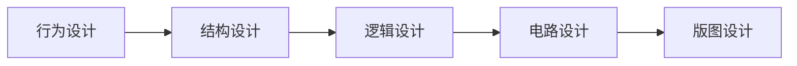

# Verilog 语言简介

Verilog是在C语言基础上发展而来的**硬件描述语言（HDL）**。它于1990年由Cadence公司公开，并于1995年正式成为IEEE 1364标准。它是目前数字电路设计领域应用最广泛的语言之一。

该语言支持从底层的==开关级、门级，到高层的行为级==的系统描述，具有极大的灵活性。

## 层次化设计

层次化设计类似于计算机软件开发中的**函数或方法抽象**。通过将大系统拆分为功能独立的子模块，设计者可以有效管理系统复杂性。

在现实的集成电路中，一个模块可能包含数以亿计的晶体管。HDL的作用就是将这些海量元器件通过抽象化的层级描述，最终**综合（Synthesis）** 为实际的门级电路。

## “自顶向下”设计方法



首先定义系统的**顶层模块**，并识别构成该模块所需的**子模块**。随后不断对子模块进行细分，直至拆解为不可再分的底层**电路元件**。

Verilog程序由==模块==构成，所有内容必须包含在 `module` 和 `endmodule` 这一对关键字之间。每个模块代表一个特定的逻辑功能。
    
**内部构成**：
    
1. **端口定义**：模块的外部接口。

2. **I/O说明**：明确信号的流动方向，包括输入（`input`）、输出（`output`）或双向（`inout`）。

3. **功能定义**：通过逻辑语句或子模块调用实现特定的电路功能。
        
> **书写规范**：Verilog是**格式自由**的语言（类似C语言），允许一行多语句或一语句分多行。除了极少数关键字外，每个语句必须以**分号（;）**结尾。支持 `//` 或 `/*...*/` 形式的注释。

# 代码教程
    
>[!example] 模块举例
> 

模块描述：

```verilog
// 模块定义
module aoi(a, b, c, d, f);
    input a, b, c, d;    // 输入端口
    output f;            // 输出端口
    wire a, b, c, d, f;  // 信号的数据类型
    assign f = ~((a & b) | (~(c & d))); // 逻辑功能描述
endmodule
```

如何在更高层模块中调用（实例化）这个 `aoi` 模块：

```verilog
// 模块实例化
aoi u_aoi ( // 模块例化
    .a(in_a),   // 例化端口信号
    .b(in_b),
    .c(in_c),
    .d(in_d),
    .f(out_f)
);
```

## 端口定义

端口是模块与外部环境进行信号交互的连接线，是对模块边界的明确说明。

| 端口方向 | 功能描述 | 示例 |
|:---|:---|:---|
| **input** | 仅作为模块的输入端口，信号流向为外部 → 模块内部 | `input a;`<br>`input [3:0] data_in;` |
| **output** | 仅作为模块的输出端口，信号流向为模块内部 → 外部 | `output f;`<br>`output [7:0] data_out;` |
| **inout** | 双向端口，常用于三态总线结构，既可作为输入也可作为输出 | `inout [7:0] data_bus;`<br>`inout wa, wb;` |

---

**进阶示例：**

| 示例类型        | 代码示例                              | 说明                                                 |
| :---------- | :-------------------------------- | :------------------------------------------------- |
| **向量定义**    | `input [7:0] a;`                  | 定义一个8位宽的输入总线，`a[7]`为最高有效位，`a[0]`为最低有效位。            |
| **inout应用** | `inout wa, wb;`<br>（在模块`modB`中定义） | 端口`wa`和`wb`为双向端口，既能接收（输入）数据，也能驱动（输出）数据，通常用于三态总线接口。 |
### 模块定义模板

```verilog
module test (
    input [7:0] a,                         // 8-bit unsigned input
    input signed [7:0] b, c, d,             // Multiple ports that share all attributes can be declared together.
    output [7:0] e,                         // Every attribute of the declaration must be in the one declaration.
    output reg signed [7:0] f, g,           // signed reg outputs
    output signed [7:0] h                    // signed output (type unspecified)
);
    // It is illegal to redeclare any ports of the module in the body of the module.
    // 模块内部代码...
endmodule
```

**ANSI C风格**的模块端口声明方式：

- **声明位置**：端口定义直接位于模块名后的括号内，不再需要在模块内部重复声明。
    
- **语法特征**：每个端口定义后使用逗号分隔，最后一个端口除外。
    
- **属性集成**：该方式支持在声明端口的同时，插入**信号方向（input/output）**、**数据类型（reg/wire）**、**符号属性（signed）** 以及**位宽（`[7:0]`）** 等所有物理属性。
    
- **语法约束**：当在括号内完成声明后，严禁在模块体内部再次对这些端口进行重复定义，否则会导致编译错误。

## 逻辑状态

| 状态值 | 符号表示 | 含义 | 常见情况 |
|:---|:---|:---|:---|
| **低电平/逻辑假** | `0` | 代表低电平，逻辑假 | 明确驱动的逻辑0信号 |
| **高电平/逻辑真** | `1` | 代表高电平，逻辑真 | 明确驱动的逻辑1信号 |
| **不确定/未知** | `x` 或 `X` | 代表不确定或未知的逻辑状态 | 信号冲突、未初始化、多驱动源值不一致 |
| **高阻态** | `z` 或 `Z` | 代表高阻态，相当于物理上的断路 | 三态门（tri-state buffer）未使能时的输出 |
对于 `x` 和 `z` 状态，Verilog不区分大小写，例如 `0x1z` 等同于 `0X1Z`。

## 数据类型

| 数据类型                    | 物理本质             | 主要特性                                       | 赋值方式                                             | 典型关键字                                  |
| :---------------------- | :--------------- | :----------------------------------------- | :----------------------------------------------- | :------------------------------------- |
| **Net型**<br>(连线类型)      | 表示结构实体间的**物理连线** | 不具备存储功能，其值由**驱动源**（如逻辑门输出）实时决定，随输入变化而立即变化。 | 在**过程块外部**，通过 `assign` 或模块实例化（端口连接）进行**连续赋值**。   | `wire`<br>`tri`<br>`wand`<br>`supply0` |
| **Variable型**<br>(变量类型) | 表示一个**数据存储单元**   | 具备存储功能，在赋值完成后能**保持**该值不变，直到被再次赋值。          | 必须在**过程块语句**（如 `initial`, `always`）内部进行**过程赋值**。 | `reg`<br>`integer`<br>`time`<br>`real` |
