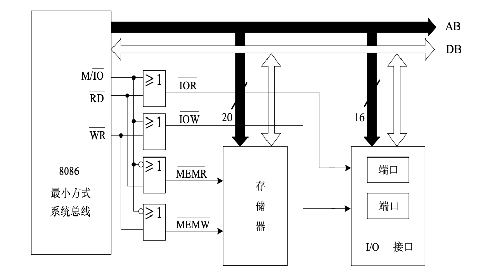

# I/O 接口概述

无论是对内存还是对外设，CPU的核心操作逻辑本质上都是==读与写==。

| 指令  | 格式             | 功能描述               | 用途            |
| --- | -------------- | ------------------ | ------------- |
| IN  | `IN DST, SRC`  | 从外设端口读取数据，送入CPU寄存器 | 输入操作，外设 → CPU |
| OUT | `OUT DST, SRC` | 将CPU数据发送到外设端口      | 输出操作，CPU → 外设 |

**核心作用**：对信号进行转化或储存，使其符合CPU的总线规范，供CPU使用。

|   功能   |                                            说明                                             |
| :----: | :---------------------------------------------------------------------------------------: |
|  地址选择  |                                       选择输入或输出的外设设备                                        |
|  控制功能  |                                        启动、停止或复位外设                                         |
|  状态指示  |                                        解决时序不匹配问题。                                         |
|  速度匹配  |                                        解决速度不匹配问题。                                         |
| 转换信息格式 |                                        解决信息格式不匹配问题                                        |
|  电平转换  | CPU通常使用TTL/CMOS电平（如0V-5V），而外设（如RS-232接口）可能使用不同的电压标准（如±12V）。接口电路负责==将双方的电压信号调整到对方可接受的范围内== |
|  可编程性  |                                         提高硬件的通用性                                          |

## I/O 软硬件

### I/O 硬件

一共三个组成部分：控制部件、设备实体、接口电路

|     类别      |                   功能                    |                                          示例                                          |
| :---------: | :-------------------------------------: | :----------------------------------------------------------------------------------: |
| **I/O控制部件** | 完成对输入和输出操作过程的控制，实现内存与外设间的数据直接传输而无需CPU干预 |                                   `中断控制器`、`DMA控制器`                                   |
|  **I/O设备**  |         I/O操作的终端实体，负责数据的实际采集或呈现         | **输入设备**：`键盘`、`鼠标` **输出设备**：`显示器`、`打印机` **存储设备**：`硬盘机` **其他**：`调制解调器`、`扫描仪` |
|  **I/O接口**  |      实现I/O设备和系统总线的连接，作为设备与总线之间的中间件      |                                                                                      |

### I/O 软件

I/O软件是建立在I/O硬件基础之上的，硬件提供了物理通路，而==软件发出指令==才能启动数据传输。

| 层次                   | 描述                                                                                |
| -------------------- | --------------------------------------------------------------------------------- |
| **I/O 指令编写的输入/输出程序** | 最底层的控制方式。直==接使用指令集中的I/O指令==（如x86架构中的`IN`、`OUT`指令）来编写程序，对端口进行读写。                   |
| **OS  中的有关管理模块**     | 较高层级的抽象。现代操作系统（OS）会提供设备驱动程序和I/O管理子系统，应用程序通常不直接操作硬件，而是通过==调用操作系统的管理模块==来间接完成I/O操作。 |
## 接口电路的作用

CPU是纯电子的、高速的、数字化的、同步的核心部件；而外设则是复杂的、低速的、可能包含机械结构的部件。两者在物理属性和工作模式上存在巨大的差异。接口电路的存在，就是为了==抹平这些差异==，让CPU能够像访问内存一样方便地访问外设。

### 外设与CPU之间的主要矛盾

##### 速度不匹配

I/O设备的工作速度通常要比CPU**慢许多**。CPU是纳秒级的，而外设（如机械硬盘、键盘）可能是毫秒甚至秒级的。

> **解决方案**：接口电路内含==缓冲器==或==锁存器==，用于暂存数据。

##### 时序不匹配

各个I/O设备都有自己的**定时控制电路**，按照自己的时钟频率和速度传输数据。外设无法与CPU的系统时钟取得统一。即外设是==异步工作==的，而CPU通常是==同步工作==的。

>  **解决方案**：接口电路负责进行==握手信号==的处理，通过查询状态或中断机制，协调双方的传输时机。

##### 信息格式不匹配

- **传输方式：** 分**串行**和**并行**两种。CPU数据总线通常是并行的，而许多外设（如鼠标、网络）是串行传输的。
    
- **编码格式：** 包含二进制格式、ASCII编码（字符设备常用）、BCD编码（数码显示常用）等。

##### 信息类型不匹配

外设中有些使用**数字信号**（如键盘），而有些是**模拟信号**（如麦克风的声音输入、温度传感器的电压输出）。CPU只能处理数字信号。

## I/O 接口分类

|  分类维度  |   类型   |             描述             |       特点       |
| :----: | :----: | :------------------------: | :------------: |
| 数据传送方式 |  并行接口  |          数据各位同时传输          |    短距离、高速传输    |
|        |  串行接口  |          数据按位顺序传输          | 长距离传输，需要较少的传输线 |
|  通用性   |  通用接口  |       设计用于多种标准设备的接口        |    如USB、打印口    |
|        |  专用接口  |       为特定设备专门设计的接口电路       | 功能专一，针对特定设备优化  |
|  可编程性  | 可编程接口  |  其功能和工作方式可以通过CPU写入控制字来改变   |    微机接口的主流     |
|        | 不可编程接口 |  逻辑固定，功能单一，接线后无法通过软件更改模式   |   结构简单，成本较低    |
|  复杂性   |  芯片式   |      接口功能集成在单一的IC芯片中       |    集成度高，体积小    |
|        |  卡槽式   | 接口电路做成独立的电路板（扩展卡），插入主板的插槽中 |  扩展性强，便于升级维护   |
## I/O 接口的内部组成

CPU与I/O设备交换的信息主要有三种：**数据信息、控制信息、状态信息**。这三种信息分别由接口内部的三种寄存器（是三种不是三个，光是控制寄存器就有好多）处理：

*I/O 接口的逻辑组成*

| 信息类别 |   处理部件    |    核心功能     |
| :--: | :-------: | :---------: |
| 数据信息 |   数据寄存器   |  暂存数据，速度匹配  |
| 状态信息 |   状态寄存器   | 状态指示，供CPU查询 |
| 控制信息 |   控制寄存器   |  控制功能，可编程性  |
| 控制逻辑 | 地址选择与控制逻辑 |  地址译码，读写控制  |

# I/O 接口的编址方式

## 概述

### 编址对象及编址数量

>[!note] I/O 端口和 I/O 接口
> | 概念 | 本质 | 关键特性 |
> |------|------|----------|
> | I/O接口 | 物理==系统==或集成电路 | 物理实体，如插槽、芯片 |
> | I/O端口 | 接口内部的==寄存器== | 逻辑单元，是接口电路内部的数据/状态/控制寄存器 |
> 
>  **关系**：接口包含多个端口，==每个端口有自己固定的地址单元==，CPU直接寻址端口，地址指向端口而非整个接口芯片。

每个端口都需要一个独立的地址，**一个I/O接口有几个端口，就说明该I/O接口至少占用几个地址**。

### 编址方式分类

| 编址方式 |   代表处理器   |         核心描述          |            关键特点             |
| :--: | :-------: | :-------------------: | :-------------------------: |
| 独立编址 | 8086/8088 | CPU开辟两个平行的地址空间：内存和I/O | 有专用控制信号（如M/IO#）或指令（如IN/OUT） |
| 统一编址 |  C51 单片机  |    I/O端口被视为内存的一部分     |       使用通用访存指令（如MOV）        |
## 独立编址

**同一个地址，有可能指向I/O，也有可能指向存储器**。仅凭地址码本身无法区分CPU意图访问的是内存条还是接口芯片。需通过控制总线上的特定信号来区分：

*独立编址逻辑电路图*

|     引脚状态      | M/IO# = 高 (内存访问) | M/IO# = 低 (I/O访问) |
| :-----------: | :--------------: | :---------------: |
| RD#低有效, WR高无效 |       内存读        |       I/O读        |
| RD高无效, WR低有效  |       内存写        |       I/O写        |

**8086/8088系统是典型的独立编址方式**。这一特征一直延续至今天的x86 处理器。

|    系统     | I/O地址线 |         寻址空间         |   I/O地址范围   |
| :-------: | :----: | :------------------: | :---------: |
| 86/8088系统 |  16根   | $2^{16}=64\text{KB}$ | 0000H-FFFFH |
|  PC/XT系统  |  10根   | $2^{10}=1\text{KB}$  |  000H-3FFH  |

### 优缺点

#### 优点

- **存储空间最大化**：I/O不占用内存地址，**存储器的容量可以达到与地址总线所决定的地址空间相同**。

- **总线效率：** **访问I/O端口时的地址位数较少**，可提高总线的利用率。

#### 缺点

- **指令系统复杂：**  CPU**必须设置专门的I/O指令**来访问这些特定的地址空间。
    
- **硬件设计复杂：** 增加了指令系统的复杂性，同时也意味着CPU内部需要针对I/O指令设计独立的控制逻辑。

## 统一编址

也称为“**存储器映射编址**”，即把 I/O 端口看作是内存地址空间的一部分，将其映射到某一段特定的内存地址上。

# I/O 接口的基本工作方式

# 可编程中断控制器 8259A

