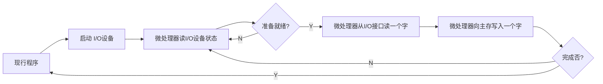
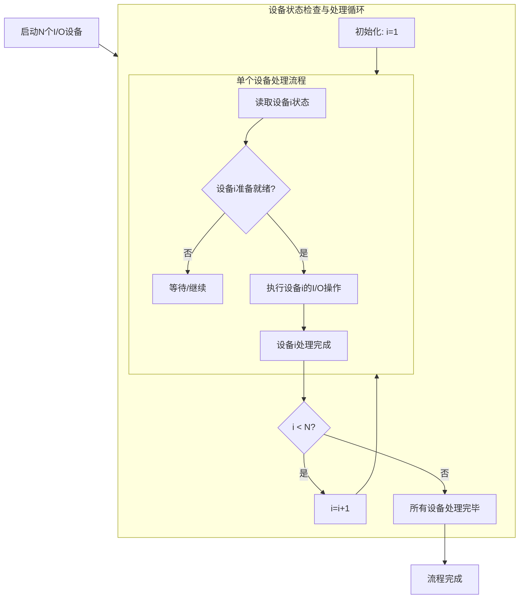
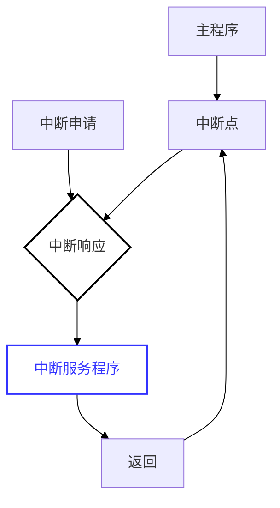

# I/O 接口概述

无论是对内存还是对外设，CPU的核心操作逻辑本质上都是==读与写==。

| 指令  | 格式             | 功能描述               | 用途            |
| --- | -------------- | ------------------ | ------------- |
| IN  | `IN DST, SRC`  | 从外设端口读取数据，送入CPU寄存器 | 输入操作，外设 → CPU |
| OUT | `OUT DST, SRC` | 将CPU数据发送到外设端口      | 输出操作，CPU → 外设 |

**核心作用**：对信号进行转化或储存，使其符合CPU的总线规范，供CPU使用。

|   功能   |                                            说明                                             |
| :----: | :---------------------------------------------------------------------------------------: |
|  地址选择  |                                       选择输入或输出的外设设备                                        |
|  控制功能  |                                        启动、停止或复位外设                                         |
|  状态指示  |                                        解决时序不匹配问题。                                         |
|  速度匹配  |                                        解决速度不匹配问题。                                         |
| 转换信息格式 |                                        解决信息格式不匹配问题                                        |
|  电平转换  | CPU通常使用TTL/CMOS电平（如0V-5V），而外设（如RS-232接口）可能使用不同的电压标准（如±12V）。接口电路负责==将双方的电压信号调整到对方可接受的范围内== |
|  可编程性  |                                         提高硬件的通用性                                          |

## I/O 软硬件

### I/O 硬件

一共三个组成部分：控制部件、设备实体、接口电路

|     类别      |                   功能                    |                                          示例                                          |
| :---------: | :-------------------------------------: | :----------------------------------------------------------------------------------: |
| **I/O控制部件** | 完成对输入和输出操作过程的控制，实现内存与外设间的数据直接传输而无需CPU干预 |                                   `中断控制器`、`DMA控制器`                                   |
|  **I/O设备**  |         I/O操作的终端实体，负责数据的实际采集或呈现         | **输入设备**：`键盘`、`鼠标`<br>**输出设备**：`显示器`、`打印机`<br>**存储设备**：`硬盘机`<br>**其他**：`调制解调器`、`扫描仪` |
|  **I/O接口**  |      实现I/O设备和系统总线的连接，作为设备与总线之间的中间件      |                                                                                      |

### I/O 软件

I/O软件是建立在I/O硬件基础之上的，硬件提供了物理通路，而==软件发出指令==才能启动数据传输。

| 层次                   | 描述                                                                                |
| -------------------- | --------------------------------------------------------------------------------- |
| **I/O 指令编写的输入/输出程序** | 最底层的控制方式。直==接使用指令集中的I/O指令==（如x86架构中的`IN`、`OUT`指令）来编写程序，对端口进行读写。                   |
| **OS  中的有关管理模块**     | 较高层级的抽象。现代操作系统（OS）会提供设备驱动程序和I/O管理子系统，应用程序通常不直接操作硬件，而是通过==调用操作系统的管理模块==来间接完成I/O操作。 |
## 接口电路的作用

CPU是纯电子的、高速的、数字化的、同步的核心部件；而外设则是复杂的、低速的、可能包含机械结构的部件。两者在物理属性和工作模式上存在巨大的差异。接口电路的存在，就是为了==抹平这些差异==，让CPU能够像访问内存一样方便地访问外设。

### 外设与CPU之间的主要矛盾

##### 速度不匹配

I/O设备的工作速度通常要比CPU**慢许多**。CPU是纳秒级的，而外设（如机械硬盘、键盘）可能是毫秒甚至秒级的。

> **解决方案**：接口电路内含==缓冲器==或==锁存器==，用于暂存数据。

##### 时序不匹配

各个I/O设备都有自己的**定时控制电路**，按照自己的时钟频率和速度传输数据。外设无法与CPU的系统时钟取得统一。即外设是==异步工作==的，而CPU通常是==同步工作==的。

>  **解决方案**：接口电路负责进行==握手信号==的处理，通过查询状态或中断机制，协调双方的传输时机。

##### 信息格式不匹配

- **传输方式：** 分**串行**和**并行**两种。CPU数据总线通常是并行的，而许多外设（如鼠标、网络）是串行传输的。
    
- **编码格式：** 包含二进制格式、ASCII编码（字符设备常用）、BCD编码（数码显示常用）等。

##### 信息类型不匹配

外设中有些使用**数字信号**（如键盘），而有些是**模拟信号**（如麦克风的声音输入、温度传感器的电压输出）。CPU只能处理数字信号。

## I/O 接口分类

|  分类维度  |   类型   |             描述             |       特点       |
| :----: | :----: | :------------------------: | :------------: |
| 数据传送方式 |  并行接口  |          数据各位同时传输          |    短距离、高速传输    |
|        |  串行接口  |          数据按位顺序传输          | 长距离传输，需要较少的传输线 |
|  通用性   |  通用接口  |       设计用于多种标准设备的接口        |    如USB、打印口    |
|        |  专用接口  |       为特定设备专门设计的接口电路       | 功能专一，针对特定设备优化  |
|  可编程性  | 可编程接口  |  其功能和工作方式可以通过CPU写入控制字来改变   |    微机接口的主流     |
|        | 不可编程接口 |  逻辑固定，功能单一，接线后无法通过软件更改模式   |   结构简单，成本较低    |
|  复杂性   |  芯片式   |      接口功能集成在单一的IC芯片中       |    集成度高，体积小    |
|        |  卡槽式   | 接口电路做成独立的电路板（扩展卡），插入主板的插槽中 |  扩展性强，便于升级维护   |
## I/O 接口的内部组成

CPU与I/O设备交换的信息主要有三种：**数据信息、控制信息、状态信息**。这三种信息分别由接口内部的三种寄存器（是三种不是三个，光是控制寄存器就有好多）处理：


*I/O 接口的逻辑组成*

| 信息类别 |   处理部件    |    核心功能     |
| :--: | :-------: | :---------: |
| 数据信息 |   数据寄存器   |  暂存数据，速度匹配  |
| 状态信息 |   状态寄存器   | 状态指示，供CPU查询 |
| 控制信息 |   控制寄存器   |  控制功能，可编程性  |
| 控制逻辑 | 地址选择与控制逻辑 |  地址译码，读写控制  |

# I/O 接口的编址方式

## 概述

### 编址对象及编址数量

>[!note] I/O 端口和 I/O 接口
> | 概念 | 本质 | 关键特性 |
> |------|------|----------|
> | I/O接口 | 物理==系统==或集成电路 | 物理实体，如插槽、芯片 |
> | I/O端口 | 接口内部的==寄存器== | 逻辑单元，是接口电路内部的数据/状态/控制寄存器 |
> 
>  **关系**：接口包含多个端口，==每个端口有自己固定的地址单元==，CPU直接寻址端口，地址指向端口而非整个接口芯片。

每个端口都需要一个独立的地址，**一个I/O接口有几个端口，就说明该I/O接口至少占用几个地址**。

### 编址方式分类

| 编址方式 |   代表处理器   |         核心描述          |            关键特点             |
| :--: | :-------: | :-------------------: | :-------------------------: |
| 独立编址 | 8086/8088 | CPU开辟两个平行的地址空间：内存和I/O | 有专用控制信号（如M/IO#）或指令（如IN/OUT） |
| 统一编址 |  C51 单片机  |    I/O端口被视为内存的一部分     |       使用通用访存指令（如MOV）        |
## 独立编址

**同一个地址，有可能指向I/O，也有可能指向存储器**。仅凭地址码本身无法区分CPU意图访问的是内存条还是接口芯片。需通过控制总线上的特定信号来区分：


*独立编址逻辑电路图*

|     引脚状态      | M/IO# = 高 (内存访问) | M/IO# = 低 (I/O访问) |
| :-----------: | :--------------: | :---------------: |
| RD#低有效, WR高无效 |       内存读        |       I/O读        |
| RD高无效, WR低有效  |       内存写        |       I/O写        |

**8086/8088系统是典型的独立编址方式**。这一特征一直延续至今天的x86 处理器。

|    系统     | I/O地址线 |         寻址空间         |   I/O地址范围   |
| :-------: | :----: | :------------------: | :---------: |
| 86/8088系统 |  16根   | $2^{16}=64\text{KB}$ | 0000H-FFFFH |
|  PC/XT系统  |  10根   | $2^{10}=1\text{KB}$  |  000H-3FFH  |

### 优缺点

#### 优点

- **存储空间最大化**：I/O不占用内存地址，**存储器的容量可以达到与地址总线所决定的地址空间相同**。

- **总线效率：** **访问I/O端口时的地址位数较少**，可提高总线的利用率。
#### 缺点

- **指令系统复杂：**  CPU**必须设置专门的I/O指令**来访问这些特定的地址空间。
    
- **硬件设计复杂：** 增加了指令系统的复杂性，同时也意味着CPU内部需要针对I/O指令设计独立的控制逻辑。

## 统一编址

也称为“**存储器映射编址**”，即把 I/O 端口看作是内存地址空间的一部分，将其映射到某一段特定的内存地址上。

### 优缺点

#### 优点

- **无需专用指令：** CPU可以使用指令集中所有访问内存的指令（如 `MOV`, `ADD`, `AND`, `OR` 等）来操作I/O端口。
        
- **硬件控制简化：** CPU在硬件上无需专门的控制线区分寻址内容。统一使用存储器读写信号即可。

#### 缺点

- **挤占内存空间：** I/O端口占用了存储器的一部分地址空间，导致系统可用的实际存储器容量减少。

- **指令执行效率降低、总线负载增加：** 这回访问存储器和访问I/O端口必须使用相同位数的地址了，这会增加**总线中传送的信息量**，可能导致执行速度相对较慢（相比于短小的专用I/O指令）。

# I/O 接口的基本工作方式

## 概述

输入/输出的控制方式是指==以某种方式控制==计算机的主机（主要是微处理器）与I/O接口之间进行==数据传送==，其根本区别在于**CPU与外设并行工作的程度**不同：

| 并行度 |    工作特点    | 效率  |
| :-: | :--------: | :-: |
|  低  |  CPU等待外设   |  低  |
|  高  | CPU与外设同时工作 |  高  |

### 分类

微型计算机中有四种标准的控制方式：

- **无条件传送方式（Unconditional Transfer）**     

- **程序查询方式（Programmed I/O / Polling）：** CPU不断==查询外设状态==。

- **I/O中断方式（Interrupt-driven I/O）：** 外设主动请求服务。

- **DMA方式（Direct Memory Access）：** 硬件直接接管总线进行传输。

>[!danger] 任何时候分析输入输出操作，都是以CPU为主语地位进行分析

## 无条件传送方式

又称同步传送方式（并非时钟同步，而是外设的动作必须==严格跟随CPU的指令执行时间==），CPU 无需查询I/O 设备的状态，而是直接可以执行 I/O 指令进行读写。

**前提条件**：I/O设备必须可以在微处理器限定的时间内==随时准备就绪==。（适用于简单设备，如：物理开关、发光二极管等）

### 无条件传送输入


*无条件传送输入电路图*

**工作流程：**

- 当CPU需要读取开关状态时，发出读信号。（这时外设的数据已经准备好，且已经输入三态缓冲门）
        
- 译码器选中LS244（三态缓冲器）的使能端（1G/2G）。

- LS244导通，将外设的数据直接投放到**数据总线**上供CPU读取。

### 无条件传送输出


*无条件传送方式输出电路*

同理，先把数据通过数据总线给到锁存器输入端，再把根据地址信号和 MIO 和 WR 相与之后，选通锁存器，把输出信息给锁存器保留。

**锁存器芯片（74LS373）**：起到了==时间展宽==的作用。能捕捉CPU瞬间发出的数据，并将其**保持**在输出端，为外设提供持续稳定的控制信号，从而保障==快速CPU==与==慢速外设==的速度匹配。

>[!warning] 课堂例题
>设计一个控制8个LED的输出接口，并设计汇编程序驱动:
>
>- **系统环境：** PC/XT系统总线。
 >
> - **分配地址：** **280H**（注意和前面总线与CPU连接的知识点结合，`280H = 10 1000 0000 B`，即A9,A7用NAND连接，剩下地址位用OR门连接）。
>
> - **核心芯片：** **74LS374**。
   > 
> - **外设：** 8个发光二极管（LED）。

```assembly
MOV DX,280H.     ;设置为输出端口地址

LOP:MOV AL,0FFH
	OUT DX,AL    ;使8个LED亮

	CALL DELAY1S ;调用1s延时子程序
	
	MOV AL,00H
	OUT DX,AL    ;使8个LED灭

	CALL DELAY1S
JMP LOP
```

## 程序查询方式

也称为：**异步传送方式**，或**有条件传送方式**（CPU与外设之间不需要严格的时钟同步，CPU通过==读取状态位==来确认外设的进度，传送的执行是有前提条件的：即外设必须处于==“准备就绪”状态==）


### 多外设轮询机制



首先**读取I/O设备1的状态（这里隐含外设设备的优先级）**，如果设备1**准备就绪（Y）**，则执行设备1的工作，完成后返回继续查询或进入下一轮，直到设备 1 的操作完成后，开始处理设备 2 的工作。

如果设备1未就绪，CPU不等待，立即转向设备2的状态。依次类推，直到查询完设备N，然后再回到设备1，形成一个大的循环。

### 优缺点

**缺点：** 

- **CPU 效率极低**：当I/O设备没有准备好时，CPU被困在查询循环中，无法执行其他有用的计算任务。

- **实时性差**：如果CPU正在处理设备1，或者刚查过设备2（未就绪）转而去查设备3，此时设备2突然就绪了，它必须等到CPU==完成一整轮查询回到设备2时才能被服务==。

## I/O 中断方式


- **中断触发**：只有当I/O设备==准备就绪==（例如键盘被按下、打印机打印完毕）且==向CPU发出中断信号==时，CPU才会暂停当前的主程序。

- **中断服务程序**：CPU响应中断，跳转去执行一段专门处理该外设的程序（即==中断服务程序==），完成数据传输。
    
- **返回：** 服务完成后，CPU返回主程序继续执行（第K+1条指令）。

### 优缺点

**优点：**
    
- **效率提升：** ==CPU和外设并行工作==，消除了查询方式中的忙等待。
        
- **多设备支持：** 当系统中有多个外设同时请求服务时，可以通过**硬件排队电路**（判断谁先谁后）和**中断屏蔽寄存器**（决定是否理会某个中断）来进行灵活的选择和管理。
        
- **实时性：** 外设一旦就绪就能主动打断CPU，相比于轮询等待，CPU对突发事件的响应速度更快。
        
**缺点：**
    
- **复杂度增加：** 中断方式需要复杂的**软、硬件设计**。

## DMA 方式

专门用于==高速、大数据量==的数据传输场景。有时数据并不需要经过 CPU 而是直接存到内存就好。在传送过程中，CPU完全释放总线控制权，不执行传送指令。

在DMA传送期间，**DMA控制器取代CPU成为总线的主人：**。


DMA 控制器向 CPU 发送 `HOLD`（总线请求信号）,CPU 允许之后，给出 `HLDA`（总线响应信号）表示同意让出总线。此时，CPU的三态门呈现==高阻态==（断开连接）。

### 工作流程

#### DMA 初始化

CPU执行主程序中的I/O指令，启动输入设备。CPU需要对**DMA控制器（DMAC）** 进行初始化设置，将以下信息写入DMAC 的内部寄存器中：

1. **主存的起始地址**：数据要存放在内存的哪个位置。写入 DMAC 的地址寄存器。

2. **数据块的字数**：传输数据的总量。

3. **DMA 的工作方式**：配置传输模式（如输入还是输出、突发传输还是周期挪用）。

#### 数据准备与请求

输入设备（如磁盘接口）从外部介质读取到数据并准备就绪后，首先将这一个字节的数据写入**DMA控制器的数据缓存器**中，随后，输入设备向DMA控制器发送一个**DMA请求（`DREQ`）** 信号，正式提出数据传输申请。

#### 总线握手

DMAC 和 CPU 互发 `HOLD`  和 `HLDA`信号，总线控制权交给 DMAC。

#### 数据传送

常规数据总线操作：发地址 - 放数据 - 写命令。

完成一次传送之后，DMAC 的字计数器-1，并将地址寄存器的地址+1，向输入设备发出应答（`DACK`），表示当前字传输完毕。

#### 循环与结束

只要计数器不为0，DMA控制器就会继续处理下一个字节的请求。结束后，DMAC 通过中断的方式通知 CPU，同时撤销 `HOLD` 信号。

### 优缺点

效率很高。

# 可编程中断控制器 8259A

## 中断

### 概念



中断是指CPU暂时停止正在执行的主程序，转而去执行处理“中断事件”的程序（即中断服务程序）。待处理完那个突发事件后，CPU必须能自动==返回到原被中断的程序处==继续执行。

#### 中断源分类


*80x86的中断源*

|          中断分类          |     子类别      |           触发因素           |            示例            | 可屏蔽性 |
| :--------------------: | :----------: | :----------------------: | :----------------------: | :--: |
|  **外部中断源<br>(硬件中断)**   | 可屏蔽中断 (INTR) |       可通过软件设置标志位忽略       |    硬盘I/O完成、键盘按键、鼠标移动     | 可屏蔽  |
|                        | 非可屏蔽中断 (NMI) |  极为重要的硬件异常信号，CPU必须立即处理   |   电源掉电预警、内存奇偶校验错误、硬件故障   | 不可屏蔽 |
| **内部中断源<br>(软件中断/异常)** |    除法错中断     | CPU执行除法指令时，除数为0或商溢出寄存器容量 |  `DIV` 或 `IDIV` 指令除数为0   | 不可屏蔽 |
|                        |     单步中断     |  用于程序调试，CPU每执行一条指令后自动产生  |    调试器设置==陷阱标志(TF)==     | 不可屏蔽 |
|                        |     断点中断     |    用于程序调试，在指定代码位置暂停执行    | `INT 3` 指令 (操作码为 `0xCC`) | 不可屏蔽 |
|                        |    运算溢出中断    |  算术运算结果溢出，且溢出标志位(OF)被置1  |      `INTO` 指令检测溢出       | 不可屏蔽 |
|                        |     软中断      |   由程序代码中显式写入的中断指令主动调用    |   `INT n` 指令 (n为中断向量号)   | 不可屏蔽 |
#### 中断类型号

为了让CPU识别不同的中断源，系统给每个中断源（只是被分成了 6 类，实际上中断源有很多）分配了一个编号。这个编号通常是一个==二进制编码（8位，0-255）==，称为中断类型号。

#### 中断向量表

存放在存储器中的一张表。位于内存从00000H开始的==最低地址区==，共占用1024个单元（00000H - 003FFH）。存放了==256个中断服务程序的入口地址==（每个中断入口都有2字节段地址CS + 2字节偏移地址IP）。

#### 中断断点

断点不是当前正在执行的指令地址，而是==即将执行、但由于中断而没有被执行的那条指令==（即当前指令的下一条指令）的地址。

在跳转到中断服务程序之前，CPU会自动将这个断点地址（CS和IP值）==压入堆栈保存==。
#### 中断服务程序

处理中断事件的程序段被称为**中断服务程序（Interrupt Service Routine, ISR）**。

**中断程序和子程序的区别**：

| 特性       | 子程序 (Subroutine)          | 中断服务程序 (ISR)           |
| :------- | :------------------------ | :--------------------- |
| **调用方式** | 程序主动调用（如 `CALL` 指令）       | 外部事件或内部异常触发（硬件或软件中断）   |
| **确定性**  | **确定、可预测**（调用时机和位置在程序中固定） | **不确定、随机**（事件发生时间不可预知） |
| **调用者**  | 程序员/程序自身                  | 外部硬件、异常条件或特定指令         |
| **响应方式** | 程序**主动执行**                | CPU**被动响应**            |

#### 中断系统

中断系统并非单一的部件，而是为了实现计算机的中断功能而配置的==相关硬件和软件的集合==。

##### 组成

- **硬件：** 包括CPU内部的中断逻辑、外部的==可编程中断控制器（如8259A）==、以及外设接口中的==中断请求电路==。
        
- **软件：** 包括中断向量表、中断服务程序（ISR）以及初始化程序。

##### 功能

- **中断响应**：就是正常的接受中断请求 - 调用中断服务程序 - 返回断点。

- **中断优先权排队**：多个中断源同时提出中断申请，CPU 按照优先级分别处理。

- **中断嵌套**：中断处理过程中，有新的优先级更高的中断请求，CPU 于是暂停当前中断服务，转而响应更高优先级的中断

### 工作方式优点

1. **并行处理能力：** CPU可以在外设进行I/O操作的==同时继续执行主程序==，实现了CPU与外设的**并行工作**，极大提高了系统效率。
        
2. **实时处理能力：** 系统能够对外部突发事件（如传感器信号、网络数据包）做出**即时响应**，满足实时控制系统的要求。
        
3. **故障处理能力：** 利用内部中断（如除法错、溢出），系统可以在运算出错时自动跳转到错误处理程序，避免死机，提高了系统的**可靠性**。
        
4. **多道程序或多重任务的运行：** 现代操作系统的基础。通过**定时器中断**，系统可以周期性地打断当前任务，切换到另一个任务，从而在单核CPU上实现“同时”运行多个程序的效果（==多线程原理==）。

### 中断管理


*多重中断处理时序*

### 中断过程

## 8086 的中断系统

## 8259A 及其应用