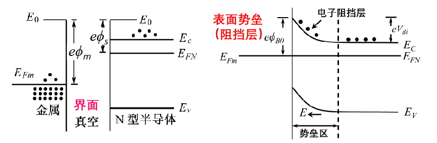
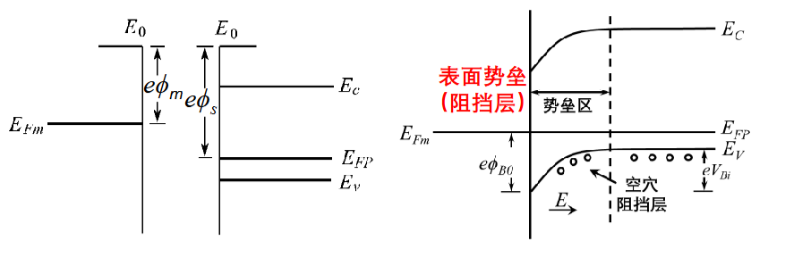
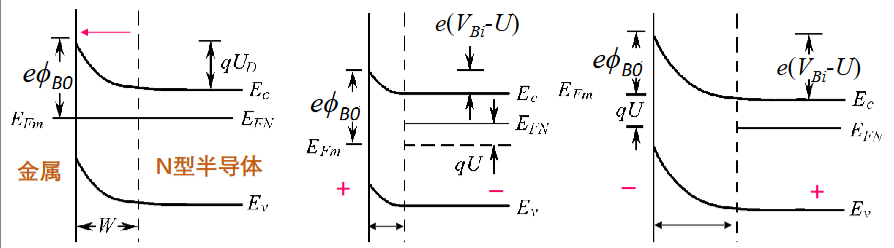
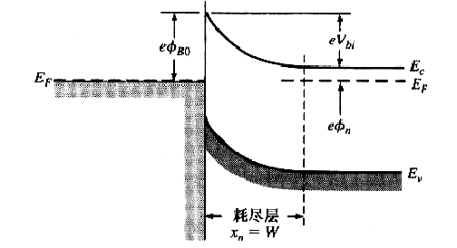

# 金半接触（对应教材第九章）

## 概述

### 常见接触类型分类

- **同质结：** 同种半导体材料（如硅-硅）形成的PN结。
    
- **异质结：** 不同半导体材料（如硅-锗，或GaAs-AlGaAs）形成的PN结。
    
- **金半结：** 特指金属与半导体直接接触形成的结构，也被称为**肖特基势垒二极管**。
    
- **欧姆接触：** 金半接触的特殊情况（或理想情况），指接触界面==没有明显的整流效应==，电流与电压呈线性关系，在电路中不仅不阻碍电流，反而作为低阻抗的连接通道。

### 能量参数定义

- **功函数（$\phi$）：** 费米能级（$E_F$）和真空能级（$E_0$）的差距。

- **电子亲和能（$\chi$）：** 导带底能量（$E_C$）和真空能级（$E_0$）的差距。

半导体功函数表达式：
$$
e\phi_s = \chi + (E_C - E_F)_s = \chi + \phi_n
$$
常见材料能量参数表：

|**金属**​|**功函数 ϕₘ (eV)**​|**半导体**​|**电子亲和能 χ (eV)**​|
|---|---|---|---|
|Ag, 银|4.26|Ge, 锗|4.13|
|Al, 铝|4.28|Si, 硅|4.01|
|Au, 金|5.1|GaAs, 砷化镓|4.07|
|Cr, 铬|4.5|AlAs, 砷化铝|3.5|
|Mo, 钼|4.6|-|-|
|Ni, 镍|5.15|-|-|
|Pd, 钯|5.12|-|-|
|Pt, 铂|5.65|-|-|
|Ti, 钛|4.33|-|-|
|W, 钨|4.55|-|-|
### 金半接触两种情况

**热力学原理**：金属与半导体相接触时，电子将从功函数小的地方跑到功函数大的地方。 系统的热力学平衡要求统一的**费米能级**。

根据电子流动的方向和半导体表面形成的状态，接触被分为两类：

- **整流接触：** 电子流出半导体，或者空穴流出半导体，导致半导体表面载流子耗尽，在半导体表面形成**表面势垒**，即**阻挡层**。与PN结的耗尽层类似，存在内建电场，对电流具有单向导电性（整流作用）。这就是所谓的**肖特基接触**。

- **欧姆接触：** 载流子从金属注入半导体表面，导致表面载流子浓度增加，形成**反阻挡层**（或称为积累层），即高电导区。界面处等效为一个极小的电阻，不阻碍电流流动，没有整流效应。

## 金半肖特基接触

### 金属 - N型半导体接触

*金半接触（和N型半导体）*

**电荷输运过程：**

$\phi_m > \phi_s$， 由于 $\phi_m = E_0 - E_{Fm}$ 且 $\phi_s = E_0 - E_{FN}$，不等式 $\phi_m > \phi_s$ ，可推导出 **$E_{Fm} < E_{FN}$**。

根据热力学原理，电子从==费米能级高的N型半导体流向费米能级低的金属==。

**空间电荷区的形成：**

半导体表面失去电子（多子），留下了带正电的**施主离子**。这些离子作为晶格的一部分，不可移动。金属表面获得了电子，带负电。
    
因此，==在半导体一侧==形成了带正电的**空间电荷区（耗尽层）**。

**能带弯曲与平衡态：**

平衡时，整个系统的 $E_F$ 必须是一条水平线。对于半导体，电子在表面处的电势能更高。因此，半导体的能带（$E_C, E_V$）在表面处**向上弯曲**。

**势垒的形成：**

两边的电子进入另外一侧分别需要克服两种势垒：

|        势垒         |   方向   |             表达式              |       补充说明       |
| :---------------: | :----: | :--------------------------: | :--------------: |
| 表面势垒$e\phi_{B0}$​ | 金属→半导体 |       $e\phi_m - \chi$       |  理想情况下，不随外加电压变化  |
|  内建电势差$eV_{Bi}$   | 半导体→金属 | $eV_{Bi} = \phi_m - \phi_s$​ | 接触前金属与半导体的费米能级之差 |
### 金属 - P型半导体接触

*金半接触（和P型半导体）*

**电荷输运过程：**

$\phi_s > \phi_m$，意味着 $E_0 - E_{FP} > E_0 - E_{Fm}$，即 **$E_{Fm} > E_{FP}$**

半导体的费米能级低，意味着==空穴能量高==。电子从金属流向半导体，即==空穴从半导体流向金属==。这导致半导体表面**空穴浓度降低**（耗尽）。

**空间电荷区与能带弯曲：**

半导体表面空穴被耗尽，留下了带负电的**受主离子**。金属表面带正电。由于半导体表面带负电，这里的电子电势能升高，能带（$E_C, E_V$）相对于内部**向下弯曲**（也就形成了空穴的势垒）。

### 对比总结

|      特性      |        金属 - N型半导体接触        |        金属 - P型半导体接触        |
| :----------: | :------------------------: | :------------------------: |
|  **接触前提**​   |     $\phi_m > \phi_s$      |     $\phi_s > \phi_m$      |
| **费米能级关系**​  |     $E_{Fm} < E_{FN}$      |     $E_{FP} < E_{Fm}$      |
| **载流子输运方向**​ |         电子从半导体流向金属         |         空穴从半导体流向金属         |
|  **空间电荷区**​  | 半导体一侧形成由带正电的**施主离子**组成的耗尽层 | 半导体一侧形成由带负电的**受主离子**组成的耗尽层 |
|  **金属侧电荷**​  |       积累电子，带**负电**​        |       失去电子，带**正电**​        |
| **能带弯曲方向**​  |      半导体表面能带**向上弯曲**​      |      半导体表面能带**向下弯曲**​      |
|   **表面势垒**   |     $e\phi_m - e\chi$      |  $E_g + e\chi - e\phi_m$   |
|  **内建电势差**   |    $e\phi_m - e\phi_s$     |    $e\phi_s - e\phi_m$     |

### 整流效应（以金 - N接触为例）

*整流效应图解*

**平衡状态（左图）：** 电子的双向流动达到动态平衡，净电流为零

系统具有统一的费米能级（$E_{Fm}$ 与 $E_{FN}$ 对齐）

**正向偏置（中图）：** 半导体的费米能级 $E_{FN}$ 相对上移，金属费米能级 $E_{Fm}$ 相对下移，两者能量差为 $qU$

半导体侧的==能带弯曲量减小==。电子从半导体进入金属所需克服的势垒降低为 $e(V_{Bi} - U)$， 由于势垒降低，N型半导体中的多子（电子）极易越过势垒扩散到金属中。电子流呈指数级增加，形成很大的**正向电流**。

**反向偏置（右图）：** $E_{Fm}$ 上移，$E_{FN}$ 下移

半导体侧的能带弯曲增强。电子从半导体进入金属所需克服的势垒升高为 $e(V_{Bi} + U)$。半导体中的电子很难越过这个增高的势垒。==电流主要由金属流向半导体的电子构成==，但金属电子面临的势垒 $e\phi_{B0}$ 几乎不变且很高，因此只有极少的电子能跃过，形成微小的**反向饱和电流（漏电流）**。

### 肖特基势垒二极管

*肖特基势垒二极管*

**肖特基势垒高度 ($\phi_{B0}$)：** 也就是金 - N接触的表面势垒
$$
\phi_{B0} = \phi_m - \chi
$$
理想的肖特基模型下，这个势垒只和材料本身相关。

#### **内建电场**

由泊松方程：
$$
\frac{dE}{dx} = \frac{\rho(x)}{\epsilon_s}
$$
**边界条件：** 在耗尽层边缘 $x = x_n$ 处，电场强度必须连续且归零（中性区无电场），即 $E(x_n) = 0$。
    
电场分布公式：
$$
E = -\frac{eN_D}{\epsilon_s}(x_n - x)
$$
即耗尽区内的电场呈线性分布，当 $x=0$（金半界面）时，电场强度绝对值 $|E|$ 达到最大值。根据电场边界条件，半导体侧存在正电荷区，为了保持电场终止，金属表面必然存在==等量的负电荷==。

#### **内建电势差**

再次对电场 $E(x)$ 积分（或利用泊松方程 $\frac{d^2\phi}{dx^2}$），得到内建电势差 $V_{bi}$ 与耗尽层宽度 $x_n$ 的平方成正比（表明电压主要降落在耗尽区，近似**单边突变结**）：
 $$
 V_{bi} = \frac{eN_D}{2\epsilon_s} x_n^2
 $$
#### **空间电荷区宽度 ($W$ 或 $x_n$)**
$$
W = x_n = \left[ \frac{2\epsilon_s(V_{bi} + V_a)}{eN_D} \right]^{1/2}
$$
#### **势垒电容 ($C_T$)**
$$
C_T = \left[ \frac{e\epsilon_s N_D}{2(V_{bi} + V_a)} \right]^{1/2}
$$
#### **C-V 特性曲线**
$$
\frac{1}{C_T^2} = \frac{2}{e\epsilon_s N_D}(V_{bi} + V_a)
$$

### 非理想因素

#### 镜像力

## 金半欧姆接触

# 结场效应晶体管（对应教材第十二章）