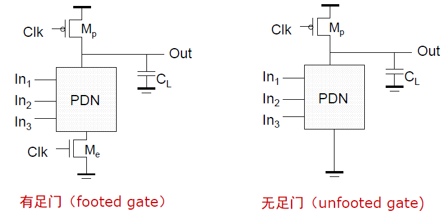

# 静态逻辑
## 静态互补 CMOS 反相器

**回顾：**

由电流相等：

$$ k_n' V_{DSATn} \left( V_M - V_{Tn} - \frac{V_{DSATn}}{2} \right) + k_p' V_{DSATp} \left( V_M - V_{DD} - V_{Tp} - \frac{V_{DSATp}}{2} \right) = 0 $$

可以推导得到开关阈值$V_M$表达式： 
$$ V_M = \frac{\left( V_{Tn} + \frac{V_{DSATn}}{2} \right) + \left( V_{DD} + V_{Tp} + \frac{V_{DSATp}}{2} \right) r}{1 + r}, \quad r = \frac{k_p' V_{DSATp}}{k_n' V_{DSATn}} = \frac{\mu_{p} W_p}{\mu_{n} W_n} $$

改变$W_p/W_n$（即$r$，通常为$2$）会平移电压传输特性曲线（VTC），$r$增大则$V_M$右移；互补CMOS静态反相器的$V_M$对器件参数不敏感。

当阈值电压$V_M$恰好等于$\frac{V_{DD}}{2}$时，噪声容限最大，

## 有比逻辑

## 传输管逻辑

# 动态逻辑

## 基本原理

1. **预充电阶段**（时钟信号 $CLK = 0$）：

	- **预充电管导通**：PMOS预充电管（$M_p$）在栅极低电平作用下导通，建立了电源 $V_{DD}$ 到输出节点 $Out$ 的低阻抗路径（无论输入逻辑状态如何，输出节点 $Out$ 均被无条件充电至高电平 $V_{DD}$）。
	    
	- **求值管关断**：NMOS求值管（$M_e$）在栅极低电平作用下截止（Cut-off），切断了下拉网络（PDN）与地（GND）之间的物理连接（电源 $V_{DD}$ 与地之间也不存在直流通路。因此，该机制消除了在预充电期间可能发生的任何静态功耗）。
2. **求值阶段**（时钟信号 $CLK = 1$）

	- **预充电管关断**：PMOS预充电管（$M_p$）截止，断开了输出节点与电源 $V_{DD}$ 的连接。
	    
	- **求值管导通**：NMOS求值管（$M_e$）导通，将下拉网络（PDN）的底部接入地（GND）。此时，电路的输出状态完全取决于下拉逻辑网络（PDN）的导通情况。

3. **有条件放电（求值阶段）**

	- **输入逻辑使得PDN导通**
	    
	    如果在输入信号作用下，下拉网络形成导通路径，则输出节点 $Out$ 通过PDN和导通的求值管 $M_e$ 形成到地的低阻抗通路。存储在输出节点的电荷被泄放，输出电压降至逻辑“0”（GND）。
	    
	- **输入逻辑使得PDN关断**
	    
	    如果下拉网络未形成通路，输出节点无法放电。此时，预充电的高电平值（$V_{DD}$）被维持在负载电容 $C_L$ 上。

>[!note] 关键特性（高阻态）
>**高阻抗状态（High-Z）**：在PDN关断的情况中，由于 $M_p$ 关断且 PDN 未导通，输出节点既不连接 $V_{DD}$ 也不连接 GND，处于==悬浮的高阻抗状态==。这与静态逻辑总是存在低阻通路截然不同。

>[!note] 关键特性（放电不可逆性）
**放电不可逆性**：在求值阶段，输出节点与电源之间唯一的可能路径是连接到 GND。因此，一旦 $Out$ 发生放电，就不可能再次充电恢复高电平，直到下一个预充电周期（$CLK=0$）到来。
>
>这意味着，在求值期间，门的输入最多只能发生一次变化（通常要求==单调变化==），否则可能导致错误的逻辑输出。

综上，右侧示例电路动态逻辑输出的布尔表达式：

$$Out = \overline{CLK} + \overline{(A \cdot B + C)} \cdot CLK$$
动态电路依靠把信号值暂时存放在高阻抗节点的电容上来代替低阻抗路径。但由于依靠电容存储电荷来维持电压，电荷会因为**泄漏电流**而逐渐流失，因此动态电路不能无限期地维持状态，必须周期性地进行**预充电**和刷新，这也是其被称为“==动态==”的原因。

设计N输入逻辑仅需要==N+2==个晶体管。

### 有足、无足门

- **有足门**：电路底部包含受时钟控制的NMOS管$M_e$，预充电阶段始终有$M_e$防止输入信号导致充放电竞争。

- **无足门**：没有对应的$M_e$，设计时需要确保预充电阶段PDN不会有输入导致GND导通。

### 具体设计约束

- 输入信号必须严格控制，避免误放电。

- 设计时确保==PDN的等效电阻等于单位电阻==，保证基本的下拉能力。

- **预充电管（$M_p$）**：**可选择较小的预充电管尺寸**（即电阻较大，如两倍单位电阻，这可以降低栅极电容，减轻时钟分布网络的负担）。

- **求值管（$M_e$）**：**选择求值管的尺寸比其他NMOS管大。**（加快放电（求值）速度）

### 工作特性

- **全摆幅输出**：输出电压可以完整地达到$V_{DD}$和$GND$，没有电压损失。

- **无比逻辑**：逻辑电平的高低不依赖于晶体管的尺寸比例（这个从原理就能看出来）。

- **阈值电压**：因为全靠$M_e$来操控高低电平，所以阈值电压就是的$M_e$导通阈值电压$V_{Tn}$。

- **噪声容限小**：只要输入端的噪声电压略微超过$V_{Tn}$，PDN就会导通并开始泄放电容上的电荷，导致逻辑错误。

- **输入稳定性要求**：输入只允许在预充电阶段变化，==在求值阶段必须保持稳定==。

- **无毛刺**：输出在求值阶段要么保持高电平，要么单调地放电至低电平，不会出现静态CMOS中常见的竞争冒险导致的毛刺。

## 串联动态门

试分析如图所示的级连动态门（反相器）：

1. **预充电阶段**：两个门同步同时充电。

2. **求值阶段**：由于放电延迟时间， $Out1$ 有一段时间是高电平，作为第二级的输入，它会导致第二级的NMOS求值管**误导通**。

### 多米诺逻辑

**定义**：多米诺逻辑 = 动态逻辑门 + **静态反相器**。（在每个动态门的输出端（$Out1$）后固定连接一个静态CMOS反相器。反相器的输出作为下一级动态门的输入。）

## 动态逻辑的速度和功耗

## 动态设计中的信号完整性问题

# 电路选择指南