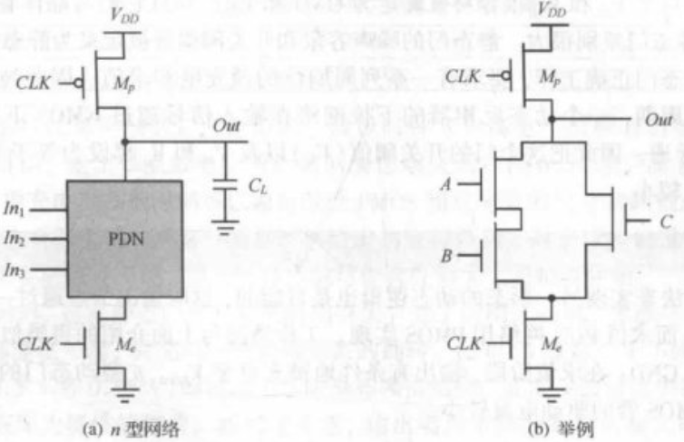

# 静态逻辑
## 静态互补 CMOS 反相器

**回顾：**

由电流相等：
$$ k_n' V_{DSATn} \left( V_M - V_{Tn} - \frac{V_{DSATn}}{2} \right) + k_p' V_{DSATp} \left( V_M - V_{DD} - V_{Tp} - \frac{V_{DSATp}}{2} \right) = 0 $$
可以推导得到开关阈值$V_M$表达式： $$ V_M = \frac{\left( V_{Tn} + \frac{V_{DSATn}}{2} \right) + \left( V_{DD} + V_{Tp} + \frac{V_{DSATp}}{2} \right) r}{1 + r}, \quad r = \frac{k_p' V_{DSATp}}{k_n' V_{DSATn}} = \frac{\mu_{p} W_p}{\mu_{n} W_n} $$改变$W_p/W_n$（即$r$，通常为$2$）会平移电压传输特性曲线（VTC），$r$增大则$V_M$右移；互补CMOS静态反相器的$V_M$对器件参数不敏感。

当阈值电压$V_M$恰好等于$\frac{V_{DD}}{2}$时，噪声容限最大，

## 有比逻辑

## 传输管逻辑

# 动态逻辑

## 基本原理

1. **预充电阶段**（时钟信号 $CLK = 0$）：

	- **预充电管导通**：PMOS预充电管（$M_p$）在栅极低电平作用下导通，建立了电源 $V_{DD}$ 到输出节点 $Out$ 的低阻抗路径（无论输入逻辑状态如何，输出节点 $Out$ 均被无条件充电至高电平 $V_{DD}$）。
	    
	- **求值管关断**：NMOS求值管（$M_e$）在栅极低电平作用下截止（Cut-off），切断了下拉网络（PDN）与地（GND）之间的物理连接（电源 $V_{DD}$ 与地之间也不存在直流通路。因此，该机制消除了在预充电期间可能发生的任何静态功耗）。

## 串联动态门

## 动态逻辑的速度和功耗

## 动态设计中的信号完整性问题

# 电路选择指南