# 时序逻辑基础

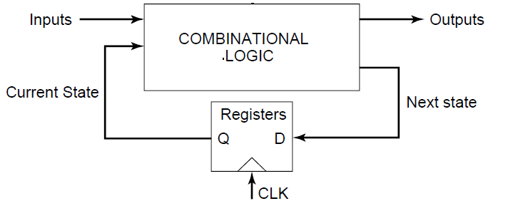
*标准时序逻辑电路*

- **组合电路**：$Output = f(Input)$。输出不仅在时间上==即时响应==（忽略延迟），且逻辑上仅由当前输入决定。
    
- **时序电路**：$Output = f(Input, State)$。输出是当前输入变量和电路内部状态变量的函数。这意味着电路具有==记忆功能==。

**两种存储机理**：

- **正反馈 (Positive Feedback)**：**静态存储器** 的基础。利用双稳态电路将信号锁定在高电平或低电平，只要==电源不断电，状态即可维持==。
    
- **基于电荷 (Charge-based)**：**动态存储器** 的基础。利用==电容存储电荷==的能力来表示逻辑状态（有电荷为1，无电荷为0）。由于漏电流存在，需要定期刷新（这一点和[动态逻辑的充电逻辑](vlsi-lecture-07.md#电荷泄露)类似）。

# 关键时序单元

**时序单元**是时序电路中用于==存储状态==的基本电路单元，须满足两个充要条件：

- **保持**：在没有写入操作时，能够长时间维持当前的状态值不变。
    
- **写入/触发**：在特定的控制信号作用下，能够接收新的输入并更新内部状态。

## 分类

### 按存储机制分类

- **静态存储器**：基于正反馈原理。具有双稳态特性，==抗干扰能力强==，不需要刷新，但通常占用==更多的晶体管面积==。
    
- **动态存储器**：基于电荷存储原理。依赖栅极电容或寄生电容存储电荷。其特点是==集成度高==，但数据会随时间衰减，通常用于==高密度存储==。

### 按触发方式分类

分类依据是电路对**时钟信号** 的敏感方式：

- **电平触发/电平敏感**：电路在时钟信号处于特定电平（高电平或低电平）的**整个持续时间段内**，输出都会随输入变化。对应器件为**锁存器**。
    
- **边沿触发/边沿敏感**：电路仅在时钟信号发生跳变（上升沿或下降沿）的**瞬间**采样输入并改变状态，其余时间状态锁定。对应器件为**寄存器/触发器**。

## 锁存器（Latch）

### 概述
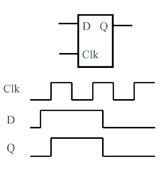
*锁存器*

- **触发特性**：电平敏感，时钟为高时写入数据。
    
    - 当 $Clk$ 为高电平期间，输入 $D$ 发生变化，输出 $Q$ **立即跟随** $D$ 变化。
        
    - 在此期间，电路处于透明状态。
        
    - 当 $Clk$ 回到低电平时，$Q$ 保持 $Clk$ 下降沿瞬间的值不变。

#### 正、负电平锁存器

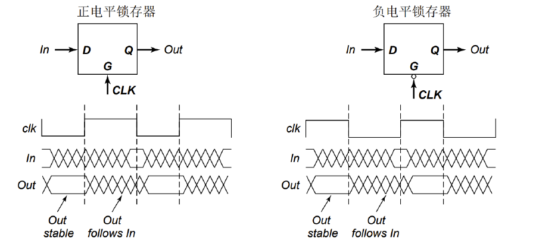
*正负电平锁存器*

顾名思义，分别对正、负电平敏感（这个在电路图上CLK信号有无==反相泡==就能看出来）。

### 静态锁存器

#### 双稳态原理

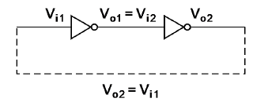
*标准锁存器环*

- 第一级反相器输入为 $V_{i1}$，输出为 $V_{o1}$。
    
- 第二级反相器输入为 $V_{i2}$（等于 $V_{o1}$），输出为 $V_{o2}$（反馈回 $V_{i1}$）。

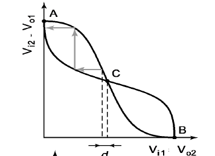
*双稳态原理图*

该原理类似于先前静态反相器级连的信号完整性机制，同样借助了电平响应曲线的==凸函数特性==。

也是通过这一特性，两根导线被自锁在 A、B 两个稳态工作点（这就是“双稳态原理”的双字所在）。

**特点**：

- 静态（只要供电，无限期保持）、鲁棒性好（详见信号完整性章节）。

- **对触发脉冲要求**（写入数据的物理限制）：==触发脉冲宽度须稍大于沿环路总的传播时间。至少是两个反相器平均延时 ($t_{pd}$) 的两倍==。如果脉冲太短，信号还没走完一圈反馈回路，输入就撤销了，电路会恢复原先的双稳态（这也是矛盾点，双稳态保持效果太好导致新数据不容易写入），导致写入失败。

- **过渡区增益**：为了使电路能从亚稳态点（上一页的点 C）迅速翻转到稳态，反相器在==过渡区电压增益必须大于 1==。

**翻转方法**：

- **切断反馈环**：在写入新数据时，暂时断开两个反相器之间的连接。
    
- **强制驱动**：不切断反馈，而是使用一个驱动能力极强的信号源，强行覆盖掉内部反馈节点的电压。但是进行仔细的**尺寸设计**。

#### 具体实现

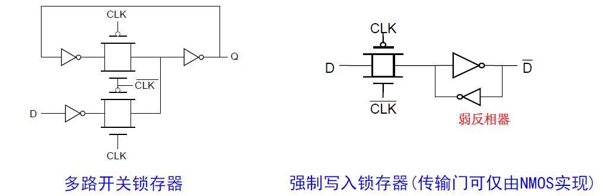
*两种静态锁存器电路*

##### 多路开关锁存器 (Multiplexer Based Latch)

- **写入方法**：切断反馈环（利用**传输门**作为开关）
        
- **工作原理**：
    
    -  $CLK$ 有效时：输入通路接通，反馈通路断开。数据 $D$ 直接进入电路，无视旧状态。
        
    -  $CLK$ 无效时：输入通路断开，反馈通路接通。两个反相器闭合成环，锁存数据。
        
- **优缺点**：
    
    - **优点**：晶体管尺寸容易设计，不需要考虑驱动能力的强弱比值。
        
    - **缺点**：使用的==晶体管数目较多==，且传输门给时钟信号带来了较大的电容负载 ($CLK$ 和 $\overline{CLK}$ 都要接，虽然另一个也是，但是这个接的更多)，增加了功耗。

###### 使用NMOS传输管优化设计

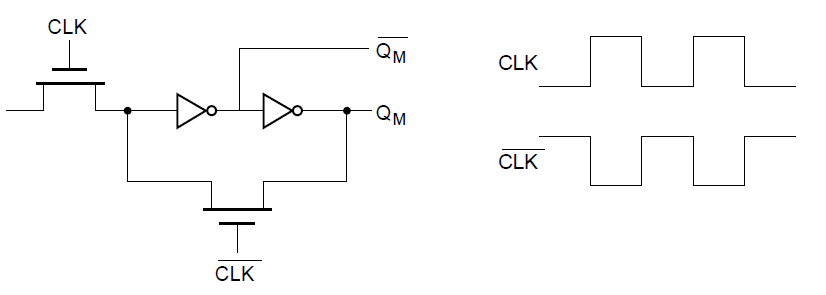
*NMOS多路开关锁存器*

对照前图可见，开关和输入信号的传输门都仅使用一个NMOS。

- **优点**：
    
    - **晶体管数目减少**：每个开关省去了一个PMOS管，显著减小了电路面积。
        
    - **时钟负载小**：时钟信号只需要驱动NMOS的栅极电容，降低了时钟网络的动态功耗。
        
- **缺点**：
    
    - **阈值损失**：NMOS传输高电平的能力较差。当它传输 $V_{DD}$ 时，源极电压最高只能达到 $V_{DD} - V_{tn}$ ，节点无法达到满幅度的 $V_{DD}$。
        
    - **静态功耗**：由于节点电压只有 $V_{DD} - V_{tn}$（弱“1”），连接在后面的CMOS反相器的PMOS管无法完全截止（$V_{gs}$ 不为0），导致反相器内部形成从电源到地的直通电流，产生持续的静态功耗。

- **不重叠时钟**：$CLK$ 和 $\overline{CLK}$ **不能同时为高电平**（不然就变成强制写入锁存器了，但是很明显多路开关锁存器没有设计这一点）。

	- **解决方案**：引入**死区时间**，在 $CLK$ 下降后，经过一段微小的延迟，$\overline{CLK}$ 才上升。在此期间，两个开关都断开，节点依靠寄生电容暂时保持电荷（动态存储），从而安全地完成回路切换。

>[!tip] CLK和CLK#怎么会同时为高电平呢
>
>在物理世界中， $\overline{CLK}$ 通常是由 $CLK$ 经过一个反相器产生的。根据VLSI实验可以知道，反相器是存在延时的，因此会出现二者同时为较高电平的时刻。而且这个时刻正好位于写入的最后一刻，同时也是锁存的前一刻，引入了很强的不确定性。

##### 强制写入锁存器 (Force-Write / Jam Latch)

- **写入方法**：强制驱动，反馈回路中包含了一个特殊的==弱反相器（反馈反相器）==。

- **工作原理**：
    
    - 当需要写入 $D$ 时，外部信号经过传输门进入（假设输入节点原先为0，外部信号想要输入1），此时，输入节点上出现了==电压竞争==：

		1. **外部驱动力**：输入信号 $D$ 试图通过传输门将输入节点 **拉高** 到 $V_{DD}$。
		    
		2. **内部抵抗力**：下方的反馈反相器试图将输入节点 **拉低** 到 $GND$。

    - 但是由于反馈管（弱驱动能力）竞争不过输入信号，所以得以写入新的信号值。
    
    - 这里的传输门可以简化==仅由 NMOS 实现==（虽然有阈值损失，但为了减少面积有时会这样做）。
        
- **优缺点**：
    
    - **优点**：晶体管数目少，对时钟负载小（寄生参数小）。
        
    - **缺点**：**晶体管尺寸需要精心设计**。必须保证输入驱动器的驱动能力远大于反馈弱反相器的能力，否则无法写入。类似于有比电路。

###### 尺寸设计
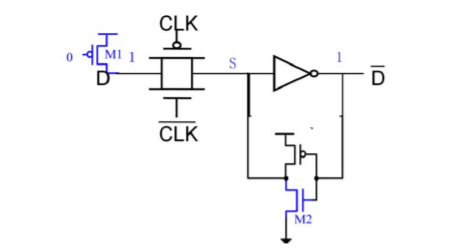
*强制写入锁存器剖析*

为确保电路在任何情况下都能正确翻转，设计必须基于==最困难的写入场景==进行：

- **当前状态**：锁存器内部存储逻辑“0”。即反馈反相器的输出（节点 $S$ 的驱动源）试图将 $S$ 拉低到地（GND）。
    
- **写入操作**：外部输入 $D$ 试图写入逻辑“1”，输入驱动器试图将节点 $S$ 拉高到电源电压（$V_{DD}$）。

**翻转条件**：S点的电位高于反相器阈值电压 $V_M$ 。

问题可以简化为一条从 **VDD - M1 - CLK#传输管 - M2 - GND** 的电压通路，也就是M2的分压必须大于反相器阈值电压 $V_M$ 。

即：

$$
\frac{R_{M2}}{R_{M1+TG} + R_{M2}} V_{DD} > V_M
$$

为了满足不等式，$R_{M2}$ 必须足够大，或者$R_{M1+TG}$ 必须足够小。在集成电路设计中，电阻大意味着晶体管的宽长比 ($W/L$) 小（也就是W比较小），因此，必须将反馈管 $M2$ 设计为**小尺寸（弱）**，将输入管 $M1$ 和传输门设计为**大尺寸（强）**，从数学上严谨证明了弱反相器的设计。

## 寄存器（Register）

### 概述
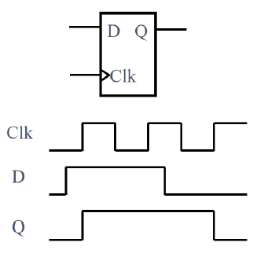
*寄存器*

- **触发特性**：边沿敏感，时钟上升时存储数据。
    
    - 尽管 $D$ 信号在 $Clk$ 高电平期间发生了变化，输出 $Q$ 并未跟随变化。
        
    - $Q$ 仅在 $Clk$ 从低电平变为高电平的**上升沿** 瞬间发生更新。
        
    - 体现了严格的同步特性，能有效过滤掉非时钟边沿期间输入端的==毛刺信号==。

#### 上升、下降边沿敏感寄存器

顾名思义，输出对上升沿和下降沿（CLK有==反相泡==）敏感而变化的寄存器。

### 主从边沿触发寄存器

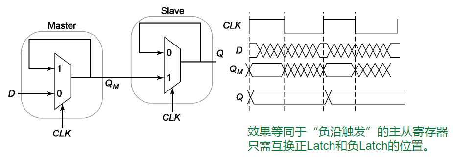
*主从边沿寄存器示意图*

这种寄存器是由两个锁存器组成的：

- **主锁存器**：位于前级，由 $CLK$ 控制。
    
- **从锁存器**：位于后级，也由 $CLK$ 控制，但控制逻辑与主锁存器**相反**。

**工作流程**：

- **$CLK = 0$ 时**：
    
    - **Master**：处于**透明模式**。输入 $D$ 直接传递到中间节点 $Q_M$。
        
    - **Slave**：处于**保持模式**。切断与 $Q_M$ 的联系，维持输出 $Q$ 的旧值不变。
        
    - 主锁存器采样输入，从锁存器维持输出。
        
- **$CLK$ 从 $0 \rightarrow 1$ (上升沿) 瞬间**：
    
    - **Master**：进入**保持模式**。锁定刚刚采样到的 $D$ 值，此时 $Q_M$ 不再随 $D$ 变化。
        
    - **Slave**：进入**透明模式**。读取 $Q_M$ 的值（即上升沿前一刻的 $D$ 值），并将其传递到输出 $Q$。
        
    - 输出 $Q$ 在上升沿瞬间发生了跳变。
        
- **$CLK = 1$ 时**：
    
    - **Master**：维持保持状态，隔离输入 $D$。
        
    - **Slave**：虽然是透明的，但由于它的输入源 $Q_M$ 是静止的，所以输出 $Q$ 也保持静止。

**脉宽约束**：为了保证数据正确传输，==时钟的高电平或低电平持续时间必须分别大于对应透明状态锁存器的传播延时==，确保数据能穿过锁存器。

**采样风险**：虽然是边沿触发，但在 $CLK$ 有效期间（对主锁存器而言），输入端的毛刺会被主锁存器捕捉到并传递给中间节点 $Q_M$。如果在边沿到来前毛刺没有消失，错误数据就会被锁存。

#### 具体实现

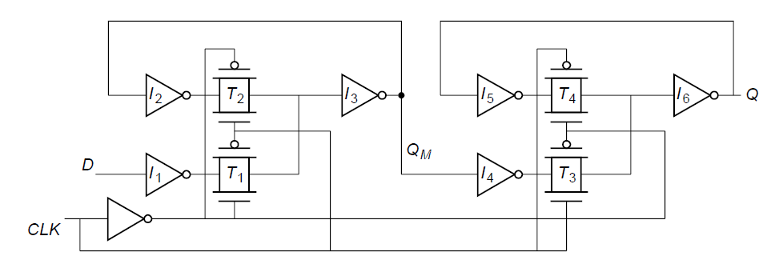
*基于多路选择器的锁存器对 -> 主从边沿寄存器*

- **时钟控制部分**：CLK并联两个相反的线路（分别控制主从锁存器）

- **信号通路部分**：

	- $D$ -> **I1** ->  $\overline{D}$ （进入主锁存器，$CLK = 0$） -> **I3** -> $D (Q_M)$
	
	- $D (Q_M)$ -> **I4** ->  $\overline{D}$ （进入从锁存器，$CLK = 1$） -> **I6** -> $D (Q)$

##### 减少时钟负载（强制写入锁存器级联）

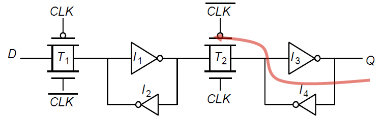
*减少时钟负载的寄存器设计*

反馈反相器 $I_2$ 和 $I_4$ 被设计为==弱反相器==。

**设计复杂性增加 (强制写入)**：必须满足有比逻辑的设计规则。
    
- **Master部分**：输入驱动器和 $T_1$ 的驱动能力必须强于弱反相器 $I_2$，才能覆写 Master 的状态。
    
- **Slave部分**：Master 的输出反相器 $I_1$ 和传输门 $T_2$ 必须强于 Slave 的弱反相器 $I_4$。

**反相导通**：

- 当 $T_2$ 导通（Slave 开始采样 Master）的瞬间，Slave 内部存储节点（$I_3$ 的输入端）可能存储着与当前 Master 输出相反的电荷。由于 $T_2$ 是双向导通的，Slave 的电荷会反向流向 Master 的输出节点。
    
- 如果 Slave 的反馈环（$I_3, I_4$）具有较强的寄生电容或驱动力，这种反向电流可能会干扰甚至翻转 Master 中存储的数据（即影响 $I_1$ 的输入），导致==前级数据被后级“污染”==。
    
- 因此，必须保证前级驱动能力 ($I_1 - T_2$) 足够强，能够压制住后级的反向干扰。

##### 时钟重叠

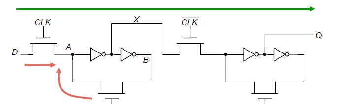
*时钟重叠导致信号直接穿通 -> 回归电平触发*

当 $CLK$ 和 $\overline{CLK}$ 同时为高时，Master 的输入开关是通的，Slave 的输入开关也是通的。
    
输入 $D$ 像流过一根导线一样，直接穿过 Master，穿过 Slave，到达输出 $Q$。本来应该在边沿更新数据，现在变成了在重叠期间数据直接“漏”到了输出端。这会导致下游电路在错误的时间接收到新数据，引发整个系统的逻辑混乱。

###### 解决方案：采用不重叠时钟

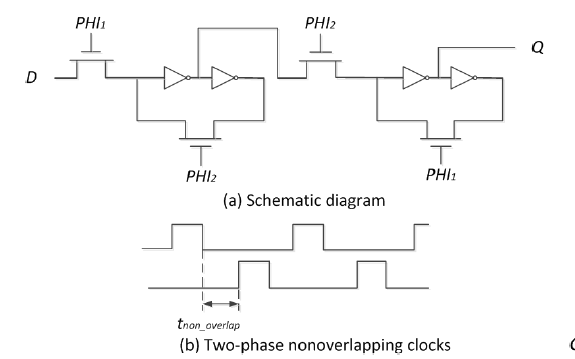
*两相位时钟*

系统不再使用单一的 $CLK$ 和 $\overline{CLK}$，而是生成两个独立的时钟相位 $PHI_1$ 和 $PHI_2$。$PHI_1$ 和 $PHI_2$ **永远不会同时为高电平**。它们之间存在一个明显的间隙，称为 $t_{non\_overlap}$（不重叠时间）。

在 $t_{non\_overlap}$ 这段“死区时间”内，信号通路断开，数据仅仅是依靠节点上的==寄生电容存储电荷==来维持的（类似于动态存储器 DRAM）。与此同时，电容上的电荷会通过晶体管的**漏电流** 逐渐泄露。因此，==时钟不重叠部分不能太长==。如果间隙过大，电荷漏光了，数据就会丢失。这就是==“伪”静态==。

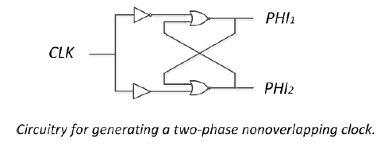
*两相位时钟生成电路*

# 时序参数与约束

## 定义与基本概念

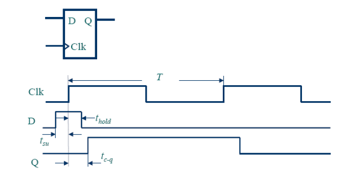
*时序参数可视化*

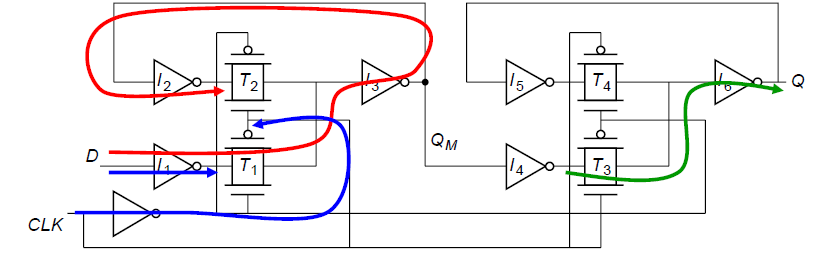
*时序参数物理来源*

1. **建立时间 (Setup Time, $t_{su}$)**：
    
    - **定义**：时钟有效沿到来之前，输入数据 $D$ 稳定存在的最小时间。（数据提前到位）

    - 如**红色线路**所示：$D \rightarrow I_1 \rightarrow T_1 \rightarrow I_3 \rightarrow I_2 \rightarrow$ 抵达 $T_2$ 的两端，为了让反馈环路 ($I_2, I_3, T_2$) 能够顺利锁死新数据，新数据必须已经建立起稳定的电平。

2. **保持时间 (Hold Time, $t_{hold}$)**：
    
    - **定义**：时钟有效沿到来之后，输入数据 $D$ 保持稳定的最小时间。（在门关闭的过程中，数据不能撤走，否则可能把错误的尾巴关在里面）
    
    - 如**蓝色线路**所示：在 $T_1$ 完全关断之前的这段微小时间内，输入 $D$ 仍然能通过 $T_1$ 影响内部节点。因此，输入 $D$ 必须由旧值保持不变，直到 $T_1$ 彻底关死。这段等待 $T_1$ 关闭的时间就是 $t_{hold}$。

3. **时钟至输出时间 (Clock-to-Q Delay, $t_{clk-q}$)**：
    
    - **定义**：从时钟沿触发开始，到输出端 $Q$ 出现新数据所需的延时。
        
    - **最大值（传播延时）**：数据走得最慢的一条路径。决定电路的最高主频。
        
    - **最小值（污染延时）**：数据走得最快的一条路径。用于检查是否存在保持时间违例。

    - 如**绿色线路**所示：$Q_M$ 通过 $T_3 \rightarrow I_6 \rightarrow Q$。

4. **锁存器特有参数 ($t_{d-q}$)**：
    
    - 对于电平敏感的锁存器，在透明期间，输入传到输出的穿透延时称为 $t_{d-q}$。

5. **时钟周期 ($T$)**

## 约束

### 最高时钟频率（即最小时钟周期）约束

我们研究的是 **寄存器1（FF1） -> 组合逻辑电路 -> 寄存器2（FF2）**：

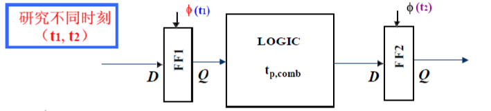
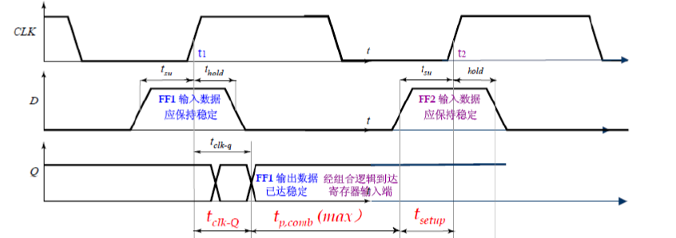
*最高时钟频率约束*

其中，$t_{p,comb}(max)$ ：数据从 FF1 输出端传播穿过组合逻辑电路到达 FF2 输入端所需的时间。

为了让 FF2 在 $t_2$ 时刻成功捕获数据，数据必须在 $t_2$ 之前的 **建立时间 ($t_{setup}$)** 窗口内就已经稳定存在。 也就是说：

$$
\mathbf{t_{clk-Q} + t_{p,comb}(max) + t_{setup} \le T}
$$
### 避免信号竞争

# 时钟技术
