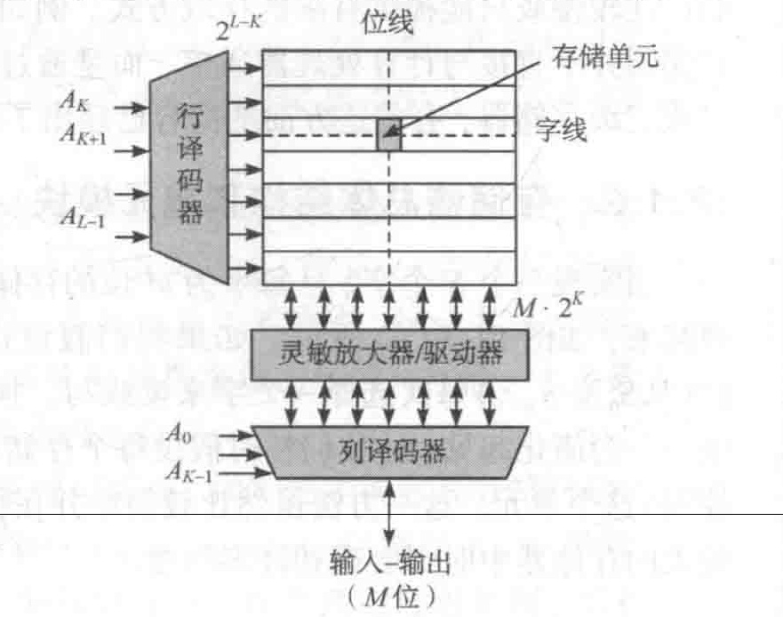

# 存储器分类

## 基于数据存储特性

### 只读存储器（ROM）
    
**非易失性**：核心物理特性，电源断开后，存储的数据不会丢失。

| 类型          | 名称      | 主要特点                                          | 数据擦除方式         |
| ----------- | ------- | --------------------------------------------- | -------------- |
| **固化ROM**​  | 掩膜只读存储器 | 数据在芯片制造时写入，**完全不可更改**。成本低，用于大批量固定程序。          | 不可擦除           |
| **可改写ROM**​ | EPROM   | 可擦除可编程ROM。允许用户编程写入，需要特殊设备。                    | 紫外线照射擦除（窗口式）   |
|             | E²PROM  | 电可擦除可编程ROM。可以按字节进行擦写，无需从电路上取下。                | 使用电信号擦除        |
|             | Flash​  | 当前最主流的可改写ROM。结合了EPROM的高集成度和E²PROM的电擦除优点，按块擦除。 | 使用电信号擦除（按块或扇区） |

### 随机存取存储器（RAM)
    
**易失性**：局限性所在，电源断开后数据即刻丢失。

| 类型        | 全称        | 存储原理             | 主要特点                                                 |
| --------- | --------- | ---------------- | ---------------------------------------------------- |
| **SRAM**​ | 静态随机存取存储器 | 利用==双稳态触发器==存储数据 | **速度快**，无需刷新；但**结构复杂，集成度低，面积大，成本高**。常用作高速缓存（Cache）。  |
| **DRAM**​ | 动态随机存取存储器 | 利用==电容==上的电荷存储数据 | **集成度高**，容量大，成本低；但**速度较慢**，且电荷会泄漏，**需要定时刷新**。常用作主内存。 |
### 特殊用途存储器

| 类型          | 全称       | 工作方式 / 特点                                        | 应用场景                     |
| ----------- | -------- | ------------------------------------------------ | ------------------------ |
| **FIFO**​   | 先进先出存储器  | 数据按照写入的顺序依次读出，即先写入的数据先读出。                        | 数据缓冲、异步通信、不同时钟域的数据交换     |
| **LIFO**​   | 后进先出存储器  | 数据按照与写入相反的顺序读出，即最后写入的数据最先读出。                     | 堆栈操作、程序调用、算法中的回溯         |
| **CAM**​    | 按内容寻址存储器 | ==通过输入数据内容进行并行搜索==，直接返回匹配项的地址，而非通过地址访问数据。查找速度极快。 | 网络路由器的路由表查找、缓存标签匹配、数据库加速 |
| **多端口存储器**​ | 多端口存储器   | 具有多个独立的访问端口，允许两个或以上的设备同时读写。                      | 多核处理器数据共享、通信交换芯片、图形处理    |

# 存储器结构

无论SRAM、DRAM还是ROM，其外部接口与内部逻辑架构大体一致，遵循**地址解码-阵列访问-数据I/O**的模式：

*阵列结构的存储器组织*

- **存储体（$N \times M$）**：核心数据存储区，形式为二维矩阵。
    
- **地址解码系统**：
    
    - **行译码器**：接收$n$位行地址，激活存储阵列中的某一行。
        
    - **列==预==译码器**：接收$m$位列地址，控制列选开关。
        
- **列选开关**：由于物理阵列的==列数通常多于逻辑字长==，该模块用于从激活的行中筛选出目标数据。
    
- **读写控制**：接收外部控制信号（如WE、OE、CS），协调输入/输出电路的工作时序。
    
- **输入/输出**：数据总线的接口缓冲。

**信号流向逻辑**：地址信号（$n$位行 + $m$位列）定位单元 $\rightarrow$ 控制信号决定读/写操作 $\rightarrow$ 数据通过I/O端口传输。

# 存储体

**容量**：$N \times M$

- **$N$（字数）**：存储器能够存储的数据单元的总数量。
    
- **$M$（位数）**：每一个数据单元包含的二进制位数（8位、32位）。

为了使版图接近正方形以减少延迟和面积，设计者通常会将==多个逻辑字放在同一个物理行==中。

- **行数 $\le N$**：物理行的数量通常小于或等于逻辑字数。
        
- **列数 $\ge M$**：物理列的数量通常大于或等于字长。
        
- **总容量守恒**：$物理行数 \times 物理列数 = N \times M$。

### 字线（行选

在存储阵列的物理行上，同一行中所有存储单元的**选择控制端**是物理连接在一起的。这条连线被称为**字线**。

字线直接与**行译码器**的输出端相连，当$n$位行地址输入行译码器后，译码器会对地址进行解码，并仅将对应的那一条字线置为有效电平，激活该行所有的存储单元。其他未被选中的字线保持无效状态。

# 地址译码器

# 读写控制及输入输出电路